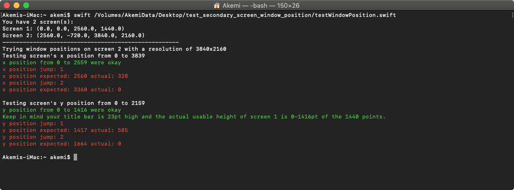

## Usage

```
swift testWindowPosition.swift
```

## Info

There seems to be a bug in Apple's window creation [init function](https://developer.apple.com/documentation/appkit/nswindow/1419755-init)
for a specific screen. It constraints the position to the bounds of the main
screen instead of the wanted screen.

This bug only occurs when the none Main screen has a higher resolution than the
Main one.

This little test initialises a new 1x1pt NSWindow for all x and y positions of
the none Main screen, reads their initialised positions and compares those actual
positions with the expected (passed) ones. Discrepancies are output on the
command line and from those discrepancies it can be concluded that the Main screen
bounds are used.

See output examples below with a 2560x1440pt Main Screen and 3840x2160pt secondary
screen. Windows can't be properly positioned on the secondary screen beyond the
Main screen's bounds of 2559pt in width and 1416pt in height. 1416pt because of
1439 pt minus the title bar's height of 23pt.

## Output Normal
```
You have 2 screen(s):
Screen 1: (0.0, 0.0, 2560.0, 1440.0)
Screen 2: (2560.0, -720.0, 3840.0, 2160.0)
----------------------------------------------------
Trying window positions on screen 2 with a resolution of 3840x2160
Testing screen's x position from 0 to 3839
x position from 0 to 2559 were okay
x position jump: 1
x position expected: 2560 actual: 320
x position jump: 2
x position expected: 3360 actual: 0

Testing screen's y position from 0 to 2159
y position from 0 to 1416 were okay
Keep in mind your title bar is 23pt high and the actual usable height of screen 1 is 0-1416pt of the 1440 points.
y position jump: 1
y position expected: 1417 actual: 585
y position jump: 2
y position expected: 1664 actual: 0
```



## Debug output

```
You have 2 screen(s):
Screen 1: (0.0, 0.0, 2560.0, 1440.0)
Screen 2: (2560.0, -720.0, 3840.0, 2160.0)
----------------------------------------------------
Trying window positions on screen 2 with a resolution of 3840x2160
Testing screen's x position from 0 to 3839
x position expected: 0 actual: 0
x position expected: 1 actual: 1
x position expected: 2 actual: 2
x position expected: 3 actual: 3
x position expected: 4 actual: 4
x position expected: 5 actual: 5
x position expected: 6 actual: 6
x position expected: 7 actual: 7
x position expected: 8 actual: 8
x position expected: 9 actual: 9
x position expected: 10 actual: 10
x position expected: 11 actual: 11
x position expected: 12 actual: 12
x position expected: 13 actual: 13
x position expected: 14 actual: 14
x position expected: 15 actual: 15
x position expected: 16 actual: 16
x position expected: 17 actual: 17
x position expected: 18 actual: 18
x position expected: 19 actual: 19
x position expected: 20 actual: 20
x position expected: 21 actual: 21
x position expected: 22 actual: 22
x position expected: 23 actual: 23
x position expected: 24 actual: 24
x position expected: 25 actual: 25
x position expected: 26 actual: 26
x position expected: 27 actual: 27
x position expected: 28 actual: 28
x position expected: 29 actual: 29
x position expected: 30 actual: 30
x position expected: 31 actual: 31
x position expected: 32 actual: 32
x position expected: 33 actual: 33
x position expected: 34 actual: 34
x position expected: 35 actual: 35
x position expected: 36 actual: 36
x position expected: 37 actual: 37
x position expected: 38 actual: 38
x position expected: 39 actual: 39
x position expected: 40 actual: 40
x position expected: 41 actual: 41
x position expected: 42 actual: 42
x position expected: 43 actual: 43
x position expected: 44 actual: 44
x position expected: 45 actual: 45
x position expected: 46 actual: 46
x position expected: 47 actual: 47
x position expected: 48 actual: 48
x position expected: 49 actual: 49
x position expected: 50 actual: 50
x position expected: 51 actual: 51
x position expected: 52 actual: 52
x position expected: 53 actual: 53
x position expected: 54 actual: 54
x position expected: 55 actual: 55
x position expected: 56 actual: 56
x position expected: 57 actual: 57
x position expected: 58 actual: 58
x position expected: 59 actual: 59
x position expected: 60 actual: 60
x position expected: 61 actual: 61
x position expected: 62 actual: 62
x position expected: 63 actual: 63
x position expected: 64 actual: 64
x position expected: 65 actual: 65
x position expected: 66 actual: 66
x position expected: 67 actual: 67
x position expected: 68 actual: 68
x position expected: 69 actual: 69
x position expected: 70 actual: 70
x position expected: 71 actual: 71
x position expected: 72 actual: 72
x position expected: 73 actual: 73
x position expected: 74 actual: 74
x position expected: 75 actual: 75
x position expected: 76 actual: 76
x position expected: 77 actual: 77
x position expected: 78 actual: 78
x position expected: 79 actual: 79
x position expected: 80 actual: 80
x position expected: 81 actual: 81
x position expected: 82 actual: 82
x position expected: 83 actual: 83
x position expected: 84 actual: 84
x position expected: 85 actual: 85
x position expected: 86 actual: 86
x position expected: 87 actual: 87
x position expected: 88 actual: 88
x position expected: 89 actual: 89
x position expected: 90 actual: 90
x position expected: 91 actual: 91
x position expected: 92 actual: 92
x position expected: 93 actual: 93
x position expected: 94 actual: 94
x position expected: 95 actual: 95
x position expected: 96 actual: 96
x position expected: 97 actual: 97
x position expected: 98 actual: 98
x position expected: 99 actual: 99
x position expected: 100 actual: 100
x position expected: 101 actual: 101
x position expected: 102 actual: 102
x position expected: 103 actual: 103
x position expected: 104 actual: 104
x position expected: 105 actual: 105
x position expected: 106 actual: 106
x position expected: 107 actual: 107
x position expected: 108 actual: 108
x position expected: 109 actual: 109
x position expected: 110 actual: 110
x position expected: 111 actual: 111
x position expected: 112 actual: 112
x position expected: 113 actual: 113
x position expected: 114 actual: 114
x position expected: 115 actual: 115
x position expected: 116 actual: 116
x position expected: 117 actual: 117
x position expected: 118 actual: 118
x position expected: 119 actual: 119
x position expected: 120 actual: 120
x position expected: 121 actual: 121
x position expected: 122 actual: 122
x position expected: 123 actual: 123
x position expected: 124 actual: 124
x position expected: 125 actual: 125
x position expected: 126 actual: 126
x position expected: 127 actual: 127
x position expected: 128 actual: 128
x position expected: 129 actual: 129
x position expected: 130 actual: 130
x position expected: 131 actual: 131
x position expected: 132 actual: 132
x position expected: 133 actual: 133
x position expected: 134 actual: 134
x position expected: 135 actual: 135
x position expected: 136 actual: 136
x position expected: 137 actual: 137
x position expected: 138 actual: 138
x position expected: 139 actual: 139
x position expected: 140 actual: 140
x position expected: 141 actual: 141
x position expected: 142 actual: 142
x position expected: 143 actual: 143
x position expected: 144 actual: 144
x position expected: 145 actual: 145
x position expected: 146 actual: 146
x position expected: 147 actual: 147
x position expected: 148 actual: 148
x position expected: 149 actual: 149
x position expected: 150 actual: 150
x position expected: 151 actual: 151
x position expected: 152 actual: 152
x position expected: 153 actual: 153
x position expected: 154 actual: 154
x position expected: 155 actual: 155
x position expected: 156 actual: 156
x position expected: 157 actual: 157
x position expected: 158 actual: 158
x position expected: 159 actual: 159
x position expected: 160 actual: 160
x position expected: 161 actual: 161
x position expected: 162 actual: 162
x position expected: 163 actual: 163
x position expected: 164 actual: 164
x position expected: 165 actual: 165
x position expected: 166 actual: 166
x position expected: 167 actual: 167
x position expected: 168 actual: 168
x position expected: 169 actual: 169
x position expected: 170 actual: 170
x position expected: 171 actual: 171
x position expected: 172 actual: 172
x position expected: 173 actual: 173
x position expected: 174 actual: 174
x position expected: 175 actual: 175
x position expected: 176 actual: 176
x position expected: 177 actual: 177
x position expected: 178 actual: 178
x position expected: 179 actual: 179
x position expected: 180 actual: 180
x position expected: 181 actual: 181
x position expected: 182 actual: 182
x position expected: 183 actual: 183
x position expected: 184 actual: 184
x position expected: 185 actual: 185
x position expected: 186 actual: 186
x position expected: 187 actual: 187
x position expected: 188 actual: 188
x position expected: 189 actual: 189
x position expected: 190 actual: 190
x position expected: 191 actual: 191
x position expected: 192 actual: 192
x position expected: 193 actual: 193
x position expected: 194 actual: 194
x position expected: 195 actual: 195
x position expected: 196 actual: 196
x position expected: 197 actual: 197
x position expected: 198 actual: 198
x position expected: 199 actual: 199
x position expected: 200 actual: 200
x position expected: 201 actual: 201
x position expected: 202 actual: 202
x position expected: 203 actual: 203
x position expected: 204 actual: 204
x position expected: 205 actual: 205
x position expected: 206 actual: 206
x position expected: 207 actual: 207
x position expected: 208 actual: 208
x position expected: 209 actual: 209
x position expected: 210 actual: 210
x position expected: 211 actual: 211
x position expected: 212 actual: 212
x position expected: 213 actual: 213
x position expected: 214 actual: 214
x position expected: 215 actual: 215
x position expected: 216 actual: 216
x position expected: 217 actual: 217
x position expected: 218 actual: 218
x position expected: 219 actual: 219
x position expected: 220 actual: 220
x position expected: 221 actual: 221
x position expected: 222 actual: 222
x position expected: 223 actual: 223
x position expected: 224 actual: 224
x position expected: 225 actual: 225
x position expected: 226 actual: 226
x position expected: 227 actual: 227
x position expected: 228 actual: 228
x position expected: 229 actual: 229
x position expected: 230 actual: 230
x position expected: 231 actual: 231
x position expected: 232 actual: 232
x position expected: 233 actual: 233
x position expected: 234 actual: 234
x position expected: 235 actual: 235
x position expected: 236 actual: 236
x position expected: 237 actual: 237
x position expected: 238 actual: 238
x position expected: 239 actual: 239
x position expected: 240 actual: 240
x position expected: 241 actual: 241
x position expected: 242 actual: 242
x position expected: 243 actual: 243
x position expected: 244 actual: 244
x position expected: 245 actual: 245
x position expected: 246 actual: 246
x position expected: 247 actual: 247
x position expected: 248 actual: 248
x position expected: 249 actual: 249
x position expected: 250 actual: 250
x position expected: 251 actual: 251
x position expected: 252 actual: 252
x position expected: 253 actual: 253
x position expected: 254 actual: 254
x position expected: 255 actual: 255
x position expected: 256 actual: 256
x position expected: 257 actual: 257
x position expected: 258 actual: 258
x position expected: 259 actual: 259
x position expected: 260 actual: 260
x position expected: 261 actual: 261
x position expected: 262 actual: 262
x position expected: 263 actual: 263
x position expected: 264 actual: 264
x position expected: 265 actual: 265
x position expected: 266 actual: 266
x position expected: 267 actual: 267
x position expected: 268 actual: 268
x position expected: 269 actual: 269
x position expected: 270 actual: 270
x position expected: 271 actual: 271
x position expected: 272 actual: 272
x position expected: 273 actual: 273
x position expected: 274 actual: 274
x position expected: 275 actual: 275
x position expected: 276 actual: 276
x position expected: 277 actual: 277
x position expected: 278 actual: 278
x position expected: 279 actual: 279
x position expected: 280 actual: 280
x position expected: 281 actual: 281
x position expected: 282 actual: 282
x position expected: 283 actual: 283
x position expected: 284 actual: 284
x position expected: 285 actual: 285
x position expected: 286 actual: 286
x position expected: 287 actual: 287
x position expected: 288 actual: 288
x position expected: 289 actual: 289
x position expected: 290 actual: 290
x position expected: 291 actual: 291
x position expected: 292 actual: 292
x position expected: 293 actual: 293
x position expected: 294 actual: 294
x position expected: 295 actual: 295
x position expected: 296 actual: 296
x position expected: 297 actual: 297
x position expected: 298 actual: 298
x position expected: 299 actual: 299
x position expected: 300 actual: 300
x position expected: 301 actual: 301
x position expected: 302 actual: 302
x position expected: 303 actual: 303
x position expected: 304 actual: 304
x position expected: 305 actual: 305
x position expected: 306 actual: 306
x position expected: 307 actual: 307
x position expected: 308 actual: 308
x position expected: 309 actual: 309
x position expected: 310 actual: 310
x position expected: 311 actual: 311
x position expected: 312 actual: 312
x position expected: 313 actual: 313
x position expected: 314 actual: 314
x position expected: 315 actual: 315
x position expected: 316 actual: 316
x position expected: 317 actual: 317
x position expected: 318 actual: 318
x position expected: 319 actual: 319
x position expected: 320 actual: 320
x position expected: 321 actual: 321
x position expected: 322 actual: 322
x position expected: 323 actual: 323
x position expected: 324 actual: 324
x position expected: 325 actual: 325
x position expected: 326 actual: 326
x position expected: 327 actual: 327
x position expected: 328 actual: 328
x position expected: 329 actual: 329
x position expected: 330 actual: 330
x position expected: 331 actual: 331
x position expected: 332 actual: 332
x position expected: 333 actual: 333
x position expected: 334 actual: 334
x position expected: 335 actual: 335
x position expected: 336 actual: 336
x position expected: 337 actual: 337
x position expected: 338 actual: 338
x position expected: 339 actual: 339
x position expected: 340 actual: 340
x position expected: 341 actual: 341
x position expected: 342 actual: 342
x position expected: 343 actual: 343
x position expected: 344 actual: 344
x position expected: 345 actual: 345
x position expected: 346 actual: 346
x position expected: 347 actual: 347
x position expected: 348 actual: 348
x position expected: 349 actual: 349
x position expected: 350 actual: 350
x position expected: 351 actual: 351
x position expected: 352 actual: 352
x position expected: 353 actual: 353
x position expected: 354 actual: 354
x position expected: 355 actual: 355
x position expected: 356 actual: 356
x position expected: 357 actual: 357
x position expected: 358 actual: 358
x position expected: 359 actual: 359
x position expected: 360 actual: 360
x position expected: 361 actual: 361
x position expected: 362 actual: 362
x position expected: 363 actual: 363
x position expected: 364 actual: 364
x position expected: 365 actual: 365
x position expected: 366 actual: 366
x position expected: 367 actual: 367
x position expected: 368 actual: 368
x position expected: 369 actual: 369
x position expected: 370 actual: 370
x position expected: 371 actual: 371
x position expected: 372 actual: 372
x position expected: 373 actual: 373
x position expected: 374 actual: 374
x position expected: 375 actual: 375
x position expected: 376 actual: 376
x position expected: 377 actual: 377
x position expected: 378 actual: 378
x position expected: 379 actual: 379
x position expected: 380 actual: 380
x position expected: 381 actual: 381
x position expected: 382 actual: 382
x position expected: 383 actual: 383
x position expected: 384 actual: 384
x position expected: 385 actual: 385
x position expected: 386 actual: 386
x position expected: 387 actual: 387
x position expected: 388 actual: 388
x position expected: 389 actual: 389
x position expected: 390 actual: 390
x position expected: 391 actual: 391
x position expected: 392 actual: 392
x position expected: 393 actual: 393
x position expected: 394 actual: 394
x position expected: 395 actual: 395
x position expected: 396 actual: 396
x position expected: 397 actual: 397
x position expected: 398 actual: 398
x position expected: 399 actual: 399
x position expected: 400 actual: 400
x position expected: 401 actual: 401
x position expected: 402 actual: 402
x position expected: 403 actual: 403
x position expected: 404 actual: 404
x position expected: 405 actual: 405
x position expected: 406 actual: 406
x position expected: 407 actual: 407
x position expected: 408 actual: 408
x position expected: 409 actual: 409
x position expected: 410 actual: 410
x position expected: 411 actual: 411
x position expected: 412 actual: 412
x position expected: 413 actual: 413
x position expected: 414 actual: 414
x position expected: 415 actual: 415
x position expected: 416 actual: 416
x position expected: 417 actual: 417
x position expected: 418 actual: 418
x position expected: 419 actual: 419
x position expected: 420 actual: 420
x position expected: 421 actual: 421
x position expected: 422 actual: 422
x position expected: 423 actual: 423
x position expected: 424 actual: 424
x position expected: 425 actual: 425
x position expected: 426 actual: 426
x position expected: 427 actual: 427
x position expected: 428 actual: 428
x position expected: 429 actual: 429
x position expected: 430 actual: 430
x position expected: 431 actual: 431
x position expected: 432 actual: 432
x position expected: 433 actual: 433
x position expected: 434 actual: 434
x position expected: 435 actual: 435
x position expected: 436 actual: 436
x position expected: 437 actual: 437
x position expected: 438 actual: 438
x position expected: 439 actual: 439
x position expected: 440 actual: 440
x position expected: 441 actual: 441
x position expected: 442 actual: 442
x position expected: 443 actual: 443
x position expected: 444 actual: 444
x position expected: 445 actual: 445
x position expected: 446 actual: 446
x position expected: 447 actual: 447
x position expected: 448 actual: 448
x position expected: 449 actual: 449
x position expected: 450 actual: 450
x position expected: 451 actual: 451
x position expected: 452 actual: 452
x position expected: 453 actual: 453
x position expected: 454 actual: 454
x position expected: 455 actual: 455
x position expected: 456 actual: 456
x position expected: 457 actual: 457
x position expected: 458 actual: 458
x position expected: 459 actual: 459
x position expected: 460 actual: 460
x position expected: 461 actual: 461
x position expected: 462 actual: 462
x position expected: 463 actual: 463
x position expected: 464 actual: 464
x position expected: 465 actual: 465
x position expected: 466 actual: 466
x position expected: 467 actual: 467
x position expected: 468 actual: 468
x position expected: 469 actual: 469
x position expected: 470 actual: 470
x position expected: 471 actual: 471
x position expected: 472 actual: 472
x position expected: 473 actual: 473
x position expected: 474 actual: 474
x position expected: 475 actual: 475
x position expected: 476 actual: 476
x position expected: 477 actual: 477
x position expected: 478 actual: 478
x position expected: 479 actual: 479
x position expected: 480 actual: 480
x position expected: 481 actual: 481
x position expected: 482 actual: 482
x position expected: 483 actual: 483
x position expected: 484 actual: 484
x position expected: 485 actual: 485
x position expected: 486 actual: 486
x position expected: 487 actual: 487
x position expected: 488 actual: 488
x position expected: 489 actual: 489
x position expected: 490 actual: 490
x position expected: 491 actual: 491
x position expected: 492 actual: 492
x position expected: 493 actual: 493
x position expected: 494 actual: 494
x position expected: 495 actual: 495
x position expected: 496 actual: 496
x position expected: 497 actual: 497
x position expected: 498 actual: 498
x position expected: 499 actual: 499
x position expected: 500 actual: 500
x position expected: 501 actual: 501
x position expected: 502 actual: 502
x position expected: 503 actual: 503
x position expected: 504 actual: 504
x position expected: 505 actual: 505
x position expected: 506 actual: 506
x position expected: 507 actual: 507
x position expected: 508 actual: 508
x position expected: 509 actual: 509
x position expected: 510 actual: 510
x position expected: 511 actual: 511
x position expected: 512 actual: 512
x position expected: 513 actual: 513
x position expected: 514 actual: 514
x position expected: 515 actual: 515
x position expected: 516 actual: 516
x position expected: 517 actual: 517
x position expected: 518 actual: 518
x position expected: 519 actual: 519
x position expected: 520 actual: 520
x position expected: 521 actual: 521
x position expected: 522 actual: 522
x position expected: 523 actual: 523
x position expected: 524 actual: 524
x position expected: 525 actual: 525
x position expected: 526 actual: 526
x position expected: 527 actual: 527
x position expected: 528 actual: 528
x position expected: 529 actual: 529
x position expected: 530 actual: 530
x position expected: 531 actual: 531
x position expected: 532 actual: 532
x position expected: 533 actual: 533
x position expected: 534 actual: 534
x position expected: 535 actual: 535
x position expected: 536 actual: 536
x position expected: 537 actual: 537
x position expected: 538 actual: 538
x position expected: 539 actual: 539
x position expected: 540 actual: 540
x position expected: 541 actual: 541
x position expected: 542 actual: 542
x position expected: 543 actual: 543
x position expected: 544 actual: 544
x position expected: 545 actual: 545
x position expected: 546 actual: 546
x position expected: 547 actual: 547
x position expected: 548 actual: 548
x position expected: 549 actual: 549
x position expected: 550 actual: 550
x position expected: 551 actual: 551
x position expected: 552 actual: 552
x position expected: 553 actual: 553
x position expected: 554 actual: 554
x position expected: 555 actual: 555
x position expected: 556 actual: 556
x position expected: 557 actual: 557
x position expected: 558 actual: 558
x position expected: 559 actual: 559
x position expected: 560 actual: 560
x position expected: 561 actual: 561
x position expected: 562 actual: 562
x position expected: 563 actual: 563
x position expected: 564 actual: 564
x position expected: 565 actual: 565
x position expected: 566 actual: 566
x position expected: 567 actual: 567
x position expected: 568 actual: 568
x position expected: 569 actual: 569
x position expected: 570 actual: 570
x position expected: 571 actual: 571
x position expected: 572 actual: 572
x position expected: 573 actual: 573
x position expected: 574 actual: 574
x position expected: 575 actual: 575
x position expected: 576 actual: 576
x position expected: 577 actual: 577
x position expected: 578 actual: 578
x position expected: 579 actual: 579
x position expected: 580 actual: 580
x position expected: 581 actual: 581
x position expected: 582 actual: 582
x position expected: 583 actual: 583
x position expected: 584 actual: 584
x position expected: 585 actual: 585
x position expected: 586 actual: 586
x position expected: 587 actual: 587
x position expected: 588 actual: 588
x position expected: 589 actual: 589
x position expected: 590 actual: 590
x position expected: 591 actual: 591
x position expected: 592 actual: 592
x position expected: 593 actual: 593
x position expected: 594 actual: 594
x position expected: 595 actual: 595
x position expected: 596 actual: 596
x position expected: 597 actual: 597
x position expected: 598 actual: 598
x position expected: 599 actual: 599
x position expected: 600 actual: 600
x position expected: 601 actual: 601
x position expected: 602 actual: 602
x position expected: 603 actual: 603
x position expected: 604 actual: 604
x position expected: 605 actual: 605
x position expected: 606 actual: 606
x position expected: 607 actual: 607
x position expected: 608 actual: 608
x position expected: 609 actual: 609
x position expected: 610 actual: 610
x position expected: 611 actual: 611
x position expected: 612 actual: 612
x position expected: 613 actual: 613
x position expected: 614 actual: 614
x position expected: 615 actual: 615
x position expected: 616 actual: 616
x position expected: 617 actual: 617
x position expected: 618 actual: 618
x position expected: 619 actual: 619
x position expected: 620 actual: 620
x position expected: 621 actual: 621
x position expected: 622 actual: 622
x position expected: 623 actual: 623
x position expected: 624 actual: 624
x position expected: 625 actual: 625
x position expected: 626 actual: 626
x position expected: 627 actual: 627
x position expected: 628 actual: 628
x position expected: 629 actual: 629
x position expected: 630 actual: 630
x position expected: 631 actual: 631
x position expected: 632 actual: 632
x position expected: 633 actual: 633
x position expected: 634 actual: 634
x position expected: 635 actual: 635
x position expected: 636 actual: 636
x position expected: 637 actual: 637
x position expected: 638 actual: 638
x position expected: 639 actual: 639
x position expected: 640 actual: 640
x position expected: 641 actual: 641
x position expected: 642 actual: 642
x position expected: 643 actual: 643
x position expected: 644 actual: 644
x position expected: 645 actual: 645
x position expected: 646 actual: 646
x position expected: 647 actual: 647
x position expected: 648 actual: 648
x position expected: 649 actual: 649
x position expected: 650 actual: 650
x position expected: 651 actual: 651
x position expected: 652 actual: 652
x position expected: 653 actual: 653
x position expected: 654 actual: 654
x position expected: 655 actual: 655
x position expected: 656 actual: 656
x position expected: 657 actual: 657
x position expected: 658 actual: 658
x position expected: 659 actual: 659
x position expected: 660 actual: 660
x position expected: 661 actual: 661
x position expected: 662 actual: 662
x position expected: 663 actual: 663
x position expected: 664 actual: 664
x position expected: 665 actual: 665
x position expected: 666 actual: 666
x position expected: 667 actual: 667
x position expected: 668 actual: 668
x position expected: 669 actual: 669
x position expected: 670 actual: 670
x position expected: 671 actual: 671
x position expected: 672 actual: 672
x position expected: 673 actual: 673
x position expected: 674 actual: 674
x position expected: 675 actual: 675
x position expected: 676 actual: 676
x position expected: 677 actual: 677
x position expected: 678 actual: 678
x position expected: 679 actual: 679
x position expected: 680 actual: 680
x position expected: 681 actual: 681
x position expected: 682 actual: 682
x position expected: 683 actual: 683
x position expected: 684 actual: 684
x position expected: 685 actual: 685
x position expected: 686 actual: 686
x position expected: 687 actual: 687
x position expected: 688 actual: 688
x position expected: 689 actual: 689
x position expected: 690 actual: 690
x position expected: 691 actual: 691
x position expected: 692 actual: 692
x position expected: 693 actual: 693
x position expected: 694 actual: 694
x position expected: 695 actual: 695
x position expected: 696 actual: 696
x position expected: 697 actual: 697
x position expected: 698 actual: 698
x position expected: 699 actual: 699
x position expected: 700 actual: 700
x position expected: 701 actual: 701
x position expected: 702 actual: 702
x position expected: 703 actual: 703
x position expected: 704 actual: 704
x position expected: 705 actual: 705
x position expected: 706 actual: 706
x position expected: 707 actual: 707
x position expected: 708 actual: 708
x position expected: 709 actual: 709
x position expected: 710 actual: 710
x position expected: 711 actual: 711
x position expected: 712 actual: 712
x position expected: 713 actual: 713
x position expected: 714 actual: 714
x position expected: 715 actual: 715
x position expected: 716 actual: 716
x position expected: 717 actual: 717
x position expected: 718 actual: 718
x position expected: 719 actual: 719
x position expected: 720 actual: 720
x position expected: 721 actual: 721
x position expected: 722 actual: 722
x position expected: 723 actual: 723
x position expected: 724 actual: 724
x position expected: 725 actual: 725
x position expected: 726 actual: 726
x position expected: 727 actual: 727
x position expected: 728 actual: 728
x position expected: 729 actual: 729
x position expected: 730 actual: 730
x position expected: 731 actual: 731
x position expected: 732 actual: 732
x position expected: 733 actual: 733
x position expected: 734 actual: 734
x position expected: 735 actual: 735
x position expected: 736 actual: 736
x position expected: 737 actual: 737
x position expected: 738 actual: 738
x position expected: 739 actual: 739
x position expected: 740 actual: 740
x position expected: 741 actual: 741
x position expected: 742 actual: 742
x position expected: 743 actual: 743
x position expected: 744 actual: 744
x position expected: 745 actual: 745
x position expected: 746 actual: 746
x position expected: 747 actual: 747
x position expected: 748 actual: 748
x position expected: 749 actual: 749
x position expected: 750 actual: 750
x position expected: 751 actual: 751
x position expected: 752 actual: 752
x position expected: 753 actual: 753
x position expected: 754 actual: 754
x position expected: 755 actual: 755
x position expected: 756 actual: 756
x position expected: 757 actual: 757
x position expected: 758 actual: 758
x position expected: 759 actual: 759
x position expected: 760 actual: 760
x position expected: 761 actual: 761
x position expected: 762 actual: 762
x position expected: 763 actual: 763
x position expected: 764 actual: 764
x position expected: 765 actual: 765
x position expected: 766 actual: 766
x position expected: 767 actual: 767
x position expected: 768 actual: 768
x position expected: 769 actual: 769
x position expected: 770 actual: 770
x position expected: 771 actual: 771
x position expected: 772 actual: 772
x position expected: 773 actual: 773
x position expected: 774 actual: 774
x position expected: 775 actual: 775
x position expected: 776 actual: 776
x position expected: 777 actual: 777
x position expected: 778 actual: 778
x position expected: 779 actual: 779
x position expected: 780 actual: 780
x position expected: 781 actual: 781
x position expected: 782 actual: 782
x position expected: 783 actual: 783
x position expected: 784 actual: 784
x position expected: 785 actual: 785
x position expected: 786 actual: 786
x position expected: 787 actual: 787
x position expected: 788 actual: 788
x position expected: 789 actual: 789
x position expected: 790 actual: 790
x position expected: 791 actual: 791
x position expected: 792 actual: 792
x position expected: 793 actual: 793
x position expected: 794 actual: 794
x position expected: 795 actual: 795
x position expected: 796 actual: 796
x position expected: 797 actual: 797
x position expected: 798 actual: 798
x position expected: 799 actual: 799
x position expected: 800 actual: 800
x position expected: 801 actual: 801
x position expected: 802 actual: 802
x position expected: 803 actual: 803
x position expected: 804 actual: 804
x position expected: 805 actual: 805
x position expected: 806 actual: 806
x position expected: 807 actual: 807
x position expected: 808 actual: 808
x position expected: 809 actual: 809
x position expected: 810 actual: 810
x position expected: 811 actual: 811
x position expected: 812 actual: 812
x position expected: 813 actual: 813
x position expected: 814 actual: 814
x position expected: 815 actual: 815
x position expected: 816 actual: 816
x position expected: 817 actual: 817
x position expected: 818 actual: 818
x position expected: 819 actual: 819
x position expected: 820 actual: 820
x position expected: 821 actual: 821
x position expected: 822 actual: 822
x position expected: 823 actual: 823
x position expected: 824 actual: 824
x position expected: 825 actual: 825
x position expected: 826 actual: 826
x position expected: 827 actual: 827
x position expected: 828 actual: 828
x position expected: 829 actual: 829
x position expected: 830 actual: 830
x position expected: 831 actual: 831
x position expected: 832 actual: 832
x position expected: 833 actual: 833
x position expected: 834 actual: 834
x position expected: 835 actual: 835
x position expected: 836 actual: 836
x position expected: 837 actual: 837
x position expected: 838 actual: 838
x position expected: 839 actual: 839
x position expected: 840 actual: 840
x position expected: 841 actual: 841
x position expected: 842 actual: 842
x position expected: 843 actual: 843
x position expected: 844 actual: 844
x position expected: 845 actual: 845
x position expected: 846 actual: 846
x position expected: 847 actual: 847
x position expected: 848 actual: 848
x position expected: 849 actual: 849
x position expected: 850 actual: 850
x position expected: 851 actual: 851
x position expected: 852 actual: 852
x position expected: 853 actual: 853
x position expected: 854 actual: 854
x position expected: 855 actual: 855
x position expected: 856 actual: 856
x position expected: 857 actual: 857
x position expected: 858 actual: 858
x position expected: 859 actual: 859
x position expected: 860 actual: 860
x position expected: 861 actual: 861
x position expected: 862 actual: 862
x position expected: 863 actual: 863
x position expected: 864 actual: 864
x position expected: 865 actual: 865
x position expected: 866 actual: 866
x position expected: 867 actual: 867
x position expected: 868 actual: 868
x position expected: 869 actual: 869
x position expected: 870 actual: 870
x position expected: 871 actual: 871
x position expected: 872 actual: 872
x position expected: 873 actual: 873
x position expected: 874 actual: 874
x position expected: 875 actual: 875
x position expected: 876 actual: 876
x position expected: 877 actual: 877
x position expected: 878 actual: 878
x position expected: 879 actual: 879
x position expected: 880 actual: 880
x position expected: 881 actual: 881
x position expected: 882 actual: 882
x position expected: 883 actual: 883
x position expected: 884 actual: 884
x position expected: 885 actual: 885
x position expected: 886 actual: 886
x position expected: 887 actual: 887
x position expected: 888 actual: 888
x position expected: 889 actual: 889
x position expected: 890 actual: 890
x position expected: 891 actual: 891
x position expected: 892 actual: 892
x position expected: 893 actual: 893
x position expected: 894 actual: 894
x position expected: 895 actual: 895
x position expected: 896 actual: 896
x position expected: 897 actual: 897
x position expected: 898 actual: 898
x position expected: 899 actual: 899
x position expected: 900 actual: 900
x position expected: 901 actual: 901
x position expected: 902 actual: 902
x position expected: 903 actual: 903
x position expected: 904 actual: 904
x position expected: 905 actual: 905
x position expected: 906 actual: 906
x position expected: 907 actual: 907
x position expected: 908 actual: 908
x position expected: 909 actual: 909
x position expected: 910 actual: 910
x position expected: 911 actual: 911
x position expected: 912 actual: 912
x position expected: 913 actual: 913
x position expected: 914 actual: 914
x position expected: 915 actual: 915
x position expected: 916 actual: 916
x position expected: 917 actual: 917
x position expected: 918 actual: 918
x position expected: 919 actual: 919
x position expected: 920 actual: 920
x position expected: 921 actual: 921
x position expected: 922 actual: 922
x position expected: 923 actual: 923
x position expected: 924 actual: 924
x position expected: 925 actual: 925
x position expected: 926 actual: 926
x position expected: 927 actual: 927
x position expected: 928 actual: 928
x position expected: 929 actual: 929
x position expected: 930 actual: 930
x position expected: 931 actual: 931
x position expected: 932 actual: 932
x position expected: 933 actual: 933
x position expected: 934 actual: 934
x position expected: 935 actual: 935
x position expected: 936 actual: 936
x position expected: 937 actual: 937
x position expected: 938 actual: 938
x position expected: 939 actual: 939
x position expected: 940 actual: 940
x position expected: 941 actual: 941
x position expected: 942 actual: 942
x position expected: 943 actual: 943
x position expected: 944 actual: 944
x position expected: 945 actual: 945
x position expected: 946 actual: 946
x position expected: 947 actual: 947
x position expected: 948 actual: 948
x position expected: 949 actual: 949
x position expected: 950 actual: 950
x position expected: 951 actual: 951
x position expected: 952 actual: 952
x position expected: 953 actual: 953
x position expected: 954 actual: 954
x position expected: 955 actual: 955
x position expected: 956 actual: 956
x position expected: 957 actual: 957
x position expected: 958 actual: 958
x position expected: 959 actual: 959
x position expected: 960 actual: 960
x position expected: 961 actual: 961
x position expected: 962 actual: 962
x position expected: 963 actual: 963
x position expected: 964 actual: 964
x position expected: 965 actual: 965
x position expected: 966 actual: 966
x position expected: 967 actual: 967
x position expected: 968 actual: 968
x position expected: 969 actual: 969
x position expected: 970 actual: 970
x position expected: 971 actual: 971
x position expected: 972 actual: 972
x position expected: 973 actual: 973
x position expected: 974 actual: 974
x position expected: 975 actual: 975
x position expected: 976 actual: 976
x position expected: 977 actual: 977
x position expected: 978 actual: 978
x position expected: 979 actual: 979
x position expected: 980 actual: 980
x position expected: 981 actual: 981
x position expected: 982 actual: 982
x position expected: 983 actual: 983
x position expected: 984 actual: 984
x position expected: 985 actual: 985
x position expected: 986 actual: 986
x position expected: 987 actual: 987
x position expected: 988 actual: 988
x position expected: 989 actual: 989
x position expected: 990 actual: 990
x position expected: 991 actual: 991
x position expected: 992 actual: 992
x position expected: 993 actual: 993
x position expected: 994 actual: 994
x position expected: 995 actual: 995
x position expected: 996 actual: 996
x position expected: 997 actual: 997
x position expected: 998 actual: 998
x position expected: 999 actual: 999
x position expected: 1000 actual: 1000
x position expected: 1001 actual: 1001
x position expected: 1002 actual: 1002
x position expected: 1003 actual: 1003
x position expected: 1004 actual: 1004
x position expected: 1005 actual: 1005
x position expected: 1006 actual: 1006
x position expected: 1007 actual: 1007
x position expected: 1008 actual: 1008
x position expected: 1009 actual: 1009
x position expected: 1010 actual: 1010
x position expected: 1011 actual: 1011
x position expected: 1012 actual: 1012
x position expected: 1013 actual: 1013
x position expected: 1014 actual: 1014
x position expected: 1015 actual: 1015
x position expected: 1016 actual: 1016
x position expected: 1017 actual: 1017
x position expected: 1018 actual: 1018
x position expected: 1019 actual: 1019
x position expected: 1020 actual: 1020
x position expected: 1021 actual: 1021
x position expected: 1022 actual: 1022
x position expected: 1023 actual: 1023
x position expected: 1024 actual: 1024
x position expected: 1025 actual: 1025
x position expected: 1026 actual: 1026
x position expected: 1027 actual: 1027
x position expected: 1028 actual: 1028
x position expected: 1029 actual: 1029
x position expected: 1030 actual: 1030
x position expected: 1031 actual: 1031
x position expected: 1032 actual: 1032
x position expected: 1033 actual: 1033
x position expected: 1034 actual: 1034
x position expected: 1035 actual: 1035
x position expected: 1036 actual: 1036
x position expected: 1037 actual: 1037
x position expected: 1038 actual: 1038
x position expected: 1039 actual: 1039
x position expected: 1040 actual: 1040
x position expected: 1041 actual: 1041
x position expected: 1042 actual: 1042
x position expected: 1043 actual: 1043
x position expected: 1044 actual: 1044
x position expected: 1045 actual: 1045
x position expected: 1046 actual: 1046
x position expected: 1047 actual: 1047
x position expected: 1048 actual: 1048
x position expected: 1049 actual: 1049
x position expected: 1050 actual: 1050
x position expected: 1051 actual: 1051
x position expected: 1052 actual: 1052
x position expected: 1053 actual: 1053
x position expected: 1054 actual: 1054
x position expected: 1055 actual: 1055
x position expected: 1056 actual: 1056
x position expected: 1057 actual: 1057
x position expected: 1058 actual: 1058
x position expected: 1059 actual: 1059
x position expected: 1060 actual: 1060
x position expected: 1061 actual: 1061
x position expected: 1062 actual: 1062
x position expected: 1063 actual: 1063
x position expected: 1064 actual: 1064
x position expected: 1065 actual: 1065
x position expected: 1066 actual: 1066
x position expected: 1067 actual: 1067
x position expected: 1068 actual: 1068
x position expected: 1069 actual: 1069
x position expected: 1070 actual: 1070
x position expected: 1071 actual: 1071
x position expected: 1072 actual: 1072
x position expected: 1073 actual: 1073
x position expected: 1074 actual: 1074
x position expected: 1075 actual: 1075
x position expected: 1076 actual: 1076
x position expected: 1077 actual: 1077
x position expected: 1078 actual: 1078
x position expected: 1079 actual: 1079
x position expected: 1080 actual: 1080
x position expected: 1081 actual: 1081
x position expected: 1082 actual: 1082
x position expected: 1083 actual: 1083
x position expected: 1084 actual: 1084
x position expected: 1085 actual: 1085
x position expected: 1086 actual: 1086
x position expected: 1087 actual: 1087
x position expected: 1088 actual: 1088
x position expected: 1089 actual: 1089
x position expected: 1090 actual: 1090
x position expected: 1091 actual: 1091
x position expected: 1092 actual: 1092
x position expected: 1093 actual: 1093
x position expected: 1094 actual: 1094
x position expected: 1095 actual: 1095
x position expected: 1096 actual: 1096
x position expected: 1097 actual: 1097
x position expected: 1098 actual: 1098
x position expected: 1099 actual: 1099
x position expected: 1100 actual: 1100
x position expected: 1101 actual: 1101
x position expected: 1102 actual: 1102
x position expected: 1103 actual: 1103
x position expected: 1104 actual: 1104
x position expected: 1105 actual: 1105
x position expected: 1106 actual: 1106
x position expected: 1107 actual: 1107
x position expected: 1108 actual: 1108
x position expected: 1109 actual: 1109
x position expected: 1110 actual: 1110
x position expected: 1111 actual: 1111
x position expected: 1112 actual: 1112
x position expected: 1113 actual: 1113
x position expected: 1114 actual: 1114
x position expected: 1115 actual: 1115
x position expected: 1116 actual: 1116
x position expected: 1117 actual: 1117
x position expected: 1118 actual: 1118
x position expected: 1119 actual: 1119
x position expected: 1120 actual: 1120
x position expected: 1121 actual: 1121
x position expected: 1122 actual: 1122
x position expected: 1123 actual: 1123
x position expected: 1124 actual: 1124
x position expected: 1125 actual: 1125
x position expected: 1126 actual: 1126
x position expected: 1127 actual: 1127
x position expected: 1128 actual: 1128
x position expected: 1129 actual: 1129
x position expected: 1130 actual: 1130
x position expected: 1131 actual: 1131
x position expected: 1132 actual: 1132
x position expected: 1133 actual: 1133
x position expected: 1134 actual: 1134
x position expected: 1135 actual: 1135
x position expected: 1136 actual: 1136
x position expected: 1137 actual: 1137
x position expected: 1138 actual: 1138
x position expected: 1139 actual: 1139
x position expected: 1140 actual: 1140
x position expected: 1141 actual: 1141
x position expected: 1142 actual: 1142
x position expected: 1143 actual: 1143
x position expected: 1144 actual: 1144
x position expected: 1145 actual: 1145
x position expected: 1146 actual: 1146
x position expected: 1147 actual: 1147
x position expected: 1148 actual: 1148
x position expected: 1149 actual: 1149
x position expected: 1150 actual: 1150
x position expected: 1151 actual: 1151
x position expected: 1152 actual: 1152
x position expected: 1153 actual: 1153
x position expected: 1154 actual: 1154
x position expected: 1155 actual: 1155
x position expected: 1156 actual: 1156
x position expected: 1157 actual: 1157
x position expected: 1158 actual: 1158
x position expected: 1159 actual: 1159
x position expected: 1160 actual: 1160
x position expected: 1161 actual: 1161
x position expected: 1162 actual: 1162
x position expected: 1163 actual: 1163
x position expected: 1164 actual: 1164
x position expected: 1165 actual: 1165
x position expected: 1166 actual: 1166
x position expected: 1167 actual: 1167
x position expected: 1168 actual: 1168
x position expected: 1169 actual: 1169
x position expected: 1170 actual: 1170
x position expected: 1171 actual: 1171
x position expected: 1172 actual: 1172
x position expected: 1173 actual: 1173
x position expected: 1174 actual: 1174
x position expected: 1175 actual: 1175
x position expected: 1176 actual: 1176
x position expected: 1177 actual: 1177
x position expected: 1178 actual: 1178
x position expected: 1179 actual: 1179
x position expected: 1180 actual: 1180
x position expected: 1181 actual: 1181
x position expected: 1182 actual: 1182
x position expected: 1183 actual: 1183
x position expected: 1184 actual: 1184
x position expected: 1185 actual: 1185
x position expected: 1186 actual: 1186
x position expected: 1187 actual: 1187
x position expected: 1188 actual: 1188
x position expected: 1189 actual: 1189
x position expected: 1190 actual: 1190
x position expected: 1191 actual: 1191
x position expected: 1192 actual: 1192
x position expected: 1193 actual: 1193
x position expected: 1194 actual: 1194
x position expected: 1195 actual: 1195
x position expected: 1196 actual: 1196
x position expected: 1197 actual: 1197
x position expected: 1198 actual: 1198
x position expected: 1199 actual: 1199
x position expected: 1200 actual: 1200
x position expected: 1201 actual: 1201
x position expected: 1202 actual: 1202
x position expected: 1203 actual: 1203
x position expected: 1204 actual: 1204
x position expected: 1205 actual: 1205
x position expected: 1206 actual: 1206
x position expected: 1207 actual: 1207
x position expected: 1208 actual: 1208
x position expected: 1209 actual: 1209
x position expected: 1210 actual: 1210
x position expected: 1211 actual: 1211
x position expected: 1212 actual: 1212
x position expected: 1213 actual: 1213
x position expected: 1214 actual: 1214
x position expected: 1215 actual: 1215
x position expected: 1216 actual: 1216
x position expected: 1217 actual: 1217
x position expected: 1218 actual: 1218
x position expected: 1219 actual: 1219
x position expected: 1220 actual: 1220
x position expected: 1221 actual: 1221
x position expected: 1222 actual: 1222
x position expected: 1223 actual: 1223
x position expected: 1224 actual: 1224
x position expected: 1225 actual: 1225
x position expected: 1226 actual: 1226
x position expected: 1227 actual: 1227
x position expected: 1228 actual: 1228
x position expected: 1229 actual: 1229
x position expected: 1230 actual: 1230
x position expected: 1231 actual: 1231
x position expected: 1232 actual: 1232
x position expected: 1233 actual: 1233
x position expected: 1234 actual: 1234
x position expected: 1235 actual: 1235
x position expected: 1236 actual: 1236
x position expected: 1237 actual: 1237
x position expected: 1238 actual: 1238
x position expected: 1239 actual: 1239
x position expected: 1240 actual: 1240
x position expected: 1241 actual: 1241
x position expected: 1242 actual: 1242
x position expected: 1243 actual: 1243
x position expected: 1244 actual: 1244
x position expected: 1245 actual: 1245
x position expected: 1246 actual: 1246
x position expected: 1247 actual: 1247
x position expected: 1248 actual: 1248
x position expected: 1249 actual: 1249
x position expected: 1250 actual: 1250
x position expected: 1251 actual: 1251
x position expected: 1252 actual: 1252
x position expected: 1253 actual: 1253
x position expected: 1254 actual: 1254
x position expected: 1255 actual: 1255
x position expected: 1256 actual: 1256
x position expected: 1257 actual: 1257
x position expected: 1258 actual: 1258
x position expected: 1259 actual: 1259
x position expected: 1260 actual: 1260
x position expected: 1261 actual: 1261
x position expected: 1262 actual: 1262
x position expected: 1263 actual: 1263
x position expected: 1264 actual: 1264
x position expected: 1265 actual: 1265
x position expected: 1266 actual: 1266
x position expected: 1267 actual: 1267
x position expected: 1268 actual: 1268
x position expected: 1269 actual: 1269
x position expected: 1270 actual: 1270
x position expected: 1271 actual: 1271
x position expected: 1272 actual: 1272
x position expected: 1273 actual: 1273
x position expected: 1274 actual: 1274
x position expected: 1275 actual: 1275
x position expected: 1276 actual: 1276
x position expected: 1277 actual: 1277
x position expected: 1278 actual: 1278
x position expected: 1279 actual: 1279
x position expected: 1280 actual: 1280
x position expected: 1281 actual: 1281
x position expected: 1282 actual: 1282
x position expected: 1283 actual: 1283
x position expected: 1284 actual: 1284
x position expected: 1285 actual: 1285
x position expected: 1286 actual: 1286
x position expected: 1287 actual: 1287
x position expected: 1288 actual: 1288
x position expected: 1289 actual: 1289
x position expected: 1290 actual: 1290
x position expected: 1291 actual: 1291
x position expected: 1292 actual: 1292
x position expected: 1293 actual: 1293
x position expected: 1294 actual: 1294
x position expected: 1295 actual: 1295
x position expected: 1296 actual: 1296
x position expected: 1297 actual: 1297
x position expected: 1298 actual: 1298
x position expected: 1299 actual: 1299
x position expected: 1300 actual: 1300
x position expected: 1301 actual: 1301
x position expected: 1302 actual: 1302
x position expected: 1303 actual: 1303
x position expected: 1304 actual: 1304
x position expected: 1305 actual: 1305
x position expected: 1306 actual: 1306
x position expected: 1307 actual: 1307
x position expected: 1308 actual: 1308
x position expected: 1309 actual: 1309
x position expected: 1310 actual: 1310
x position expected: 1311 actual: 1311
x position expected: 1312 actual: 1312
x position expected: 1313 actual: 1313
x position expected: 1314 actual: 1314
x position expected: 1315 actual: 1315
x position expected: 1316 actual: 1316
x position expected: 1317 actual: 1317
x position expected: 1318 actual: 1318
x position expected: 1319 actual: 1319
x position expected: 1320 actual: 1320
x position expected: 1321 actual: 1321
x position expected: 1322 actual: 1322
x position expected: 1323 actual: 1323
x position expected: 1324 actual: 1324
x position expected: 1325 actual: 1325
x position expected: 1326 actual: 1326
x position expected: 1327 actual: 1327
x position expected: 1328 actual: 1328
x position expected: 1329 actual: 1329
x position expected: 1330 actual: 1330
x position expected: 1331 actual: 1331
x position expected: 1332 actual: 1332
x position expected: 1333 actual: 1333
x position expected: 1334 actual: 1334
x position expected: 1335 actual: 1335
x position expected: 1336 actual: 1336
x position expected: 1337 actual: 1337
x position expected: 1338 actual: 1338
x position expected: 1339 actual: 1339
x position expected: 1340 actual: 1340
x position expected: 1341 actual: 1341
x position expected: 1342 actual: 1342
x position expected: 1343 actual: 1343
x position expected: 1344 actual: 1344
x position expected: 1345 actual: 1345
x position expected: 1346 actual: 1346
x position expected: 1347 actual: 1347
x position expected: 1348 actual: 1348
x position expected: 1349 actual: 1349
x position expected: 1350 actual: 1350
x position expected: 1351 actual: 1351
x position expected: 1352 actual: 1352
x position expected: 1353 actual: 1353
x position expected: 1354 actual: 1354
x position expected: 1355 actual: 1355
x position expected: 1356 actual: 1356
x position expected: 1357 actual: 1357
x position expected: 1358 actual: 1358
x position expected: 1359 actual: 1359
x position expected: 1360 actual: 1360
x position expected: 1361 actual: 1361
x position expected: 1362 actual: 1362
x position expected: 1363 actual: 1363
x position expected: 1364 actual: 1364
x position expected: 1365 actual: 1365
x position expected: 1366 actual: 1366
x position expected: 1367 actual: 1367
x position expected: 1368 actual: 1368
x position expected: 1369 actual: 1369
x position expected: 1370 actual: 1370
x position expected: 1371 actual: 1371
x position expected: 1372 actual: 1372
x position expected: 1373 actual: 1373
x position expected: 1374 actual: 1374
x position expected: 1375 actual: 1375
x position expected: 1376 actual: 1376
x position expected: 1377 actual: 1377
x position expected: 1378 actual: 1378
x position expected: 1379 actual: 1379
x position expected: 1380 actual: 1380
x position expected: 1381 actual: 1381
x position expected: 1382 actual: 1382
x position expected: 1383 actual: 1383
x position expected: 1384 actual: 1384
x position expected: 1385 actual: 1385
x position expected: 1386 actual: 1386
x position expected: 1387 actual: 1387
x position expected: 1388 actual: 1388
x position expected: 1389 actual: 1389
x position expected: 1390 actual: 1390
x position expected: 1391 actual: 1391
x position expected: 1392 actual: 1392
x position expected: 1393 actual: 1393
x position expected: 1394 actual: 1394
x position expected: 1395 actual: 1395
x position expected: 1396 actual: 1396
x position expected: 1397 actual: 1397
x position expected: 1398 actual: 1398
x position expected: 1399 actual: 1399
x position expected: 1400 actual: 1400
x position expected: 1401 actual: 1401
x position expected: 1402 actual: 1402
x position expected: 1403 actual: 1403
x position expected: 1404 actual: 1404
x position expected: 1405 actual: 1405
x position expected: 1406 actual: 1406
x position expected: 1407 actual: 1407
x position expected: 1408 actual: 1408
x position expected: 1409 actual: 1409
x position expected: 1410 actual: 1410
x position expected: 1411 actual: 1411
x position expected: 1412 actual: 1412
x position expected: 1413 actual: 1413
x position expected: 1414 actual: 1414
x position expected: 1415 actual: 1415
x position expected: 1416 actual: 1416
x position expected: 1417 actual: 1417
x position expected: 1418 actual: 1418
x position expected: 1419 actual: 1419
x position expected: 1420 actual: 1420
x position expected: 1421 actual: 1421
x position expected: 1422 actual: 1422
x position expected: 1423 actual: 1423
x position expected: 1424 actual: 1424
x position expected: 1425 actual: 1425
x position expected: 1426 actual: 1426
x position expected: 1427 actual: 1427
x position expected: 1428 actual: 1428
x position expected: 1429 actual: 1429
x position expected: 1430 actual: 1430
x position expected: 1431 actual: 1431
x position expected: 1432 actual: 1432
x position expected: 1433 actual: 1433
x position expected: 1434 actual: 1434
x position expected: 1435 actual: 1435
x position expected: 1436 actual: 1436
x position expected: 1437 actual: 1437
x position expected: 1438 actual: 1438
x position expected: 1439 actual: 1439
x position expected: 1440 actual: 1440
x position expected: 1441 actual: 1441
x position expected: 1442 actual: 1442
x position expected: 1443 actual: 1443
x position expected: 1444 actual: 1444
x position expected: 1445 actual: 1445
x position expected: 1446 actual: 1446
x position expected: 1447 actual: 1447
x position expected: 1448 actual: 1448
x position expected: 1449 actual: 1449
x position expected: 1450 actual: 1450
x position expected: 1451 actual: 1451
x position expected: 1452 actual: 1452
x position expected: 1453 actual: 1453
x position expected: 1454 actual: 1454
x position expected: 1455 actual: 1455
x position expected: 1456 actual: 1456
x position expected: 1457 actual: 1457
x position expected: 1458 actual: 1458
x position expected: 1459 actual: 1459
x position expected: 1460 actual: 1460
x position expected: 1461 actual: 1461
x position expected: 1462 actual: 1462
x position expected: 1463 actual: 1463
x position expected: 1464 actual: 1464
x position expected: 1465 actual: 1465
x position expected: 1466 actual: 1466
x position expected: 1467 actual: 1467
x position expected: 1468 actual: 1468
x position expected: 1469 actual: 1469
x position expected: 1470 actual: 1470
x position expected: 1471 actual: 1471
x position expected: 1472 actual: 1472
x position expected: 1473 actual: 1473
x position expected: 1474 actual: 1474
x position expected: 1475 actual: 1475
x position expected: 1476 actual: 1476
x position expected: 1477 actual: 1477
x position expected: 1478 actual: 1478
x position expected: 1479 actual: 1479
x position expected: 1480 actual: 1480
x position expected: 1481 actual: 1481
x position expected: 1482 actual: 1482
x position expected: 1483 actual: 1483
x position expected: 1484 actual: 1484
x position expected: 1485 actual: 1485
x position expected: 1486 actual: 1486
x position expected: 1487 actual: 1487
x position expected: 1488 actual: 1488
x position expected: 1489 actual: 1489
x position expected: 1490 actual: 1490
x position expected: 1491 actual: 1491
x position expected: 1492 actual: 1492
x position expected: 1493 actual: 1493
x position expected: 1494 actual: 1494
x position expected: 1495 actual: 1495
x position expected: 1496 actual: 1496
x position expected: 1497 actual: 1497
x position expected: 1498 actual: 1498
x position expected: 1499 actual: 1499
x position expected: 1500 actual: 1500
x position expected: 1501 actual: 1501
x position expected: 1502 actual: 1502
x position expected: 1503 actual: 1503
x position expected: 1504 actual: 1504
x position expected: 1505 actual: 1505
x position expected: 1506 actual: 1506
x position expected: 1507 actual: 1507
x position expected: 1508 actual: 1508
x position expected: 1509 actual: 1509
x position expected: 1510 actual: 1510
x position expected: 1511 actual: 1511
x position expected: 1512 actual: 1512
x position expected: 1513 actual: 1513
x position expected: 1514 actual: 1514
x position expected: 1515 actual: 1515
x position expected: 1516 actual: 1516
x position expected: 1517 actual: 1517
x position expected: 1518 actual: 1518
x position expected: 1519 actual: 1519
x position expected: 1520 actual: 1520
x position expected: 1521 actual: 1521
x position expected: 1522 actual: 1522
x position expected: 1523 actual: 1523
x position expected: 1524 actual: 1524
x position expected: 1525 actual: 1525
x position expected: 1526 actual: 1526
x position expected: 1527 actual: 1527
x position expected: 1528 actual: 1528
x position expected: 1529 actual: 1529
x position expected: 1530 actual: 1530
x position expected: 1531 actual: 1531
x position expected: 1532 actual: 1532
x position expected: 1533 actual: 1533
x position expected: 1534 actual: 1534
x position expected: 1535 actual: 1535
x position expected: 1536 actual: 1536
x position expected: 1537 actual: 1537
x position expected: 1538 actual: 1538
x position expected: 1539 actual: 1539
x position expected: 1540 actual: 1540
x position expected: 1541 actual: 1541
x position expected: 1542 actual: 1542
x position expected: 1543 actual: 1543
x position expected: 1544 actual: 1544
x position expected: 1545 actual: 1545
x position expected: 1546 actual: 1546
x position expected: 1547 actual: 1547
x position expected: 1548 actual: 1548
x position expected: 1549 actual: 1549
x position expected: 1550 actual: 1550
x position expected: 1551 actual: 1551
x position expected: 1552 actual: 1552
x position expected: 1553 actual: 1553
x position expected: 1554 actual: 1554
x position expected: 1555 actual: 1555
x position expected: 1556 actual: 1556
x position expected: 1557 actual: 1557
x position expected: 1558 actual: 1558
x position expected: 1559 actual: 1559
x position expected: 1560 actual: 1560
x position expected: 1561 actual: 1561
x position expected: 1562 actual: 1562
x position expected: 1563 actual: 1563
x position expected: 1564 actual: 1564
x position expected: 1565 actual: 1565
x position expected: 1566 actual: 1566
x position expected: 1567 actual: 1567
x position expected: 1568 actual: 1568
x position expected: 1569 actual: 1569
x position expected: 1570 actual: 1570
x position expected: 1571 actual: 1571
x position expected: 1572 actual: 1572
x position expected: 1573 actual: 1573
x position expected: 1574 actual: 1574
x position expected: 1575 actual: 1575
x position expected: 1576 actual: 1576
x position expected: 1577 actual: 1577
x position expected: 1578 actual: 1578
x position expected: 1579 actual: 1579
x position expected: 1580 actual: 1580
x position expected: 1581 actual: 1581
x position expected: 1582 actual: 1582
x position expected: 1583 actual: 1583
x position expected: 1584 actual: 1584
x position expected: 1585 actual: 1585
x position expected: 1586 actual: 1586
x position expected: 1587 actual: 1587
x position expected: 1588 actual: 1588
x position expected: 1589 actual: 1589
x position expected: 1590 actual: 1590
x position expected: 1591 actual: 1591
x position expected: 1592 actual: 1592
x position expected: 1593 actual: 1593
x position expected: 1594 actual: 1594
x position expected: 1595 actual: 1595
x position expected: 1596 actual: 1596
x position expected: 1597 actual: 1597
x position expected: 1598 actual: 1598
x position expected: 1599 actual: 1599
x position expected: 1600 actual: 1600
x position expected: 1601 actual: 1601
x position expected: 1602 actual: 1602
x position expected: 1603 actual: 1603
x position expected: 1604 actual: 1604
x position expected: 1605 actual: 1605
x position expected: 1606 actual: 1606
x position expected: 1607 actual: 1607
x position expected: 1608 actual: 1608
x position expected: 1609 actual: 1609
x position expected: 1610 actual: 1610
x position expected: 1611 actual: 1611
x position expected: 1612 actual: 1612
x position expected: 1613 actual: 1613
x position expected: 1614 actual: 1614
x position expected: 1615 actual: 1615
x position expected: 1616 actual: 1616
x position expected: 1617 actual: 1617
x position expected: 1618 actual: 1618
x position expected: 1619 actual: 1619
x position expected: 1620 actual: 1620
x position expected: 1621 actual: 1621
x position expected: 1622 actual: 1622
x position expected: 1623 actual: 1623
x position expected: 1624 actual: 1624
x position expected: 1625 actual: 1625
x position expected: 1626 actual: 1626
x position expected: 1627 actual: 1627
x position expected: 1628 actual: 1628
x position expected: 1629 actual: 1629
x position expected: 1630 actual: 1630
x position expected: 1631 actual: 1631
x position expected: 1632 actual: 1632
x position expected: 1633 actual: 1633
x position expected: 1634 actual: 1634
x position expected: 1635 actual: 1635
x position expected: 1636 actual: 1636
x position expected: 1637 actual: 1637
x position expected: 1638 actual: 1638
x position expected: 1639 actual: 1639
x position expected: 1640 actual: 1640
x position expected: 1641 actual: 1641
x position expected: 1642 actual: 1642
x position expected: 1643 actual: 1643
x position expected: 1644 actual: 1644
x position expected: 1645 actual: 1645
x position expected: 1646 actual: 1646
x position expected: 1647 actual: 1647
x position expected: 1648 actual: 1648
x position expected: 1649 actual: 1649
x position expected: 1650 actual: 1650
x position expected: 1651 actual: 1651
x position expected: 1652 actual: 1652
x position expected: 1653 actual: 1653
x position expected: 1654 actual: 1654
x position expected: 1655 actual: 1655
x position expected: 1656 actual: 1656
x position expected: 1657 actual: 1657
x position expected: 1658 actual: 1658
x position expected: 1659 actual: 1659
x position expected: 1660 actual: 1660
x position expected: 1661 actual: 1661
x position expected: 1662 actual: 1662
x position expected: 1663 actual: 1663
x position expected: 1664 actual: 1664
x position expected: 1665 actual: 1665
x position expected: 1666 actual: 1666
x position expected: 1667 actual: 1667
x position expected: 1668 actual: 1668
x position expected: 1669 actual: 1669
x position expected: 1670 actual: 1670
x position expected: 1671 actual: 1671
x position expected: 1672 actual: 1672
x position expected: 1673 actual: 1673
x position expected: 1674 actual: 1674
x position expected: 1675 actual: 1675
x position expected: 1676 actual: 1676
x position expected: 1677 actual: 1677
x position expected: 1678 actual: 1678
x position expected: 1679 actual: 1679
x position expected: 1680 actual: 1680
x position expected: 1681 actual: 1681
x position expected: 1682 actual: 1682
x position expected: 1683 actual: 1683
x position expected: 1684 actual: 1684
x position expected: 1685 actual: 1685
x position expected: 1686 actual: 1686
x position expected: 1687 actual: 1687
x position expected: 1688 actual: 1688
x position expected: 1689 actual: 1689
x position expected: 1690 actual: 1690
x position expected: 1691 actual: 1691
x position expected: 1692 actual: 1692
x position expected: 1693 actual: 1693
x position expected: 1694 actual: 1694
x position expected: 1695 actual: 1695
x position expected: 1696 actual: 1696
x position expected: 1697 actual: 1697
x position expected: 1698 actual: 1698
x position expected: 1699 actual: 1699
x position expected: 1700 actual: 1700
x position expected: 1701 actual: 1701
x position expected: 1702 actual: 1702
x position expected: 1703 actual: 1703
x position expected: 1704 actual: 1704
x position expected: 1705 actual: 1705
x position expected: 1706 actual: 1706
x position expected: 1707 actual: 1707
x position expected: 1708 actual: 1708
x position expected: 1709 actual: 1709
x position expected: 1710 actual: 1710
x position expected: 1711 actual: 1711
x position expected: 1712 actual: 1712
x position expected: 1713 actual: 1713
x position expected: 1714 actual: 1714
x position expected: 1715 actual: 1715
x position expected: 1716 actual: 1716
x position expected: 1717 actual: 1717
x position expected: 1718 actual: 1718
x position expected: 1719 actual: 1719
x position expected: 1720 actual: 1720
x position expected: 1721 actual: 1721
x position expected: 1722 actual: 1722
x position expected: 1723 actual: 1723
x position expected: 1724 actual: 1724
x position expected: 1725 actual: 1725
x position expected: 1726 actual: 1726
x position expected: 1727 actual: 1727
x position expected: 1728 actual: 1728
x position expected: 1729 actual: 1729
x position expected: 1730 actual: 1730
x position expected: 1731 actual: 1731
x position expected: 1732 actual: 1732
x position expected: 1733 actual: 1733
x position expected: 1734 actual: 1734
x position expected: 1735 actual: 1735
x position expected: 1736 actual: 1736
x position expected: 1737 actual: 1737
x position expected: 1738 actual: 1738
x position expected: 1739 actual: 1739
x position expected: 1740 actual: 1740
x position expected: 1741 actual: 1741
x position expected: 1742 actual: 1742
x position expected: 1743 actual: 1743
x position expected: 1744 actual: 1744
x position expected: 1745 actual: 1745
x position expected: 1746 actual: 1746
x position expected: 1747 actual: 1747
x position expected: 1748 actual: 1748
x position expected: 1749 actual: 1749
x position expected: 1750 actual: 1750
x position expected: 1751 actual: 1751
x position expected: 1752 actual: 1752
x position expected: 1753 actual: 1753
x position expected: 1754 actual: 1754
x position expected: 1755 actual: 1755
x position expected: 1756 actual: 1756
x position expected: 1757 actual: 1757
x position expected: 1758 actual: 1758
x position expected: 1759 actual: 1759
x position expected: 1760 actual: 1760
x position expected: 1761 actual: 1761
x position expected: 1762 actual: 1762
x position expected: 1763 actual: 1763
x position expected: 1764 actual: 1764
x position expected: 1765 actual: 1765
x position expected: 1766 actual: 1766
x position expected: 1767 actual: 1767
x position expected: 1768 actual: 1768
x position expected: 1769 actual: 1769
x position expected: 1770 actual: 1770
x position expected: 1771 actual: 1771
x position expected: 1772 actual: 1772
x position expected: 1773 actual: 1773
x position expected: 1774 actual: 1774
x position expected: 1775 actual: 1775
x position expected: 1776 actual: 1776
x position expected: 1777 actual: 1777
x position expected: 1778 actual: 1778
x position expected: 1779 actual: 1779
x position expected: 1780 actual: 1780
x position expected: 1781 actual: 1781
x position expected: 1782 actual: 1782
x position expected: 1783 actual: 1783
x position expected: 1784 actual: 1784
x position expected: 1785 actual: 1785
x position expected: 1786 actual: 1786
x position expected: 1787 actual: 1787
x position expected: 1788 actual: 1788
x position expected: 1789 actual: 1789
x position expected: 1790 actual: 1790
x position expected: 1791 actual: 1791
x position expected: 1792 actual: 1792
x position expected: 1793 actual: 1793
x position expected: 1794 actual: 1794
x position expected: 1795 actual: 1795
x position expected: 1796 actual: 1796
x position expected: 1797 actual: 1797
x position expected: 1798 actual: 1798
x position expected: 1799 actual: 1799
x position expected: 1800 actual: 1800
x position expected: 1801 actual: 1801
x position expected: 1802 actual: 1802
x position expected: 1803 actual: 1803
x position expected: 1804 actual: 1804
x position expected: 1805 actual: 1805
x position expected: 1806 actual: 1806
x position expected: 1807 actual: 1807
x position expected: 1808 actual: 1808
x position expected: 1809 actual: 1809
x position expected: 1810 actual: 1810
x position expected: 1811 actual: 1811
x position expected: 1812 actual: 1812
x position expected: 1813 actual: 1813
x position expected: 1814 actual: 1814
x position expected: 1815 actual: 1815
x position expected: 1816 actual: 1816
x position expected: 1817 actual: 1817
x position expected: 1818 actual: 1818
x position expected: 1819 actual: 1819
x position expected: 1820 actual: 1820
x position expected: 1821 actual: 1821
x position expected: 1822 actual: 1822
x position expected: 1823 actual: 1823
x position expected: 1824 actual: 1824
x position expected: 1825 actual: 1825
x position expected: 1826 actual: 1826
x position expected: 1827 actual: 1827
x position expected: 1828 actual: 1828
x position expected: 1829 actual: 1829
x position expected: 1830 actual: 1830
x position expected: 1831 actual: 1831
x position expected: 1832 actual: 1832
x position expected: 1833 actual: 1833
x position expected: 1834 actual: 1834
x position expected: 1835 actual: 1835
x position expected: 1836 actual: 1836
x position expected: 1837 actual: 1837
x position expected: 1838 actual: 1838
x position expected: 1839 actual: 1839
x position expected: 1840 actual: 1840
x position expected: 1841 actual: 1841
x position expected: 1842 actual: 1842
x position expected: 1843 actual: 1843
x position expected: 1844 actual: 1844
x position expected: 1845 actual: 1845
x position expected: 1846 actual: 1846
x position expected: 1847 actual: 1847
x position expected: 1848 actual: 1848
x position expected: 1849 actual: 1849
x position expected: 1850 actual: 1850
x position expected: 1851 actual: 1851
x position expected: 1852 actual: 1852
x position expected: 1853 actual: 1853
x position expected: 1854 actual: 1854
x position expected: 1855 actual: 1855
x position expected: 1856 actual: 1856
x position expected: 1857 actual: 1857
x position expected: 1858 actual: 1858
x position expected: 1859 actual: 1859
x position expected: 1860 actual: 1860
x position expected: 1861 actual: 1861
x position expected: 1862 actual: 1862
x position expected: 1863 actual: 1863
x position expected: 1864 actual: 1864
x position expected: 1865 actual: 1865
x position expected: 1866 actual: 1866
x position expected: 1867 actual: 1867
x position expected: 1868 actual: 1868
x position expected: 1869 actual: 1869
x position expected: 1870 actual: 1870
x position expected: 1871 actual: 1871
x position expected: 1872 actual: 1872
x position expected: 1873 actual: 1873
x position expected: 1874 actual: 1874
x position expected: 1875 actual: 1875
x position expected: 1876 actual: 1876
x position expected: 1877 actual: 1877
x position expected: 1878 actual: 1878
x position expected: 1879 actual: 1879
x position expected: 1880 actual: 1880
x position expected: 1881 actual: 1881
x position expected: 1882 actual: 1882
x position expected: 1883 actual: 1883
x position expected: 1884 actual: 1884
x position expected: 1885 actual: 1885
x position expected: 1886 actual: 1886
x position expected: 1887 actual: 1887
x position expected: 1888 actual: 1888
x position expected: 1889 actual: 1889
x position expected: 1890 actual: 1890
x position expected: 1891 actual: 1891
x position expected: 1892 actual: 1892
x position expected: 1893 actual: 1893
x position expected: 1894 actual: 1894
x position expected: 1895 actual: 1895
x position expected: 1896 actual: 1896
x position expected: 1897 actual: 1897
x position expected: 1898 actual: 1898
x position expected: 1899 actual: 1899
x position expected: 1900 actual: 1900
x position expected: 1901 actual: 1901
x position expected: 1902 actual: 1902
x position expected: 1903 actual: 1903
x position expected: 1904 actual: 1904
x position expected: 1905 actual: 1905
x position expected: 1906 actual: 1906
x position expected: 1907 actual: 1907
x position expected: 1908 actual: 1908
x position expected: 1909 actual: 1909
x position expected: 1910 actual: 1910
x position expected: 1911 actual: 1911
x position expected: 1912 actual: 1912
x position expected: 1913 actual: 1913
x position expected: 1914 actual: 1914
x position expected: 1915 actual: 1915
x position expected: 1916 actual: 1916
x position expected: 1917 actual: 1917
x position expected: 1918 actual: 1918
x position expected: 1919 actual: 1919
x position expected: 1920 actual: 1920
x position expected: 1921 actual: 1921
x position expected: 1922 actual: 1922
x position expected: 1923 actual: 1923
x position expected: 1924 actual: 1924
x position expected: 1925 actual: 1925
x position expected: 1926 actual: 1926
x position expected: 1927 actual: 1927
x position expected: 1928 actual: 1928
x position expected: 1929 actual: 1929
x position expected: 1930 actual: 1930
x position expected: 1931 actual: 1931
x position expected: 1932 actual: 1932
x position expected: 1933 actual: 1933
x position expected: 1934 actual: 1934
x position expected: 1935 actual: 1935
x position expected: 1936 actual: 1936
x position expected: 1937 actual: 1937
x position expected: 1938 actual: 1938
x position expected: 1939 actual: 1939
x position expected: 1940 actual: 1940
x position expected: 1941 actual: 1941
x position expected: 1942 actual: 1942
x position expected: 1943 actual: 1943
x position expected: 1944 actual: 1944
x position expected: 1945 actual: 1945
x position expected: 1946 actual: 1946
x position expected: 1947 actual: 1947
x position expected: 1948 actual: 1948
x position expected: 1949 actual: 1949
x position expected: 1950 actual: 1950
x position expected: 1951 actual: 1951
x position expected: 1952 actual: 1952
x position expected: 1953 actual: 1953
x position expected: 1954 actual: 1954
x position expected: 1955 actual: 1955
x position expected: 1956 actual: 1956
x position expected: 1957 actual: 1957
x position expected: 1958 actual: 1958
x position expected: 1959 actual: 1959
x position expected: 1960 actual: 1960
x position expected: 1961 actual: 1961
x position expected: 1962 actual: 1962
x position expected: 1963 actual: 1963
x position expected: 1964 actual: 1964
x position expected: 1965 actual: 1965
x position expected: 1966 actual: 1966
x position expected: 1967 actual: 1967
x position expected: 1968 actual: 1968
x position expected: 1969 actual: 1969
x position expected: 1970 actual: 1970
x position expected: 1971 actual: 1971
x position expected: 1972 actual: 1972
x position expected: 1973 actual: 1973
x position expected: 1974 actual: 1974
x position expected: 1975 actual: 1975
x position expected: 1976 actual: 1976
x position expected: 1977 actual: 1977
x position expected: 1978 actual: 1978
x position expected: 1979 actual: 1979
x position expected: 1980 actual: 1980
x position expected: 1981 actual: 1981
x position expected: 1982 actual: 1982
x position expected: 1983 actual: 1983
x position expected: 1984 actual: 1984
x position expected: 1985 actual: 1985
x position expected: 1986 actual: 1986
x position expected: 1987 actual: 1987
x position expected: 1988 actual: 1988
x position expected: 1989 actual: 1989
x position expected: 1990 actual: 1990
x position expected: 1991 actual: 1991
x position expected: 1992 actual: 1992
x position expected: 1993 actual: 1993
x position expected: 1994 actual: 1994
x position expected: 1995 actual: 1995
x position expected: 1996 actual: 1996
x position expected: 1997 actual: 1997
x position expected: 1998 actual: 1998
x position expected: 1999 actual: 1999
x position expected: 2000 actual: 2000
x position expected: 2001 actual: 2001
x position expected: 2002 actual: 2002
x position expected: 2003 actual: 2003
x position expected: 2004 actual: 2004
x position expected: 2005 actual: 2005
x position expected: 2006 actual: 2006
x position expected: 2007 actual: 2007
x position expected: 2008 actual: 2008
x position expected: 2009 actual: 2009
x position expected: 2010 actual: 2010
x position expected: 2011 actual: 2011
x position expected: 2012 actual: 2012
x position expected: 2013 actual: 2013
x position expected: 2014 actual: 2014
x position expected: 2015 actual: 2015
x position expected: 2016 actual: 2016
x position expected: 2017 actual: 2017
x position expected: 2018 actual: 2018
x position expected: 2019 actual: 2019
x position expected: 2020 actual: 2020
x position expected: 2021 actual: 2021
x position expected: 2022 actual: 2022
x position expected: 2023 actual: 2023
x position expected: 2024 actual: 2024
x position expected: 2025 actual: 2025
x position expected: 2026 actual: 2026
x position expected: 2027 actual: 2027
x position expected: 2028 actual: 2028
x position expected: 2029 actual: 2029
x position expected: 2030 actual: 2030
x position expected: 2031 actual: 2031
x position expected: 2032 actual: 2032
x position expected: 2033 actual: 2033
x position expected: 2034 actual: 2034
x position expected: 2035 actual: 2035
x position expected: 2036 actual: 2036
x position expected: 2037 actual: 2037
x position expected: 2038 actual: 2038
x position expected: 2039 actual: 2039
x position expected: 2040 actual: 2040
x position expected: 2041 actual: 2041
x position expected: 2042 actual: 2042
x position expected: 2043 actual: 2043
x position expected: 2044 actual: 2044
x position expected: 2045 actual: 2045
x position expected: 2046 actual: 2046
x position expected: 2047 actual: 2047
x position expected: 2048 actual: 2048
x position expected: 2049 actual: 2049
x position expected: 2050 actual: 2050
x position expected: 2051 actual: 2051
x position expected: 2052 actual: 2052
x position expected: 2053 actual: 2053
x position expected: 2054 actual: 2054
x position expected: 2055 actual: 2055
x position expected: 2056 actual: 2056
x position expected: 2057 actual: 2057
x position expected: 2058 actual: 2058
x position expected: 2059 actual: 2059
x position expected: 2060 actual: 2060
x position expected: 2061 actual: 2061
x position expected: 2062 actual: 2062
x position expected: 2063 actual: 2063
x position expected: 2064 actual: 2064
x position expected: 2065 actual: 2065
x position expected: 2066 actual: 2066
x position expected: 2067 actual: 2067
x position expected: 2068 actual: 2068
x position expected: 2069 actual: 2069
x position expected: 2070 actual: 2070
x position expected: 2071 actual: 2071
x position expected: 2072 actual: 2072
x position expected: 2073 actual: 2073
x position expected: 2074 actual: 2074
x position expected: 2075 actual: 2075
x position expected: 2076 actual: 2076
x position expected: 2077 actual: 2077
x position expected: 2078 actual: 2078
x position expected: 2079 actual: 2079
x position expected: 2080 actual: 2080
x position expected: 2081 actual: 2081
x position expected: 2082 actual: 2082
x position expected: 2083 actual: 2083
x position expected: 2084 actual: 2084
x position expected: 2085 actual: 2085
x position expected: 2086 actual: 2086
x position expected: 2087 actual: 2087
x position expected: 2088 actual: 2088
x position expected: 2089 actual: 2089
x position expected: 2090 actual: 2090
x position expected: 2091 actual: 2091
x position expected: 2092 actual: 2092
x position expected: 2093 actual: 2093
x position expected: 2094 actual: 2094
x position expected: 2095 actual: 2095
x position expected: 2096 actual: 2096
x position expected: 2097 actual: 2097
x position expected: 2098 actual: 2098
x position expected: 2099 actual: 2099
x position expected: 2100 actual: 2100
x position expected: 2101 actual: 2101
x position expected: 2102 actual: 2102
x position expected: 2103 actual: 2103
x position expected: 2104 actual: 2104
x position expected: 2105 actual: 2105
x position expected: 2106 actual: 2106
x position expected: 2107 actual: 2107
x position expected: 2108 actual: 2108
x position expected: 2109 actual: 2109
x position expected: 2110 actual: 2110
x position expected: 2111 actual: 2111
x position expected: 2112 actual: 2112
x position expected: 2113 actual: 2113
x position expected: 2114 actual: 2114
x position expected: 2115 actual: 2115
x position expected: 2116 actual: 2116
x position expected: 2117 actual: 2117
x position expected: 2118 actual: 2118
x position expected: 2119 actual: 2119
x position expected: 2120 actual: 2120
x position expected: 2121 actual: 2121
x position expected: 2122 actual: 2122
x position expected: 2123 actual: 2123
x position expected: 2124 actual: 2124
x position expected: 2125 actual: 2125
x position expected: 2126 actual: 2126
x position expected: 2127 actual: 2127
x position expected: 2128 actual: 2128
x position expected: 2129 actual: 2129
x position expected: 2130 actual: 2130
x position expected: 2131 actual: 2131
x position expected: 2132 actual: 2132
x position expected: 2133 actual: 2133
x position expected: 2134 actual: 2134
x position expected: 2135 actual: 2135
x position expected: 2136 actual: 2136
x position expected: 2137 actual: 2137
x position expected: 2138 actual: 2138
x position expected: 2139 actual: 2139
x position expected: 2140 actual: 2140
x position expected: 2141 actual: 2141
x position expected: 2142 actual: 2142
x position expected: 2143 actual: 2143
x position expected: 2144 actual: 2144
x position expected: 2145 actual: 2145
x position expected: 2146 actual: 2146
x position expected: 2147 actual: 2147
x position expected: 2148 actual: 2148
x position expected: 2149 actual: 2149
x position expected: 2150 actual: 2150
x position expected: 2151 actual: 2151
x position expected: 2152 actual: 2152
x position expected: 2153 actual: 2153
x position expected: 2154 actual: 2154
x position expected: 2155 actual: 2155
x position expected: 2156 actual: 2156
x position expected: 2157 actual: 2157
x position expected: 2158 actual: 2158
x position expected: 2159 actual: 2159
x position expected: 2160 actual: 2160
x position expected: 2161 actual: 2161
x position expected: 2162 actual: 2162
x position expected: 2163 actual: 2163
x position expected: 2164 actual: 2164
x position expected: 2165 actual: 2165
x position expected: 2166 actual: 2166
x position expected: 2167 actual: 2167
x position expected: 2168 actual: 2168
x position expected: 2169 actual: 2169
x position expected: 2170 actual: 2170
x position expected: 2171 actual: 2171
x position expected: 2172 actual: 2172
x position expected: 2173 actual: 2173
x position expected: 2174 actual: 2174
x position expected: 2175 actual: 2175
x position expected: 2176 actual: 2176
x position expected: 2177 actual: 2177
x position expected: 2178 actual: 2178
x position expected: 2179 actual: 2179
x position expected: 2180 actual: 2180
x position expected: 2181 actual: 2181
x position expected: 2182 actual: 2182
x position expected: 2183 actual: 2183
x position expected: 2184 actual: 2184
x position expected: 2185 actual: 2185
x position expected: 2186 actual: 2186
x position expected: 2187 actual: 2187
x position expected: 2188 actual: 2188
x position expected: 2189 actual: 2189
x position expected: 2190 actual: 2190
x position expected: 2191 actual: 2191
x position expected: 2192 actual: 2192
x position expected: 2193 actual: 2193
x position expected: 2194 actual: 2194
x position expected: 2195 actual: 2195
x position expected: 2196 actual: 2196
x position expected: 2197 actual: 2197
x position expected: 2198 actual: 2198
x position expected: 2199 actual: 2199
x position expected: 2200 actual: 2200
x position expected: 2201 actual: 2201
x position expected: 2202 actual: 2202
x position expected: 2203 actual: 2203
x position expected: 2204 actual: 2204
x position expected: 2205 actual: 2205
x position expected: 2206 actual: 2206
x position expected: 2207 actual: 2207
x position expected: 2208 actual: 2208
x position expected: 2209 actual: 2209
x position expected: 2210 actual: 2210
x position expected: 2211 actual: 2211
x position expected: 2212 actual: 2212
x position expected: 2213 actual: 2213
x position expected: 2214 actual: 2214
x position expected: 2215 actual: 2215
x position expected: 2216 actual: 2216
x position expected: 2217 actual: 2217
x position expected: 2218 actual: 2218
x position expected: 2219 actual: 2219
x position expected: 2220 actual: 2220
x position expected: 2221 actual: 2221
x position expected: 2222 actual: 2222
x position expected: 2223 actual: 2223
x position expected: 2224 actual: 2224
x position expected: 2225 actual: 2225
x position expected: 2226 actual: 2226
x position expected: 2227 actual: 2227
x position expected: 2228 actual: 2228
x position expected: 2229 actual: 2229
x position expected: 2230 actual: 2230
x position expected: 2231 actual: 2231
x position expected: 2232 actual: 2232
x position expected: 2233 actual: 2233
x position expected: 2234 actual: 2234
x position expected: 2235 actual: 2235
x position expected: 2236 actual: 2236
x position expected: 2237 actual: 2237
x position expected: 2238 actual: 2238
x position expected: 2239 actual: 2239
x position expected: 2240 actual: 2240
x position expected: 2241 actual: 2241
x position expected: 2242 actual: 2242
x position expected: 2243 actual: 2243
x position expected: 2244 actual: 2244
x position expected: 2245 actual: 2245
x position expected: 2246 actual: 2246
x position expected: 2247 actual: 2247
x position expected: 2248 actual: 2248
x position expected: 2249 actual: 2249
x position expected: 2250 actual: 2250
x position expected: 2251 actual: 2251
x position expected: 2252 actual: 2252
x position expected: 2253 actual: 2253
x position expected: 2254 actual: 2254
x position expected: 2255 actual: 2255
x position expected: 2256 actual: 2256
x position expected: 2257 actual: 2257
x position expected: 2258 actual: 2258
x position expected: 2259 actual: 2259
x position expected: 2260 actual: 2260
x position expected: 2261 actual: 2261
x position expected: 2262 actual: 2262
x position expected: 2263 actual: 2263
x position expected: 2264 actual: 2264
x position expected: 2265 actual: 2265
x position expected: 2266 actual: 2266
x position expected: 2267 actual: 2267
x position expected: 2268 actual: 2268
x position expected: 2269 actual: 2269
x position expected: 2270 actual: 2270
x position expected: 2271 actual: 2271
x position expected: 2272 actual: 2272
x position expected: 2273 actual: 2273
x position expected: 2274 actual: 2274
x position expected: 2275 actual: 2275
x position expected: 2276 actual: 2276
x position expected: 2277 actual: 2277
x position expected: 2278 actual: 2278
x position expected: 2279 actual: 2279
x position expected: 2280 actual: 2280
x position expected: 2281 actual: 2281
x position expected: 2282 actual: 2282
x position expected: 2283 actual: 2283
x position expected: 2284 actual: 2284
x position expected: 2285 actual: 2285
x position expected: 2286 actual: 2286
x position expected: 2287 actual: 2287
x position expected: 2288 actual: 2288
x position expected: 2289 actual: 2289
x position expected: 2290 actual: 2290
x position expected: 2291 actual: 2291
x position expected: 2292 actual: 2292
x position expected: 2293 actual: 2293
x position expected: 2294 actual: 2294
x position expected: 2295 actual: 2295
x position expected: 2296 actual: 2296
x position expected: 2297 actual: 2297
x position expected: 2298 actual: 2298
x position expected: 2299 actual: 2299
x position expected: 2300 actual: 2300
x position expected: 2301 actual: 2301
x position expected: 2302 actual: 2302
x position expected: 2303 actual: 2303
x position expected: 2304 actual: 2304
x position expected: 2305 actual: 2305
x position expected: 2306 actual: 2306
x position expected: 2307 actual: 2307
x position expected: 2308 actual: 2308
x position expected: 2309 actual: 2309
x position expected: 2310 actual: 2310
x position expected: 2311 actual: 2311
x position expected: 2312 actual: 2312
x position expected: 2313 actual: 2313
x position expected: 2314 actual: 2314
x position expected: 2315 actual: 2315
x position expected: 2316 actual: 2316
x position expected: 2317 actual: 2317
x position expected: 2318 actual: 2318
x position expected: 2319 actual: 2319
x position expected: 2320 actual: 2320
x position expected: 2321 actual: 2321
x position expected: 2322 actual: 2322
x position expected: 2323 actual: 2323
x position expected: 2324 actual: 2324
x position expected: 2325 actual: 2325
x position expected: 2326 actual: 2326
x position expected: 2327 actual: 2327
x position expected: 2328 actual: 2328
x position expected: 2329 actual: 2329
x position expected: 2330 actual: 2330
x position expected: 2331 actual: 2331
x position expected: 2332 actual: 2332
x position expected: 2333 actual: 2333
x position expected: 2334 actual: 2334
x position expected: 2335 actual: 2335
x position expected: 2336 actual: 2336
x position expected: 2337 actual: 2337
x position expected: 2338 actual: 2338
x position expected: 2339 actual: 2339
x position expected: 2340 actual: 2340
x position expected: 2341 actual: 2341
x position expected: 2342 actual: 2342
x position expected: 2343 actual: 2343
x position expected: 2344 actual: 2344
x position expected: 2345 actual: 2345
x position expected: 2346 actual: 2346
x position expected: 2347 actual: 2347
x position expected: 2348 actual: 2348
x position expected: 2349 actual: 2349
x position expected: 2350 actual: 2350
x position expected: 2351 actual: 2351
x position expected: 2352 actual: 2352
x position expected: 2353 actual: 2353
x position expected: 2354 actual: 2354
x position expected: 2355 actual: 2355
x position expected: 2356 actual: 2356
x position expected: 2357 actual: 2357
x position expected: 2358 actual: 2358
x position expected: 2359 actual: 2359
x position expected: 2360 actual: 2360
x position expected: 2361 actual: 2361
x position expected: 2362 actual: 2362
x position expected: 2363 actual: 2363
x position expected: 2364 actual: 2364
x position expected: 2365 actual: 2365
x position expected: 2366 actual: 2366
x position expected: 2367 actual: 2367
x position expected: 2368 actual: 2368
x position expected: 2369 actual: 2369
x position expected: 2370 actual: 2370
x position expected: 2371 actual: 2371
x position expected: 2372 actual: 2372
x position expected: 2373 actual: 2373
x position expected: 2374 actual: 2374
x position expected: 2375 actual: 2375
x position expected: 2376 actual: 2376
x position expected: 2377 actual: 2377
x position expected: 2378 actual: 2378
x position expected: 2379 actual: 2379
x position expected: 2380 actual: 2380
x position expected: 2381 actual: 2381
x position expected: 2382 actual: 2382
x position expected: 2383 actual: 2383
x position expected: 2384 actual: 2384
x position expected: 2385 actual: 2385
x position expected: 2386 actual: 2386
x position expected: 2387 actual: 2387
x position expected: 2388 actual: 2388
x position expected: 2389 actual: 2389
x position expected: 2390 actual: 2390
x position expected: 2391 actual: 2391
x position expected: 2392 actual: 2392
x position expected: 2393 actual: 2393
x position expected: 2394 actual: 2394
x position expected: 2395 actual: 2395
x position expected: 2396 actual: 2396
x position expected: 2397 actual: 2397
x position expected: 2398 actual: 2398
x position expected: 2399 actual: 2399
x position expected: 2400 actual: 2400
x position expected: 2401 actual: 2401
x position expected: 2402 actual: 2402
x position expected: 2403 actual: 2403
x position expected: 2404 actual: 2404
x position expected: 2405 actual: 2405
x position expected: 2406 actual: 2406
x position expected: 2407 actual: 2407
x position expected: 2408 actual: 2408
x position expected: 2409 actual: 2409
x position expected: 2410 actual: 2410
x position expected: 2411 actual: 2411
x position expected: 2412 actual: 2412
x position expected: 2413 actual: 2413
x position expected: 2414 actual: 2414
x position expected: 2415 actual: 2415
x position expected: 2416 actual: 2416
x position expected: 2417 actual: 2417
x position expected: 2418 actual: 2418
x position expected: 2419 actual: 2419
x position expected: 2420 actual: 2420
x position expected: 2421 actual: 2421
x position expected: 2422 actual: 2422
x position expected: 2423 actual: 2423
x position expected: 2424 actual: 2424
x position expected: 2425 actual: 2425
x position expected: 2426 actual: 2426
x position expected: 2427 actual: 2427
x position expected: 2428 actual: 2428
x position expected: 2429 actual: 2429
x position expected: 2430 actual: 2430
x position expected: 2431 actual: 2431
x position expected: 2432 actual: 2432
x position expected: 2433 actual: 2433
x position expected: 2434 actual: 2434
x position expected: 2435 actual: 2435
x position expected: 2436 actual: 2436
x position expected: 2437 actual: 2437
x position expected: 2438 actual: 2438
x position expected: 2439 actual: 2439
x position expected: 2440 actual: 2440
x position expected: 2441 actual: 2441
x position expected: 2442 actual: 2442
x position expected: 2443 actual: 2443
x position expected: 2444 actual: 2444
x position expected: 2445 actual: 2445
x position expected: 2446 actual: 2446
x position expected: 2447 actual: 2447
x position expected: 2448 actual: 2448
x position expected: 2449 actual: 2449
x position expected: 2450 actual: 2450
x position expected: 2451 actual: 2451
x position expected: 2452 actual: 2452
x position expected: 2453 actual: 2453
x position expected: 2454 actual: 2454
x position expected: 2455 actual: 2455
x position expected: 2456 actual: 2456
x position expected: 2457 actual: 2457
x position expected: 2458 actual: 2458
x position expected: 2459 actual: 2459
x position expected: 2460 actual: 2460
x position expected: 2461 actual: 2461
x position expected: 2462 actual: 2462
x position expected: 2463 actual: 2463
x position expected: 2464 actual: 2464
x position expected: 2465 actual: 2465
x position expected: 2466 actual: 2466
x position expected: 2467 actual: 2467
x position expected: 2468 actual: 2468
x position expected: 2469 actual: 2469
x position expected: 2470 actual: 2470
x position expected: 2471 actual: 2471
x position expected: 2472 actual: 2472
x position expected: 2473 actual: 2473
x position expected: 2474 actual: 2474
x position expected: 2475 actual: 2475
x position expected: 2476 actual: 2476
x position expected: 2477 actual: 2477
x position expected: 2478 actual: 2478
x position expected: 2479 actual: 2479
x position expected: 2480 actual: 2480
x position expected: 2481 actual: 2481
x position expected: 2482 actual: 2482
x position expected: 2483 actual: 2483
x position expected: 2484 actual: 2484
x position expected: 2485 actual: 2485
x position expected: 2486 actual: 2486
x position expected: 2487 actual: 2487
x position expected: 2488 actual: 2488
x position expected: 2489 actual: 2489
x position expected: 2490 actual: 2490
x position expected: 2491 actual: 2491
x position expected: 2492 actual: 2492
x position expected: 2493 actual: 2493
x position expected: 2494 actual: 2494
x position expected: 2495 actual: 2495
x position expected: 2496 actual: 2496
x position expected: 2497 actual: 2497
x position expected: 2498 actual: 2498
x position expected: 2499 actual: 2499
x position expected: 2500 actual: 2500
x position expected: 2501 actual: 2501
x position expected: 2502 actual: 2502
x position expected: 2503 actual: 2503
x position expected: 2504 actual: 2504
x position expected: 2505 actual: 2505
x position expected: 2506 actual: 2506
x position expected: 2507 actual: 2507
x position expected: 2508 actual: 2508
x position expected: 2509 actual: 2509
x position expected: 2510 actual: 2510
x position expected: 2511 actual: 2511
x position expected: 2512 actual: 2512
x position expected: 2513 actual: 2513
x position expected: 2514 actual: 2514
x position expected: 2515 actual: 2515
x position expected: 2516 actual: 2516
x position expected: 2517 actual: 2517
x position expected: 2518 actual: 2518
x position expected: 2519 actual: 2519
x position expected: 2520 actual: 2520
x position expected: 2521 actual: 2521
x position expected: 2522 actual: 2522
x position expected: 2523 actual: 2523
x position expected: 2524 actual: 2524
x position expected: 2525 actual: 2525
x position expected: 2526 actual: 2526
x position expected: 2527 actual: 2527
x position expected: 2528 actual: 2528
x position expected: 2529 actual: 2529
x position expected: 2530 actual: 2530
x position expected: 2531 actual: 2531
x position expected: 2532 actual: 2532
x position expected: 2533 actual: 2533
x position expected: 2534 actual: 2534
x position expected: 2535 actual: 2535
x position expected: 2536 actual: 2536
x position expected: 2537 actual: 2537
x position expected: 2538 actual: 2538
x position expected: 2539 actual: 2539
x position expected: 2540 actual: 2540
x position expected: 2541 actual: 2541
x position expected: 2542 actual: 2542
x position expected: 2543 actual: 2543
x position expected: 2544 actual: 2544
x position expected: 2545 actual: 2545
x position expected: 2546 actual: 2546
x position expected: 2547 actual: 2547
x position expected: 2548 actual: 2548
x position expected: 2549 actual: 2549
x position expected: 2550 actual: 2550
x position expected: 2551 actual: 2551
x position expected: 2552 actual: 2552
x position expected: 2553 actual: 2553
x position expected: 2554 actual: 2554
x position expected: 2555 actual: 2555
x position expected: 2556 actual: 2556
x position expected: 2557 actual: 2557
x position expected: 2558 actual: 2558
x position expected: 2559 actual: 2559
x position expected: 2560 actual: 320
x position expected: 2561 actual: 321
x position expected: 2562 actual: 322
x position expected: 2563 actual: 323
x position expected: 2564 actual: 324
x position expected: 2565 actual: 325
x position expected: 2566 actual: 326
x position expected: 2567 actual: 327
x position expected: 2568 actual: 328
x position expected: 2569 actual: 329
x position expected: 2570 actual: 330
x position expected: 2571 actual: 331
x position expected: 2572 actual: 332
x position expected: 2573 actual: 333
x position expected: 2574 actual: 334
x position expected: 2575 actual: 335
x position expected: 2576 actual: 336
x position expected: 2577 actual: 337
x position expected: 2578 actual: 338
x position expected: 2579 actual: 339
x position expected: 2580 actual: 340
x position expected: 2581 actual: 341
x position expected: 2582 actual: 342
x position expected: 2583 actual: 343
x position expected: 2584 actual: 344
x position expected: 2585 actual: 345
x position expected: 2586 actual: 346
x position expected: 2587 actual: 347
x position expected: 2588 actual: 348
x position expected: 2589 actual: 349
x position expected: 2590 actual: 350
x position expected: 2591 actual: 351
x position expected: 2592 actual: 352
x position expected: 2593 actual: 353
x position expected: 2594 actual: 354
x position expected: 2595 actual: 355
x position expected: 2596 actual: 356
x position expected: 2597 actual: 357
x position expected: 2598 actual: 358
x position expected: 2599 actual: 359
x position expected: 2600 actual: 360
x position expected: 2601 actual: 361
x position expected: 2602 actual: 362
x position expected: 2603 actual: 363
x position expected: 2604 actual: 364
x position expected: 2605 actual: 365
x position expected: 2606 actual: 366
x position expected: 2607 actual: 367
x position expected: 2608 actual: 368
x position expected: 2609 actual: 369
x position expected: 2610 actual: 370
x position expected: 2611 actual: 371
x position expected: 2612 actual: 372
x position expected: 2613 actual: 373
x position expected: 2614 actual: 374
x position expected: 2615 actual: 375
x position expected: 2616 actual: 376
x position expected: 2617 actual: 377
x position expected: 2618 actual: 378
x position expected: 2619 actual: 379
x position expected: 2620 actual: 380
x position expected: 2621 actual: 381
x position expected: 2622 actual: 382
x position expected: 2623 actual: 383
x position expected: 2624 actual: 384
x position expected: 2625 actual: 385
x position expected: 2626 actual: 386
x position expected: 2627 actual: 387
x position expected: 2628 actual: 388
x position expected: 2629 actual: 389
x position expected: 2630 actual: 390
x position expected: 2631 actual: 391
x position expected: 2632 actual: 392
x position expected: 2633 actual: 393
x position expected: 2634 actual: 394
x position expected: 2635 actual: 395
x position expected: 2636 actual: 396
x position expected: 2637 actual: 397
x position expected: 2638 actual: 398
x position expected: 2639 actual: 399
x position expected: 2640 actual: 400
x position expected: 2641 actual: 401
x position expected: 2642 actual: 402
x position expected: 2643 actual: 403
x position expected: 2644 actual: 404
x position expected: 2645 actual: 405
x position expected: 2646 actual: 406
x position expected: 2647 actual: 407
x position expected: 2648 actual: 408
x position expected: 2649 actual: 409
x position expected: 2650 actual: 410
x position expected: 2651 actual: 411
x position expected: 2652 actual: 412
x position expected: 2653 actual: 413
x position expected: 2654 actual: 414
x position expected: 2655 actual: 415
x position expected: 2656 actual: 416
x position expected: 2657 actual: 417
x position expected: 2658 actual: 418
x position expected: 2659 actual: 419
x position expected: 2660 actual: 420
x position expected: 2661 actual: 421
x position expected: 2662 actual: 422
x position expected: 2663 actual: 423
x position expected: 2664 actual: 424
x position expected: 2665 actual: 425
x position expected: 2666 actual: 426
x position expected: 2667 actual: 427
x position expected: 2668 actual: 428
x position expected: 2669 actual: 429
x position expected: 2670 actual: 430
x position expected: 2671 actual: 431
x position expected: 2672 actual: 432
x position expected: 2673 actual: 433
x position expected: 2674 actual: 434
x position expected: 2675 actual: 435
x position expected: 2676 actual: 436
x position expected: 2677 actual: 437
x position expected: 2678 actual: 438
x position expected: 2679 actual: 439
x position expected: 2680 actual: 440
x position expected: 2681 actual: 441
x position expected: 2682 actual: 442
x position expected: 2683 actual: 443
x position expected: 2684 actual: 444
x position expected: 2685 actual: 445
x position expected: 2686 actual: 446
x position expected: 2687 actual: 447
x position expected: 2688 actual: 448
x position expected: 2689 actual: 449
x position expected: 2690 actual: 450
x position expected: 2691 actual: 451
x position expected: 2692 actual: 452
x position expected: 2693 actual: 453
x position expected: 2694 actual: 454
x position expected: 2695 actual: 455
x position expected: 2696 actual: 456
x position expected: 2697 actual: 457
x position expected: 2698 actual: 458
x position expected: 2699 actual: 459
x position expected: 2700 actual: 460
x position expected: 2701 actual: 461
x position expected: 2702 actual: 462
x position expected: 2703 actual: 463
x position expected: 2704 actual: 464
x position expected: 2705 actual: 465
x position expected: 2706 actual: 466
x position expected: 2707 actual: 467
x position expected: 2708 actual: 468
x position expected: 2709 actual: 469
x position expected: 2710 actual: 470
x position expected: 2711 actual: 471
x position expected: 2712 actual: 472
x position expected: 2713 actual: 473
x position expected: 2714 actual: 474
x position expected: 2715 actual: 475
x position expected: 2716 actual: 476
x position expected: 2717 actual: 477
x position expected: 2718 actual: 478
x position expected: 2719 actual: 479
x position expected: 2720 actual: 480
x position expected: 2721 actual: 481
x position expected: 2722 actual: 482
x position expected: 2723 actual: 483
x position expected: 2724 actual: 484
x position expected: 2725 actual: 485
x position expected: 2726 actual: 486
x position expected: 2727 actual: 487
x position expected: 2728 actual: 488
x position expected: 2729 actual: 489
x position expected: 2730 actual: 490
x position expected: 2731 actual: 491
x position expected: 2732 actual: 492
x position expected: 2733 actual: 493
x position expected: 2734 actual: 494
x position expected: 2735 actual: 495
x position expected: 2736 actual: 496
x position expected: 2737 actual: 497
x position expected: 2738 actual: 498
x position expected: 2739 actual: 499
x position expected: 2740 actual: 500
x position expected: 2741 actual: 501
x position expected: 2742 actual: 502
x position expected: 2743 actual: 503
x position expected: 2744 actual: 504
x position expected: 2745 actual: 505
x position expected: 2746 actual: 506
x position expected: 2747 actual: 507
x position expected: 2748 actual: 508
x position expected: 2749 actual: 509
x position expected: 2750 actual: 510
x position expected: 2751 actual: 511
x position expected: 2752 actual: 512
x position expected: 2753 actual: 513
x position expected: 2754 actual: 514
x position expected: 2755 actual: 515
x position expected: 2756 actual: 516
x position expected: 2757 actual: 517
x position expected: 2758 actual: 518
x position expected: 2759 actual: 519
x position expected: 2760 actual: 520
x position expected: 2761 actual: 521
x position expected: 2762 actual: 522
x position expected: 2763 actual: 523
x position expected: 2764 actual: 524
x position expected: 2765 actual: 525
x position expected: 2766 actual: 526
x position expected: 2767 actual: 527
x position expected: 2768 actual: 528
x position expected: 2769 actual: 529
x position expected: 2770 actual: 530
x position expected: 2771 actual: 531
x position expected: 2772 actual: 532
x position expected: 2773 actual: 533
x position expected: 2774 actual: 534
x position expected: 2775 actual: 535
x position expected: 2776 actual: 536
x position expected: 2777 actual: 537
x position expected: 2778 actual: 538
x position expected: 2779 actual: 539
x position expected: 2780 actual: 540
x position expected: 2781 actual: 541
x position expected: 2782 actual: 542
x position expected: 2783 actual: 543
x position expected: 2784 actual: 544
x position expected: 2785 actual: 545
x position expected: 2786 actual: 546
x position expected: 2787 actual: 547
x position expected: 2788 actual: 548
x position expected: 2789 actual: 549
x position expected: 2790 actual: 550
x position expected: 2791 actual: 551
x position expected: 2792 actual: 552
x position expected: 2793 actual: 553
x position expected: 2794 actual: 554
x position expected: 2795 actual: 555
x position expected: 2796 actual: 556
x position expected: 2797 actual: 557
x position expected: 2798 actual: 558
x position expected: 2799 actual: 559
x position expected: 2800 actual: 560
x position expected: 2801 actual: 561
x position expected: 2802 actual: 562
x position expected: 2803 actual: 563
x position expected: 2804 actual: 564
x position expected: 2805 actual: 565
x position expected: 2806 actual: 566
x position expected: 2807 actual: 567
x position expected: 2808 actual: 568
x position expected: 2809 actual: 569
x position expected: 2810 actual: 570
x position expected: 2811 actual: 571
x position expected: 2812 actual: 572
x position expected: 2813 actual: 573
x position expected: 2814 actual: 574
x position expected: 2815 actual: 575
x position expected: 2816 actual: 576
x position expected: 2817 actual: 577
x position expected: 2818 actual: 578
x position expected: 2819 actual: 579
x position expected: 2820 actual: 580
x position expected: 2821 actual: 581
x position expected: 2822 actual: 582
x position expected: 2823 actual: 583
x position expected: 2824 actual: 584
x position expected: 2825 actual: 585
x position expected: 2826 actual: 586
x position expected: 2827 actual: 587
x position expected: 2828 actual: 588
x position expected: 2829 actual: 589
x position expected: 2830 actual: 590
x position expected: 2831 actual: 591
x position expected: 2832 actual: 592
x position expected: 2833 actual: 593
x position expected: 2834 actual: 594
x position expected: 2835 actual: 595
x position expected: 2836 actual: 596
x position expected: 2837 actual: 597
x position expected: 2838 actual: 598
x position expected: 2839 actual: 599
x position expected: 2840 actual: 600
x position expected: 2841 actual: 601
x position expected: 2842 actual: 602
x position expected: 2843 actual: 603
x position expected: 2844 actual: 604
x position expected: 2845 actual: 605
x position expected: 2846 actual: 606
x position expected: 2847 actual: 607
x position expected: 2848 actual: 608
x position expected: 2849 actual: 609
x position expected: 2850 actual: 610
x position expected: 2851 actual: 611
x position expected: 2852 actual: 612
x position expected: 2853 actual: 613
x position expected: 2854 actual: 614
x position expected: 2855 actual: 615
x position expected: 2856 actual: 616
x position expected: 2857 actual: 617
x position expected: 2858 actual: 618
x position expected: 2859 actual: 619
x position expected: 2860 actual: 620
x position expected: 2861 actual: 621
x position expected: 2862 actual: 622
x position expected: 2863 actual: 623
x position expected: 2864 actual: 624
x position expected: 2865 actual: 625
x position expected: 2866 actual: 626
x position expected: 2867 actual: 627
x position expected: 2868 actual: 628
x position expected: 2869 actual: 629
x position expected: 2870 actual: 630
x position expected: 2871 actual: 631
x position expected: 2872 actual: 632
x position expected: 2873 actual: 633
x position expected: 2874 actual: 634
x position expected: 2875 actual: 635
x position expected: 2876 actual: 636
x position expected: 2877 actual: 637
x position expected: 2878 actual: 638
x position expected: 2879 actual: 639
x position expected: 2880 actual: 640
x position expected: 2881 actual: 641
x position expected: 2882 actual: 642
x position expected: 2883 actual: 643
x position expected: 2884 actual: 644
x position expected: 2885 actual: 645
x position expected: 2886 actual: 646
x position expected: 2887 actual: 647
x position expected: 2888 actual: 648
x position expected: 2889 actual: 649
x position expected: 2890 actual: 650
x position expected: 2891 actual: 651
x position expected: 2892 actual: 652
x position expected: 2893 actual: 653
x position expected: 2894 actual: 654
x position expected: 2895 actual: 655
x position expected: 2896 actual: 656
x position expected: 2897 actual: 657
x position expected: 2898 actual: 658
x position expected: 2899 actual: 659
x position expected: 2900 actual: 660
x position expected: 2901 actual: 661
x position expected: 2902 actual: 662
x position expected: 2903 actual: 663
x position expected: 2904 actual: 664
x position expected: 2905 actual: 665
x position expected: 2906 actual: 666
x position expected: 2907 actual: 667
x position expected: 2908 actual: 668
x position expected: 2909 actual: 669
x position expected: 2910 actual: 670
x position expected: 2911 actual: 671
x position expected: 2912 actual: 672
x position expected: 2913 actual: 673
x position expected: 2914 actual: 674
x position expected: 2915 actual: 675
x position expected: 2916 actual: 676
x position expected: 2917 actual: 677
x position expected: 2918 actual: 678
x position expected: 2919 actual: 679
x position expected: 2920 actual: 680
x position expected: 2921 actual: 681
x position expected: 2922 actual: 682
x position expected: 2923 actual: 683
x position expected: 2924 actual: 684
x position expected: 2925 actual: 685
x position expected: 2926 actual: 686
x position expected: 2927 actual: 687
x position expected: 2928 actual: 688
x position expected: 2929 actual: 689
x position expected: 2930 actual: 690
x position expected: 2931 actual: 691
x position expected: 2932 actual: 692
x position expected: 2933 actual: 693
x position expected: 2934 actual: 694
x position expected: 2935 actual: 695
x position expected: 2936 actual: 696
x position expected: 2937 actual: 697
x position expected: 2938 actual: 698
x position expected: 2939 actual: 699
x position expected: 2940 actual: 700
x position expected: 2941 actual: 701
x position expected: 2942 actual: 702
x position expected: 2943 actual: 703
x position expected: 2944 actual: 704
x position expected: 2945 actual: 705
x position expected: 2946 actual: 706
x position expected: 2947 actual: 707
x position expected: 2948 actual: 708
x position expected: 2949 actual: 709
x position expected: 2950 actual: 710
x position expected: 2951 actual: 711
x position expected: 2952 actual: 712
x position expected: 2953 actual: 713
x position expected: 2954 actual: 714
x position expected: 2955 actual: 715
x position expected: 2956 actual: 716
x position expected: 2957 actual: 717
x position expected: 2958 actual: 718
x position expected: 2959 actual: 719
x position expected: 2960 actual: 720
x position expected: 2961 actual: 721
x position expected: 2962 actual: 722
x position expected: 2963 actual: 723
x position expected: 2964 actual: 724
x position expected: 2965 actual: 725
x position expected: 2966 actual: 726
x position expected: 2967 actual: 727
x position expected: 2968 actual: 728
x position expected: 2969 actual: 729
x position expected: 2970 actual: 730
x position expected: 2971 actual: 731
x position expected: 2972 actual: 732
x position expected: 2973 actual: 733
x position expected: 2974 actual: 734
x position expected: 2975 actual: 735
x position expected: 2976 actual: 736
x position expected: 2977 actual: 737
x position expected: 2978 actual: 738
x position expected: 2979 actual: 739
x position expected: 2980 actual: 740
x position expected: 2981 actual: 741
x position expected: 2982 actual: 742
x position expected: 2983 actual: 743
x position expected: 2984 actual: 744
x position expected: 2985 actual: 745
x position expected: 2986 actual: 746
x position expected: 2987 actual: 747
x position expected: 2988 actual: 748
x position expected: 2989 actual: 749
x position expected: 2990 actual: 750
x position expected: 2991 actual: 751
x position expected: 2992 actual: 752
x position expected: 2993 actual: 753
x position expected: 2994 actual: 754
x position expected: 2995 actual: 755
x position expected: 2996 actual: 756
x position expected: 2997 actual: 757
x position expected: 2998 actual: 758
x position expected: 2999 actual: 759
x position expected: 3000 actual: 760
x position expected: 3001 actual: 761
x position expected: 3002 actual: 762
x position expected: 3003 actual: 763
x position expected: 3004 actual: 764
x position expected: 3005 actual: 765
x position expected: 3006 actual: 766
x position expected: 3007 actual: 767
x position expected: 3008 actual: 768
x position expected: 3009 actual: 769
x position expected: 3010 actual: 770
x position expected: 3011 actual: 771
x position expected: 3012 actual: 772
x position expected: 3013 actual: 773
x position expected: 3014 actual: 774
x position expected: 3015 actual: 775
x position expected: 3016 actual: 776
x position expected: 3017 actual: 777
x position expected: 3018 actual: 778
x position expected: 3019 actual: 779
x position expected: 3020 actual: 780
x position expected: 3021 actual: 781
x position expected: 3022 actual: 782
x position expected: 3023 actual: 783
x position expected: 3024 actual: 784
x position expected: 3025 actual: 785
x position expected: 3026 actual: 786
x position expected: 3027 actual: 787
x position expected: 3028 actual: 788
x position expected: 3029 actual: 789
x position expected: 3030 actual: 790
x position expected: 3031 actual: 791
x position expected: 3032 actual: 792
x position expected: 3033 actual: 793
x position expected: 3034 actual: 794
x position expected: 3035 actual: 795
x position expected: 3036 actual: 796
x position expected: 3037 actual: 797
x position expected: 3038 actual: 798
x position expected: 3039 actual: 799
x position expected: 3040 actual: 800
x position expected: 3041 actual: 801
x position expected: 3042 actual: 802
x position expected: 3043 actual: 803
x position expected: 3044 actual: 804
x position expected: 3045 actual: 805
x position expected: 3046 actual: 806
x position expected: 3047 actual: 807
x position expected: 3048 actual: 808
x position expected: 3049 actual: 809
x position expected: 3050 actual: 810
x position expected: 3051 actual: 811
x position expected: 3052 actual: 812
x position expected: 3053 actual: 813
x position expected: 3054 actual: 814
x position expected: 3055 actual: 815
x position expected: 3056 actual: 816
x position expected: 3057 actual: 817
x position expected: 3058 actual: 818
x position expected: 3059 actual: 819
x position expected: 3060 actual: 820
x position expected: 3061 actual: 821
x position expected: 3062 actual: 822
x position expected: 3063 actual: 823
x position expected: 3064 actual: 824
x position expected: 3065 actual: 825
x position expected: 3066 actual: 826
x position expected: 3067 actual: 827
x position expected: 3068 actual: 828
x position expected: 3069 actual: 829
x position expected: 3070 actual: 830
x position expected: 3071 actual: 831
x position expected: 3072 actual: 832
x position expected: 3073 actual: 833
x position expected: 3074 actual: 834
x position expected: 3075 actual: 835
x position expected: 3076 actual: 836
x position expected: 3077 actual: 837
x position expected: 3078 actual: 838
x position expected: 3079 actual: 839
x position expected: 3080 actual: 840
x position expected: 3081 actual: 841
x position expected: 3082 actual: 842
x position expected: 3083 actual: 843
x position expected: 3084 actual: 844
x position expected: 3085 actual: 845
x position expected: 3086 actual: 846
x position expected: 3087 actual: 847
x position expected: 3088 actual: 848
x position expected: 3089 actual: 849
x position expected: 3090 actual: 850
x position expected: 3091 actual: 851
x position expected: 3092 actual: 852
x position expected: 3093 actual: 853
x position expected: 3094 actual: 854
x position expected: 3095 actual: 855
x position expected: 3096 actual: 856
x position expected: 3097 actual: 857
x position expected: 3098 actual: 858
x position expected: 3099 actual: 859
x position expected: 3100 actual: 860
x position expected: 3101 actual: 861
x position expected: 3102 actual: 862
x position expected: 3103 actual: 863
x position expected: 3104 actual: 864
x position expected: 3105 actual: 865
x position expected: 3106 actual: 866
x position expected: 3107 actual: 867
x position expected: 3108 actual: 868
x position expected: 3109 actual: 869
x position expected: 3110 actual: 870
x position expected: 3111 actual: 871
x position expected: 3112 actual: 872
x position expected: 3113 actual: 873
x position expected: 3114 actual: 874
x position expected: 3115 actual: 875
x position expected: 3116 actual: 876
x position expected: 3117 actual: 877
x position expected: 3118 actual: 878
x position expected: 3119 actual: 879
x position expected: 3120 actual: 880
x position expected: 3121 actual: 881
x position expected: 3122 actual: 882
x position expected: 3123 actual: 883
x position expected: 3124 actual: 884
x position expected: 3125 actual: 885
x position expected: 3126 actual: 886
x position expected: 3127 actual: 887
x position expected: 3128 actual: 888
x position expected: 3129 actual: 889
x position expected: 3130 actual: 890
x position expected: 3131 actual: 891
x position expected: 3132 actual: 892
x position expected: 3133 actual: 893
x position expected: 3134 actual: 894
x position expected: 3135 actual: 895
x position expected: 3136 actual: 896
x position expected: 3137 actual: 897
x position expected: 3138 actual: 898
x position expected: 3139 actual: 899
x position expected: 3140 actual: 900
x position expected: 3141 actual: 901
x position expected: 3142 actual: 902
x position expected: 3143 actual: 903
x position expected: 3144 actual: 904
x position expected: 3145 actual: 905
x position expected: 3146 actual: 906
x position expected: 3147 actual: 907
x position expected: 3148 actual: 908
x position expected: 3149 actual: 909
x position expected: 3150 actual: 910
x position expected: 3151 actual: 911
x position expected: 3152 actual: 912
x position expected: 3153 actual: 913
x position expected: 3154 actual: 914
x position expected: 3155 actual: 915
x position expected: 3156 actual: 916
x position expected: 3157 actual: 917
x position expected: 3158 actual: 918
x position expected: 3159 actual: 919
x position expected: 3160 actual: 920
x position expected: 3161 actual: 921
x position expected: 3162 actual: 922
x position expected: 3163 actual: 923
x position expected: 3164 actual: 924
x position expected: 3165 actual: 925
x position expected: 3166 actual: 926
x position expected: 3167 actual: 927
x position expected: 3168 actual: 928
x position expected: 3169 actual: 929
x position expected: 3170 actual: 930
x position expected: 3171 actual: 931
x position expected: 3172 actual: 932
x position expected: 3173 actual: 933
x position expected: 3174 actual: 934
x position expected: 3175 actual: 935
x position expected: 3176 actual: 936
x position expected: 3177 actual: 937
x position expected: 3178 actual: 938
x position expected: 3179 actual: 939
x position expected: 3180 actual: 940
x position expected: 3181 actual: 941
x position expected: 3182 actual: 942
x position expected: 3183 actual: 943
x position expected: 3184 actual: 944
x position expected: 3185 actual: 945
x position expected: 3186 actual: 946
x position expected: 3187 actual: 947
x position expected: 3188 actual: 948
x position expected: 3189 actual: 949
x position expected: 3190 actual: 950
x position expected: 3191 actual: 951
x position expected: 3192 actual: 952
x position expected: 3193 actual: 953
x position expected: 3194 actual: 954
x position expected: 3195 actual: 955
x position expected: 3196 actual: 956
x position expected: 3197 actual: 957
x position expected: 3198 actual: 958
x position expected: 3199 actual: 959
x position expected: 3200 actual: 960
x position expected: 3201 actual: 961
x position expected: 3202 actual: 962
x position expected: 3203 actual: 963
x position expected: 3204 actual: 964
x position expected: 3205 actual: 965
x position expected: 3206 actual: 966
x position expected: 3207 actual: 967
x position expected: 3208 actual: 968
x position expected: 3209 actual: 969
x position expected: 3210 actual: 970
x position expected: 3211 actual: 971
x position expected: 3212 actual: 972
x position expected: 3213 actual: 973
x position expected: 3214 actual: 974
x position expected: 3215 actual: 975
x position expected: 3216 actual: 976
x position expected: 3217 actual: 977
x position expected: 3218 actual: 978
x position expected: 3219 actual: 979
x position expected: 3220 actual: 980
x position expected: 3221 actual: 981
x position expected: 3222 actual: 982
x position expected: 3223 actual: 983
x position expected: 3224 actual: 984
x position expected: 3225 actual: 985
x position expected: 3226 actual: 986
x position expected: 3227 actual: 987
x position expected: 3228 actual: 988
x position expected: 3229 actual: 989
x position expected: 3230 actual: 990
x position expected: 3231 actual: 991
x position expected: 3232 actual: 992
x position expected: 3233 actual: 993
x position expected: 3234 actual: 994
x position expected: 3235 actual: 995
x position expected: 3236 actual: 996
x position expected: 3237 actual: 997
x position expected: 3238 actual: 998
x position expected: 3239 actual: 999
x position expected: 3240 actual: 1000
x position expected: 3241 actual: 1001
x position expected: 3242 actual: 1002
x position expected: 3243 actual: 1003
x position expected: 3244 actual: 1004
x position expected: 3245 actual: 1005
x position expected: 3246 actual: 1006
x position expected: 3247 actual: 1007
x position expected: 3248 actual: 1008
x position expected: 3249 actual: 1009
x position expected: 3250 actual: 1010
x position expected: 3251 actual: 1011
x position expected: 3252 actual: 1012
x position expected: 3253 actual: 1013
x position expected: 3254 actual: 1014
x position expected: 3255 actual: 1015
x position expected: 3256 actual: 1016
x position expected: 3257 actual: 1017
x position expected: 3258 actual: 1018
x position expected: 3259 actual: 1019
x position expected: 3260 actual: 1020
x position expected: 3261 actual: 1021
x position expected: 3262 actual: 1022
x position expected: 3263 actual: 1023
x position expected: 3264 actual: 1024
x position expected: 3265 actual: 1025
x position expected: 3266 actual: 1026
x position expected: 3267 actual: 1027
x position expected: 3268 actual: 1028
x position expected: 3269 actual: 1029
x position expected: 3270 actual: 1030
x position expected: 3271 actual: 1031
x position expected: 3272 actual: 1032
x position expected: 3273 actual: 1033
x position expected: 3274 actual: 1034
x position expected: 3275 actual: 1035
x position expected: 3276 actual: 1036
x position expected: 3277 actual: 1037
x position expected: 3278 actual: 1038
x position expected: 3279 actual: 1039
x position expected: 3280 actual: 1040
x position expected: 3281 actual: 1041
x position expected: 3282 actual: 1042
x position expected: 3283 actual: 1043
x position expected: 3284 actual: 1044
x position expected: 3285 actual: 1045
x position expected: 3286 actual: 1046
x position expected: 3287 actual: 1047
x position expected: 3288 actual: 1048
x position expected: 3289 actual: 1049
x position expected: 3290 actual: 1050
x position expected: 3291 actual: 1051
x position expected: 3292 actual: 1052
x position expected: 3293 actual: 1053
x position expected: 3294 actual: 1054
x position expected: 3295 actual: 1055
x position expected: 3296 actual: 1056
x position expected: 3297 actual: 1057
x position expected: 3298 actual: 1058
x position expected: 3299 actual: 1059
x position expected: 3300 actual: 1060
x position expected: 3301 actual: 1061
x position expected: 3302 actual: 1062
x position expected: 3303 actual: 1063
x position expected: 3304 actual: 1064
x position expected: 3305 actual: 1065
x position expected: 3306 actual: 1066
x position expected: 3307 actual: 1067
x position expected: 3308 actual: 1068
x position expected: 3309 actual: 1069
x position expected: 3310 actual: 1070
x position expected: 3311 actual: 1071
x position expected: 3312 actual: 1072
x position expected: 3313 actual: 1073
x position expected: 3314 actual: 1074
x position expected: 3315 actual: 1075
x position expected: 3316 actual: 1076
x position expected: 3317 actual: 1077
x position expected: 3318 actual: 1078
x position expected: 3319 actual: 1079
x position expected: 3320 actual: 1080
x position expected: 3321 actual: 1081
x position expected: 3322 actual: 1082
x position expected: 3323 actual: 1083
x position expected: 3324 actual: 1084
x position expected: 3325 actual: 1085
x position expected: 3326 actual: 1086
x position expected: 3327 actual: 1087
x position expected: 3328 actual: 1088
x position expected: 3329 actual: 1089
x position expected: 3330 actual: 1090
x position expected: 3331 actual: 1091
x position expected: 3332 actual: 1092
x position expected: 3333 actual: 1093
x position expected: 3334 actual: 1094
x position expected: 3335 actual: 1095
x position expected: 3336 actual: 1096
x position expected: 3337 actual: 1097
x position expected: 3338 actual: 1098
x position expected: 3339 actual: 1099
x position expected: 3340 actual: 1100
x position expected: 3341 actual: 1101
x position expected: 3342 actual: 1102
x position expected: 3343 actual: 1103
x position expected: 3344 actual: 1104
x position expected: 3345 actual: 1105
x position expected: 3346 actual: 1106
x position expected: 3347 actual: 1107
x position expected: 3348 actual: 1108
x position expected: 3349 actual: 1109
x position expected: 3350 actual: 1110
x position expected: 3351 actual: 1111
x position expected: 3352 actual: 1112
x position expected: 3353 actual: 1113
x position expected: 3354 actual: 1114
x position expected: 3355 actual: 1115
x position expected: 3356 actual: 1116
x position expected: 3357 actual: 1117
x position expected: 3358 actual: 1118
x position expected: 3359 actual: 1119
x position expected: 3360 actual: 0
x position expected: 3361 actual: 1
x position expected: 3362 actual: 2
x position expected: 3363 actual: 3
x position expected: 3364 actual: 4
x position expected: 3365 actual: 5
x position expected: 3366 actual: 6
x position expected: 3367 actual: 7
x position expected: 3368 actual: 8
x position expected: 3369 actual: 9
x position expected: 3370 actual: 10
x position expected: 3371 actual: 11
x position expected: 3372 actual: 12
x position expected: 3373 actual: 13
x position expected: 3374 actual: 14
x position expected: 3375 actual: 15
x position expected: 3376 actual: 16
x position expected: 3377 actual: 17
x position expected: 3378 actual: 18
x position expected: 3379 actual: 19
x position expected: 3380 actual: 20
x position expected: 3381 actual: 21
x position expected: 3382 actual: 22
x position expected: 3383 actual: 23
x position expected: 3384 actual: 24
x position expected: 3385 actual: 25
x position expected: 3386 actual: 26
x position expected: 3387 actual: 27
x position expected: 3388 actual: 28
x position expected: 3389 actual: 29
x position expected: 3390 actual: 30
x position expected: 3391 actual: 31
x position expected: 3392 actual: 32
x position expected: 3393 actual: 33
x position expected: 3394 actual: 34
x position expected: 3395 actual: 35
x position expected: 3396 actual: 36
x position expected: 3397 actual: 37
x position expected: 3398 actual: 38
x position expected: 3399 actual: 39
x position expected: 3400 actual: 40
x position expected: 3401 actual: 41
x position expected: 3402 actual: 42
x position expected: 3403 actual: 43
x position expected: 3404 actual: 44
x position expected: 3405 actual: 45
x position expected: 3406 actual: 46
x position expected: 3407 actual: 47
x position expected: 3408 actual: 48
x position expected: 3409 actual: 49
x position expected: 3410 actual: 50
x position expected: 3411 actual: 51
x position expected: 3412 actual: 52
x position expected: 3413 actual: 53
x position expected: 3414 actual: 54
x position expected: 3415 actual: 55
x position expected: 3416 actual: 56
x position expected: 3417 actual: 57
x position expected: 3418 actual: 58
x position expected: 3419 actual: 59
x position expected: 3420 actual: 60
x position expected: 3421 actual: 61
x position expected: 3422 actual: 62
x position expected: 3423 actual: 63
x position expected: 3424 actual: 64
x position expected: 3425 actual: 65
x position expected: 3426 actual: 66
x position expected: 3427 actual: 67
x position expected: 3428 actual: 68
x position expected: 3429 actual: 69
x position expected: 3430 actual: 70
x position expected: 3431 actual: 71
x position expected: 3432 actual: 72
x position expected: 3433 actual: 73
x position expected: 3434 actual: 74
x position expected: 3435 actual: 75
x position expected: 3436 actual: 76
x position expected: 3437 actual: 77
x position expected: 3438 actual: 78
x position expected: 3439 actual: 79
x position expected: 3440 actual: 80
x position expected: 3441 actual: 81
x position expected: 3442 actual: 82
x position expected: 3443 actual: 83
x position expected: 3444 actual: 84
x position expected: 3445 actual: 85
x position expected: 3446 actual: 86
x position expected: 3447 actual: 87
x position expected: 3448 actual: 88
x position expected: 3449 actual: 89
x position expected: 3450 actual: 90
x position expected: 3451 actual: 91
x position expected: 3452 actual: 92
x position expected: 3453 actual: 93
x position expected: 3454 actual: 94
x position expected: 3455 actual: 95
x position expected: 3456 actual: 96
x position expected: 3457 actual: 97
x position expected: 3458 actual: 98
x position expected: 3459 actual: 99
x position expected: 3460 actual: 100
x position expected: 3461 actual: 101
x position expected: 3462 actual: 102
x position expected: 3463 actual: 103
x position expected: 3464 actual: 104
x position expected: 3465 actual: 105
x position expected: 3466 actual: 106
x position expected: 3467 actual: 107
x position expected: 3468 actual: 108
x position expected: 3469 actual: 109
x position expected: 3470 actual: 110
x position expected: 3471 actual: 111
x position expected: 3472 actual: 112
x position expected: 3473 actual: 113
x position expected: 3474 actual: 114
x position expected: 3475 actual: 115
x position expected: 3476 actual: 116
x position expected: 3477 actual: 117
x position expected: 3478 actual: 118
x position expected: 3479 actual: 119
x position expected: 3480 actual: 120
x position expected: 3481 actual: 121
x position expected: 3482 actual: 122
x position expected: 3483 actual: 123
x position expected: 3484 actual: 124
x position expected: 3485 actual: 125
x position expected: 3486 actual: 126
x position expected: 3487 actual: 127
x position expected: 3488 actual: 128
x position expected: 3489 actual: 129
x position expected: 3490 actual: 130
x position expected: 3491 actual: 131
x position expected: 3492 actual: 132
x position expected: 3493 actual: 133
x position expected: 3494 actual: 134
x position expected: 3495 actual: 135
x position expected: 3496 actual: 136
x position expected: 3497 actual: 137
x position expected: 3498 actual: 138
x position expected: 3499 actual: 139
x position expected: 3500 actual: 140
x position expected: 3501 actual: 141
x position expected: 3502 actual: 142
x position expected: 3503 actual: 143
x position expected: 3504 actual: 144
x position expected: 3505 actual: 145
x position expected: 3506 actual: 146
x position expected: 3507 actual: 147
x position expected: 3508 actual: 148
x position expected: 3509 actual: 149
x position expected: 3510 actual: 150
x position expected: 3511 actual: 151
x position expected: 3512 actual: 152
x position expected: 3513 actual: 153
x position expected: 3514 actual: 154
x position expected: 3515 actual: 155
x position expected: 3516 actual: 156
x position expected: 3517 actual: 157
x position expected: 3518 actual: 158
x position expected: 3519 actual: 159
x position expected: 3520 actual: 160
x position expected: 3521 actual: 161
x position expected: 3522 actual: 162
x position expected: 3523 actual: 163
x position expected: 3524 actual: 164
x position expected: 3525 actual: 165
x position expected: 3526 actual: 166
x position expected: 3527 actual: 167
x position expected: 3528 actual: 168
x position expected: 3529 actual: 169
x position expected: 3530 actual: 170
x position expected: 3531 actual: 171
x position expected: 3532 actual: 172
x position expected: 3533 actual: 173
x position expected: 3534 actual: 174
x position expected: 3535 actual: 175
x position expected: 3536 actual: 176
x position expected: 3537 actual: 177
x position expected: 3538 actual: 178
x position expected: 3539 actual: 179
x position expected: 3540 actual: 180
x position expected: 3541 actual: 181
x position expected: 3542 actual: 182
x position expected: 3543 actual: 183
x position expected: 3544 actual: 184
x position expected: 3545 actual: 185
x position expected: 3546 actual: 186
x position expected: 3547 actual: 187
x position expected: 3548 actual: 188
x position expected: 3549 actual: 189
x position expected: 3550 actual: 190
x position expected: 3551 actual: 191
x position expected: 3552 actual: 192
x position expected: 3553 actual: 193
x position expected: 3554 actual: 194
x position expected: 3555 actual: 195
x position expected: 3556 actual: 196
x position expected: 3557 actual: 197
x position expected: 3558 actual: 198
x position expected: 3559 actual: 199
x position expected: 3560 actual: 200
x position expected: 3561 actual: 201
x position expected: 3562 actual: 202
x position expected: 3563 actual: 203
x position expected: 3564 actual: 204
x position expected: 3565 actual: 205
x position expected: 3566 actual: 206
x position expected: 3567 actual: 207
x position expected: 3568 actual: 208
x position expected: 3569 actual: 209
x position expected: 3570 actual: 210
x position expected: 3571 actual: 211
x position expected: 3572 actual: 212
x position expected: 3573 actual: 213
x position expected: 3574 actual: 214
x position expected: 3575 actual: 215
x position expected: 3576 actual: 216
x position expected: 3577 actual: 217
x position expected: 3578 actual: 218
x position expected: 3579 actual: 219
x position expected: 3580 actual: 220
x position expected: 3581 actual: 221
x position expected: 3582 actual: 222
x position expected: 3583 actual: 223
x position expected: 3584 actual: 224
x position expected: 3585 actual: 225
x position expected: 3586 actual: 226
x position expected: 3587 actual: 227
x position expected: 3588 actual: 228
x position expected: 3589 actual: 229
x position expected: 3590 actual: 230
x position expected: 3591 actual: 231
x position expected: 3592 actual: 232
x position expected: 3593 actual: 233
x position expected: 3594 actual: 234
x position expected: 3595 actual: 235
x position expected: 3596 actual: 236
x position expected: 3597 actual: 237
x position expected: 3598 actual: 238
x position expected: 3599 actual: 239
x position expected: 3600 actual: 240
x position expected: 3601 actual: 241
x position expected: 3602 actual: 242
x position expected: 3603 actual: 243
x position expected: 3604 actual: 244
x position expected: 3605 actual: 245
x position expected: 3606 actual: 246
x position expected: 3607 actual: 247
x position expected: 3608 actual: 248
x position expected: 3609 actual: 249
x position expected: 3610 actual: 250
x position expected: 3611 actual: 251
x position expected: 3612 actual: 252
x position expected: 3613 actual: 253
x position expected: 3614 actual: 254
x position expected: 3615 actual: 255
x position expected: 3616 actual: 256
x position expected: 3617 actual: 257
x position expected: 3618 actual: 258
x position expected: 3619 actual: 259
x position expected: 3620 actual: 260
x position expected: 3621 actual: 261
x position expected: 3622 actual: 262
x position expected: 3623 actual: 263
x position expected: 3624 actual: 264
x position expected: 3625 actual: 265
x position expected: 3626 actual: 266
x position expected: 3627 actual: 267
x position expected: 3628 actual: 268
x position expected: 3629 actual: 269
x position expected: 3630 actual: 270
x position expected: 3631 actual: 271
x position expected: 3632 actual: 272
x position expected: 3633 actual: 273
x position expected: 3634 actual: 274
x position expected: 3635 actual: 275
x position expected: 3636 actual: 276
x position expected: 3637 actual: 277
x position expected: 3638 actual: 278
x position expected: 3639 actual: 279
x position expected: 3640 actual: 280
x position expected: 3641 actual: 281
x position expected: 3642 actual: 282
x position expected: 3643 actual: 283
x position expected: 3644 actual: 284
x position expected: 3645 actual: 285
x position expected: 3646 actual: 286
x position expected: 3647 actual: 287
x position expected: 3648 actual: 288
x position expected: 3649 actual: 289
x position expected: 3650 actual: 290
x position expected: 3651 actual: 291
x position expected: 3652 actual: 292
x position expected: 3653 actual: 293
x position expected: 3654 actual: 294
x position expected: 3655 actual: 295
x position expected: 3656 actual: 296
x position expected: 3657 actual: 297
x position expected: 3658 actual: 298
x position expected: 3659 actual: 299
x position expected: 3660 actual: 300
x position expected: 3661 actual: 301
x position expected: 3662 actual: 302
x position expected: 3663 actual: 303
x position expected: 3664 actual: 304
x position expected: 3665 actual: 305
x position expected: 3666 actual: 306
x position expected: 3667 actual: 307
x position expected: 3668 actual: 308
x position expected: 3669 actual: 309
x position expected: 3670 actual: 310
x position expected: 3671 actual: 311
x position expected: 3672 actual: 312
x position expected: 3673 actual: 313
x position expected: 3674 actual: 314
x position expected: 3675 actual: 315
x position expected: 3676 actual: 316
x position expected: 3677 actual: 317
x position expected: 3678 actual: 318
x position expected: 3679 actual: 319
x position expected: 3680 actual: 320
x position expected: 3681 actual: 321
x position expected: 3682 actual: 322
x position expected: 3683 actual: 323
x position expected: 3684 actual: 324
x position expected: 3685 actual: 325
x position expected: 3686 actual: 326
x position expected: 3687 actual: 327
x position expected: 3688 actual: 328
x position expected: 3689 actual: 329
x position expected: 3690 actual: 330
x position expected: 3691 actual: 331
x position expected: 3692 actual: 332
x position expected: 3693 actual: 333
x position expected: 3694 actual: 334
x position expected: 3695 actual: 335
x position expected: 3696 actual: 336
x position expected: 3697 actual: 337
x position expected: 3698 actual: 338
x position expected: 3699 actual: 339
x position expected: 3700 actual: 340
x position expected: 3701 actual: 341
x position expected: 3702 actual: 342
x position expected: 3703 actual: 343
x position expected: 3704 actual: 344
x position expected: 3705 actual: 345
x position expected: 3706 actual: 346
x position expected: 3707 actual: 347
x position expected: 3708 actual: 348
x position expected: 3709 actual: 349
x position expected: 3710 actual: 350
x position expected: 3711 actual: 351
x position expected: 3712 actual: 352
x position expected: 3713 actual: 353
x position expected: 3714 actual: 354
x position expected: 3715 actual: 355
x position expected: 3716 actual: 356
x position expected: 3717 actual: 357
x position expected: 3718 actual: 358
x position expected: 3719 actual: 359
x position expected: 3720 actual: 360
x position expected: 3721 actual: 361
x position expected: 3722 actual: 362
x position expected: 3723 actual: 363
x position expected: 3724 actual: 364
x position expected: 3725 actual: 365
x position expected: 3726 actual: 366
x position expected: 3727 actual: 367
x position expected: 3728 actual: 368
x position expected: 3729 actual: 369
x position expected: 3730 actual: 370
x position expected: 3731 actual: 371
x position expected: 3732 actual: 372
x position expected: 3733 actual: 373
x position expected: 3734 actual: 374
x position expected: 3735 actual: 375
x position expected: 3736 actual: 376
x position expected: 3737 actual: 377
x position expected: 3738 actual: 378
x position expected: 3739 actual: 379
x position expected: 3740 actual: 380
x position expected: 3741 actual: 381
x position expected: 3742 actual: 382
x position expected: 3743 actual: 383
x position expected: 3744 actual: 384
x position expected: 3745 actual: 385
x position expected: 3746 actual: 386
x position expected: 3747 actual: 387
x position expected: 3748 actual: 388
x position expected: 3749 actual: 389
x position expected: 3750 actual: 390
x position expected: 3751 actual: 391
x position expected: 3752 actual: 392
x position expected: 3753 actual: 393
x position expected: 3754 actual: 394
x position expected: 3755 actual: 395
x position expected: 3756 actual: 396
x position expected: 3757 actual: 397
x position expected: 3758 actual: 398
x position expected: 3759 actual: 399
x position expected: 3760 actual: 400
x position expected: 3761 actual: 401
x position expected: 3762 actual: 402
x position expected: 3763 actual: 403
x position expected: 3764 actual: 404
x position expected: 3765 actual: 405
x position expected: 3766 actual: 406
x position expected: 3767 actual: 407
x position expected: 3768 actual: 408
x position expected: 3769 actual: 409
x position expected: 3770 actual: 410
x position expected: 3771 actual: 411
x position expected: 3772 actual: 412
x position expected: 3773 actual: 413
x position expected: 3774 actual: 414
x position expected: 3775 actual: 415
x position expected: 3776 actual: 416
x position expected: 3777 actual: 417
x position expected: 3778 actual: 418
x position expected: 3779 actual: 419
x position expected: 3780 actual: 420
x position expected: 3781 actual: 421
x position expected: 3782 actual: 422
x position expected: 3783 actual: 423
x position expected: 3784 actual: 424
x position expected: 3785 actual: 425
x position expected: 3786 actual: 426
x position expected: 3787 actual: 427
x position expected: 3788 actual: 428
x position expected: 3789 actual: 429
x position expected: 3790 actual: 430
x position expected: 3791 actual: 431
x position expected: 3792 actual: 432
x position expected: 3793 actual: 433
x position expected: 3794 actual: 434
x position expected: 3795 actual: 435
x position expected: 3796 actual: 436
x position expected: 3797 actual: 437
x position expected: 3798 actual: 438
x position expected: 3799 actual: 439
x position expected: 3800 actual: 440
x position expected: 3801 actual: 441
x position expected: 3802 actual: 442
x position expected: 3803 actual: 443
x position expected: 3804 actual: 444
x position expected: 3805 actual: 445
x position expected: 3806 actual: 446
x position expected: 3807 actual: 447
x position expected: 3808 actual: 448
x position expected: 3809 actual: 449
x position expected: 3810 actual: 450
x position expected: 3811 actual: 451
x position expected: 3812 actual: 452
x position expected: 3813 actual: 453
x position expected: 3814 actual: 454
x position expected: 3815 actual: 455
x position expected: 3816 actual: 456
x position expected: 3817 actual: 457
x position expected: 3818 actual: 458
x position expected: 3819 actual: 459
x position expected: 3820 actual: 460
x position expected: 3821 actual: 461
x position expected: 3822 actual: 462
x position expected: 3823 actual: 463
x position expected: 3824 actual: 464
x position expected: 3825 actual: 465
x position expected: 3826 actual: 466
x position expected: 3827 actual: 467
x position expected: 3828 actual: 468
x position expected: 3829 actual: 469
x position expected: 3830 actual: 470
x position expected: 3831 actual: 471
x position expected: 3832 actual: 472
x position expected: 3833 actual: 473
x position expected: 3834 actual: 474
x position expected: 3835 actual: 475
x position expected: 3836 actual: 476
x position expected: 3837 actual: 477
x position expected: 3838 actual: 478
x position expected: 3839 actual: 479

Testing screen's y position from 0 to 2159
y position expected: 0 actual: 0
y position expected: 1 actual: 1
y position expected: 2 actual: 2
y position expected: 3 actual: 3
y position expected: 4 actual: 4
y position expected: 5 actual: 5
y position expected: 6 actual: 6
y position expected: 7 actual: 7
y position expected: 8 actual: 8
y position expected: 9 actual: 9
y position expected: 10 actual: 10
y position expected: 11 actual: 11
y position expected: 12 actual: 12
y position expected: 13 actual: 13
y position expected: 14 actual: 14
y position expected: 15 actual: 15
y position expected: 16 actual: 16
y position expected: 17 actual: 17
y position expected: 18 actual: 18
y position expected: 19 actual: 19
y position expected: 20 actual: 20
y position expected: 21 actual: 21
y position expected: 22 actual: 22
y position expected: 23 actual: 23
y position expected: 24 actual: 24
y position expected: 25 actual: 25
y position expected: 26 actual: 26
y position expected: 27 actual: 27
y position expected: 28 actual: 28
y position expected: 29 actual: 29
y position expected: 30 actual: 30
y position expected: 31 actual: 31
y position expected: 32 actual: 32
y position expected: 33 actual: 33
y position expected: 34 actual: 34
y position expected: 35 actual: 35
y position expected: 36 actual: 36
y position expected: 37 actual: 37
y position expected: 38 actual: 38
y position expected: 39 actual: 39
y position expected: 40 actual: 40
y position expected: 41 actual: 41
y position expected: 42 actual: 42
y position expected: 43 actual: 43
y position expected: 44 actual: 44
y position expected: 45 actual: 45
y position expected: 46 actual: 46
y position expected: 47 actual: 47
y position expected: 48 actual: 48
y position expected: 49 actual: 49
y position expected: 50 actual: 50
y position expected: 51 actual: 51
y position expected: 52 actual: 52
y position expected: 53 actual: 53
y position expected: 54 actual: 54
y position expected: 55 actual: 55
y position expected: 56 actual: 56
y position expected: 57 actual: 57
y position expected: 58 actual: 58
y position expected: 59 actual: 59
y position expected: 60 actual: 60
y position expected: 61 actual: 61
y position expected: 62 actual: 62
y position expected: 63 actual: 63
y position expected: 64 actual: 64
y position expected: 65 actual: 65
y position expected: 66 actual: 66
y position expected: 67 actual: 67
y position expected: 68 actual: 68
y position expected: 69 actual: 69
y position expected: 70 actual: 70
y position expected: 71 actual: 71
y position expected: 72 actual: 72
y position expected: 73 actual: 73
y position expected: 74 actual: 74
y position expected: 75 actual: 75
y position expected: 76 actual: 76
y position expected: 77 actual: 77
y position expected: 78 actual: 78
y position expected: 79 actual: 79
y position expected: 80 actual: 80
y position expected: 81 actual: 81
y position expected: 82 actual: 82
y position expected: 83 actual: 83
y position expected: 84 actual: 84
y position expected: 85 actual: 85
y position expected: 86 actual: 86
y position expected: 87 actual: 87
y position expected: 88 actual: 88
y position expected: 89 actual: 89
y position expected: 90 actual: 90
y position expected: 91 actual: 91
y position expected: 92 actual: 92
y position expected: 93 actual: 93
y position expected: 94 actual: 94
y position expected: 95 actual: 95
y position expected: 96 actual: 96
y position expected: 97 actual: 97
y position expected: 98 actual: 98
y position expected: 99 actual: 99
y position expected: 100 actual: 100
y position expected: 101 actual: 101
y position expected: 102 actual: 102
y position expected: 103 actual: 103
y position expected: 104 actual: 104
y position expected: 105 actual: 105
y position expected: 106 actual: 106
y position expected: 107 actual: 107
y position expected: 108 actual: 108
y position expected: 109 actual: 109
y position expected: 110 actual: 110
y position expected: 111 actual: 111
y position expected: 112 actual: 112
y position expected: 113 actual: 113
y position expected: 114 actual: 114
y position expected: 115 actual: 115
y position expected: 116 actual: 116
y position expected: 117 actual: 117
y position expected: 118 actual: 118
y position expected: 119 actual: 119
y position expected: 120 actual: 120
y position expected: 121 actual: 121
y position expected: 122 actual: 122
y position expected: 123 actual: 123
y position expected: 124 actual: 124
y position expected: 125 actual: 125
y position expected: 126 actual: 126
y position expected: 127 actual: 127
y position expected: 128 actual: 128
y position expected: 129 actual: 129
y position expected: 130 actual: 130
y position expected: 131 actual: 131
y position expected: 132 actual: 132
y position expected: 133 actual: 133
y position expected: 134 actual: 134
y position expected: 135 actual: 135
y position expected: 136 actual: 136
y position expected: 137 actual: 137
y position expected: 138 actual: 138
y position expected: 139 actual: 139
y position expected: 140 actual: 140
y position expected: 141 actual: 141
y position expected: 142 actual: 142
y position expected: 143 actual: 143
y position expected: 144 actual: 144
y position expected: 145 actual: 145
y position expected: 146 actual: 146
y position expected: 147 actual: 147
y position expected: 148 actual: 148
y position expected: 149 actual: 149
y position expected: 150 actual: 150
y position expected: 151 actual: 151
y position expected: 152 actual: 152
y position expected: 153 actual: 153
y position expected: 154 actual: 154
y position expected: 155 actual: 155
y position expected: 156 actual: 156
y position expected: 157 actual: 157
y position expected: 158 actual: 158
y position expected: 159 actual: 159
y position expected: 160 actual: 160
y position expected: 161 actual: 161
y position expected: 162 actual: 162
y position expected: 163 actual: 163
y position expected: 164 actual: 164
y position expected: 165 actual: 165
y position expected: 166 actual: 166
y position expected: 167 actual: 167
y position expected: 168 actual: 168
y position expected: 169 actual: 169
y position expected: 170 actual: 170
y position expected: 171 actual: 171
y position expected: 172 actual: 172
y position expected: 173 actual: 173
y position expected: 174 actual: 174
y position expected: 175 actual: 175
y position expected: 176 actual: 176
y position expected: 177 actual: 177
y position expected: 178 actual: 178
y position expected: 179 actual: 179
y position expected: 180 actual: 180
y position expected: 181 actual: 181
y position expected: 182 actual: 182
y position expected: 183 actual: 183
y position expected: 184 actual: 184
y position expected: 185 actual: 185
y position expected: 186 actual: 186
y position expected: 187 actual: 187
y position expected: 188 actual: 188
y position expected: 189 actual: 189
y position expected: 190 actual: 190
y position expected: 191 actual: 191
y position expected: 192 actual: 192
y position expected: 193 actual: 193
y position expected: 194 actual: 194
y position expected: 195 actual: 195
y position expected: 196 actual: 196
y position expected: 197 actual: 197
y position expected: 198 actual: 198
y position expected: 199 actual: 199
y position expected: 200 actual: 200
y position expected: 201 actual: 201
y position expected: 202 actual: 202
y position expected: 203 actual: 203
y position expected: 204 actual: 204
y position expected: 205 actual: 205
y position expected: 206 actual: 206
y position expected: 207 actual: 207
y position expected: 208 actual: 208
y position expected: 209 actual: 209
y position expected: 210 actual: 210
y position expected: 211 actual: 211
y position expected: 212 actual: 212
y position expected: 213 actual: 213
y position expected: 214 actual: 214
y position expected: 215 actual: 215
y position expected: 216 actual: 216
y position expected: 217 actual: 217
y position expected: 218 actual: 218
y position expected: 219 actual: 219
y position expected: 220 actual: 220
y position expected: 221 actual: 221
y position expected: 222 actual: 222
y position expected: 223 actual: 223
y position expected: 224 actual: 224
y position expected: 225 actual: 225
y position expected: 226 actual: 226
y position expected: 227 actual: 227
y position expected: 228 actual: 228
y position expected: 229 actual: 229
y position expected: 230 actual: 230
y position expected: 231 actual: 231
y position expected: 232 actual: 232
y position expected: 233 actual: 233
y position expected: 234 actual: 234
y position expected: 235 actual: 235
y position expected: 236 actual: 236
y position expected: 237 actual: 237
y position expected: 238 actual: 238
y position expected: 239 actual: 239
y position expected: 240 actual: 240
y position expected: 241 actual: 241
y position expected: 242 actual: 242
y position expected: 243 actual: 243
y position expected: 244 actual: 244
y position expected: 245 actual: 245
y position expected: 246 actual: 246
y position expected: 247 actual: 247
y position expected: 248 actual: 248
y position expected: 249 actual: 249
y position expected: 250 actual: 250
y position expected: 251 actual: 251
y position expected: 252 actual: 252
y position expected: 253 actual: 253
y position expected: 254 actual: 254
y position expected: 255 actual: 255
y position expected: 256 actual: 256
y position expected: 257 actual: 257
y position expected: 258 actual: 258
y position expected: 259 actual: 259
y position expected: 260 actual: 260
y position expected: 261 actual: 261
y position expected: 262 actual: 262
y position expected: 263 actual: 263
y position expected: 264 actual: 264
y position expected: 265 actual: 265
y position expected: 266 actual: 266
y position expected: 267 actual: 267
y position expected: 268 actual: 268
y position expected: 269 actual: 269
y position expected: 270 actual: 270
y position expected: 271 actual: 271
y position expected: 272 actual: 272
y position expected: 273 actual: 273
y position expected: 274 actual: 274
y position expected: 275 actual: 275
y position expected: 276 actual: 276
y position expected: 277 actual: 277
y position expected: 278 actual: 278
y position expected: 279 actual: 279
y position expected: 280 actual: 280
y position expected: 281 actual: 281
y position expected: 282 actual: 282
y position expected: 283 actual: 283
y position expected: 284 actual: 284
y position expected: 285 actual: 285
y position expected: 286 actual: 286
y position expected: 287 actual: 287
y position expected: 288 actual: 288
y position expected: 289 actual: 289
y position expected: 290 actual: 290
y position expected: 291 actual: 291
y position expected: 292 actual: 292
y position expected: 293 actual: 293
y position expected: 294 actual: 294
y position expected: 295 actual: 295
y position expected: 296 actual: 296
y position expected: 297 actual: 297
y position expected: 298 actual: 298
y position expected: 299 actual: 299
y position expected: 300 actual: 300
y position expected: 301 actual: 301
y position expected: 302 actual: 302
y position expected: 303 actual: 303
y position expected: 304 actual: 304
y position expected: 305 actual: 305
y position expected: 306 actual: 306
y position expected: 307 actual: 307
y position expected: 308 actual: 308
y position expected: 309 actual: 309
y position expected: 310 actual: 310
y position expected: 311 actual: 311
y position expected: 312 actual: 312
y position expected: 313 actual: 313
y position expected: 314 actual: 314
y position expected: 315 actual: 315
y position expected: 316 actual: 316
y position expected: 317 actual: 317
y position expected: 318 actual: 318
y position expected: 319 actual: 319
y position expected: 320 actual: 320
y position expected: 321 actual: 321
y position expected: 322 actual: 322
y position expected: 323 actual: 323
y position expected: 324 actual: 324
y position expected: 325 actual: 325
y position expected: 326 actual: 326
y position expected: 327 actual: 327
y position expected: 328 actual: 328
y position expected: 329 actual: 329
y position expected: 330 actual: 330
y position expected: 331 actual: 331
y position expected: 332 actual: 332
y position expected: 333 actual: 333
y position expected: 334 actual: 334
y position expected: 335 actual: 335
y position expected: 336 actual: 336
y position expected: 337 actual: 337
y position expected: 338 actual: 338
y position expected: 339 actual: 339
y position expected: 340 actual: 340
y position expected: 341 actual: 341
y position expected: 342 actual: 342
y position expected: 343 actual: 343
y position expected: 344 actual: 344
y position expected: 345 actual: 345
y position expected: 346 actual: 346
y position expected: 347 actual: 347
y position expected: 348 actual: 348
y position expected: 349 actual: 349
y position expected: 350 actual: 350
y position expected: 351 actual: 351
y position expected: 352 actual: 352
y position expected: 353 actual: 353
y position expected: 354 actual: 354
y position expected: 355 actual: 355
y position expected: 356 actual: 356
y position expected: 357 actual: 357
y position expected: 358 actual: 358
y position expected: 359 actual: 359
y position expected: 360 actual: 360
y position expected: 361 actual: 361
y position expected: 362 actual: 362
y position expected: 363 actual: 363
y position expected: 364 actual: 364
y position expected: 365 actual: 365
y position expected: 366 actual: 366
y position expected: 367 actual: 367
y position expected: 368 actual: 368
y position expected: 369 actual: 369
y position expected: 370 actual: 370
y position expected: 371 actual: 371
y position expected: 372 actual: 372
y position expected: 373 actual: 373
y position expected: 374 actual: 374
y position expected: 375 actual: 375
y position expected: 376 actual: 376
y position expected: 377 actual: 377
y position expected: 378 actual: 378
y position expected: 379 actual: 379
y position expected: 380 actual: 380
y position expected: 381 actual: 381
y position expected: 382 actual: 382
y position expected: 383 actual: 383
y position expected: 384 actual: 384
y position expected: 385 actual: 385
y position expected: 386 actual: 386
y position expected: 387 actual: 387
y position expected: 388 actual: 388
y position expected: 389 actual: 389
y position expected: 390 actual: 390
y position expected: 391 actual: 391
y position expected: 392 actual: 392
y position expected: 393 actual: 393
y position expected: 394 actual: 394
y position expected: 395 actual: 395
y position expected: 396 actual: 396
y position expected: 397 actual: 397
y position expected: 398 actual: 398
y position expected: 399 actual: 399
y position expected: 400 actual: 400
y position expected: 401 actual: 401
y position expected: 402 actual: 402
y position expected: 403 actual: 403
y position expected: 404 actual: 404
y position expected: 405 actual: 405
y position expected: 406 actual: 406
y position expected: 407 actual: 407
y position expected: 408 actual: 408
y position expected: 409 actual: 409
y position expected: 410 actual: 410
y position expected: 411 actual: 411
y position expected: 412 actual: 412
y position expected: 413 actual: 413
y position expected: 414 actual: 414
y position expected: 415 actual: 415
y position expected: 416 actual: 416
y position expected: 417 actual: 417
y position expected: 418 actual: 418
y position expected: 419 actual: 419
y position expected: 420 actual: 420
y position expected: 421 actual: 421
y position expected: 422 actual: 422
y position expected: 423 actual: 423
y position expected: 424 actual: 424
y position expected: 425 actual: 425
y position expected: 426 actual: 426
y position expected: 427 actual: 427
y position expected: 428 actual: 428
y position expected: 429 actual: 429
y position expected: 430 actual: 430
y position expected: 431 actual: 431
y position expected: 432 actual: 432
y position expected: 433 actual: 433
y position expected: 434 actual: 434
y position expected: 435 actual: 435
y position expected: 436 actual: 436
y position expected: 437 actual: 437
y position expected: 438 actual: 438
y position expected: 439 actual: 439
y position expected: 440 actual: 440
y position expected: 441 actual: 441
y position expected: 442 actual: 442
y position expected: 443 actual: 443
y position expected: 444 actual: 444
y position expected: 445 actual: 445
y position expected: 446 actual: 446
y position expected: 447 actual: 447
y position expected: 448 actual: 448
y position expected: 449 actual: 449
y position expected: 450 actual: 450
y position expected: 451 actual: 451
y position expected: 452 actual: 452
y position expected: 453 actual: 453
y position expected: 454 actual: 454
y position expected: 455 actual: 455
y position expected: 456 actual: 456
y position expected: 457 actual: 457
y position expected: 458 actual: 458
y position expected: 459 actual: 459
y position expected: 460 actual: 460
y position expected: 461 actual: 461
y position expected: 462 actual: 462
y position expected: 463 actual: 463
y position expected: 464 actual: 464
y position expected: 465 actual: 465
y position expected: 466 actual: 466
y position expected: 467 actual: 467
y position expected: 468 actual: 468
y position expected: 469 actual: 469
y position expected: 470 actual: 470
y position expected: 471 actual: 471
y position expected: 472 actual: 472
y position expected: 473 actual: 473
y position expected: 474 actual: 474
y position expected: 475 actual: 475
y position expected: 476 actual: 476
y position expected: 477 actual: 477
y position expected: 478 actual: 478
y position expected: 479 actual: 479
y position expected: 480 actual: 480
y position expected: 481 actual: 481
y position expected: 482 actual: 482
y position expected: 483 actual: 483
y position expected: 484 actual: 484
y position expected: 485 actual: 485
y position expected: 486 actual: 486
y position expected: 487 actual: 487
y position expected: 488 actual: 488
y position expected: 489 actual: 489
y position expected: 490 actual: 490
y position expected: 491 actual: 491
y position expected: 492 actual: 492
y position expected: 493 actual: 493
y position expected: 494 actual: 494
y position expected: 495 actual: 495
y position expected: 496 actual: 496
y position expected: 497 actual: 497
y position expected: 498 actual: 498
y position expected: 499 actual: 499
y position expected: 500 actual: 500
y position expected: 501 actual: 501
y position expected: 502 actual: 502
y position expected: 503 actual: 503
y position expected: 504 actual: 504
y position expected: 505 actual: 505
y position expected: 506 actual: 506
y position expected: 507 actual: 507
y position expected: 508 actual: 508
y position expected: 509 actual: 509
y position expected: 510 actual: 510
y position expected: 511 actual: 511
y position expected: 512 actual: 512
y position expected: 513 actual: 513
y position expected: 514 actual: 514
y position expected: 515 actual: 515
y position expected: 516 actual: 516
y position expected: 517 actual: 517
y position expected: 518 actual: 518
y position expected: 519 actual: 519
y position expected: 520 actual: 520
y position expected: 521 actual: 521
y position expected: 522 actual: 522
y position expected: 523 actual: 523
y position expected: 524 actual: 524
y position expected: 525 actual: 525
y position expected: 526 actual: 526
y position expected: 527 actual: 527
y position expected: 528 actual: 528
y position expected: 529 actual: 529
y position expected: 530 actual: 530
y position expected: 531 actual: 531
y position expected: 532 actual: 532
y position expected: 533 actual: 533
y position expected: 534 actual: 534
y position expected: 535 actual: 535
y position expected: 536 actual: 536
y position expected: 537 actual: 537
y position expected: 538 actual: 538
y position expected: 539 actual: 539
y position expected: 540 actual: 540
y position expected: 541 actual: 541
y position expected: 542 actual: 542
y position expected: 543 actual: 543
y position expected: 544 actual: 544
y position expected: 545 actual: 545
y position expected: 546 actual: 546
y position expected: 547 actual: 547
y position expected: 548 actual: 548
y position expected: 549 actual: 549
y position expected: 550 actual: 550
y position expected: 551 actual: 551
y position expected: 552 actual: 552
y position expected: 553 actual: 553
y position expected: 554 actual: 554
y position expected: 555 actual: 555
y position expected: 556 actual: 556
y position expected: 557 actual: 557
y position expected: 558 actual: 558
y position expected: 559 actual: 559
y position expected: 560 actual: 560
y position expected: 561 actual: 561
y position expected: 562 actual: 562
y position expected: 563 actual: 563
y position expected: 564 actual: 564
y position expected: 565 actual: 565
y position expected: 566 actual: 566
y position expected: 567 actual: 567
y position expected: 568 actual: 568
y position expected: 569 actual: 569
y position expected: 570 actual: 570
y position expected: 571 actual: 571
y position expected: 572 actual: 572
y position expected: 573 actual: 573
y position expected: 574 actual: 574
y position expected: 575 actual: 575
y position expected: 576 actual: 576
y position expected: 577 actual: 577
y position expected: 578 actual: 578
y position expected: 579 actual: 579
y position expected: 580 actual: 580
y position expected: 581 actual: 581
y position expected: 582 actual: 582
y position expected: 583 actual: 583
y position expected: 584 actual: 584
y position expected: 585 actual: 585
y position expected: 586 actual: 586
y position expected: 587 actual: 587
y position expected: 588 actual: 588
y position expected: 589 actual: 589
y position expected: 590 actual: 590
y position expected: 591 actual: 591
y position expected: 592 actual: 592
y position expected: 593 actual: 593
y position expected: 594 actual: 594
y position expected: 595 actual: 595
y position expected: 596 actual: 596
y position expected: 597 actual: 597
y position expected: 598 actual: 598
y position expected: 599 actual: 599
y position expected: 600 actual: 600
y position expected: 601 actual: 601
y position expected: 602 actual: 602
y position expected: 603 actual: 603
y position expected: 604 actual: 604
y position expected: 605 actual: 605
y position expected: 606 actual: 606
y position expected: 607 actual: 607
y position expected: 608 actual: 608
y position expected: 609 actual: 609
y position expected: 610 actual: 610
y position expected: 611 actual: 611
y position expected: 612 actual: 612
y position expected: 613 actual: 613
y position expected: 614 actual: 614
y position expected: 615 actual: 615
y position expected: 616 actual: 616
y position expected: 617 actual: 617
y position expected: 618 actual: 618
y position expected: 619 actual: 619
y position expected: 620 actual: 620
y position expected: 621 actual: 621
y position expected: 622 actual: 622
y position expected: 623 actual: 623
y position expected: 624 actual: 624
y position expected: 625 actual: 625
y position expected: 626 actual: 626
y position expected: 627 actual: 627
y position expected: 628 actual: 628
y position expected: 629 actual: 629
y position expected: 630 actual: 630
y position expected: 631 actual: 631
y position expected: 632 actual: 632
y position expected: 633 actual: 633
y position expected: 634 actual: 634
y position expected: 635 actual: 635
y position expected: 636 actual: 636
y position expected: 637 actual: 637
y position expected: 638 actual: 638
y position expected: 639 actual: 639
y position expected: 640 actual: 640
y position expected: 641 actual: 641
y position expected: 642 actual: 642
y position expected: 643 actual: 643
y position expected: 644 actual: 644
y position expected: 645 actual: 645
y position expected: 646 actual: 646
y position expected: 647 actual: 647
y position expected: 648 actual: 648
y position expected: 649 actual: 649
y position expected: 650 actual: 650
y position expected: 651 actual: 651
y position expected: 652 actual: 652
y position expected: 653 actual: 653
y position expected: 654 actual: 654
y position expected: 655 actual: 655
y position expected: 656 actual: 656
y position expected: 657 actual: 657
y position expected: 658 actual: 658
y position expected: 659 actual: 659
y position expected: 660 actual: 660
y position expected: 661 actual: 661
y position expected: 662 actual: 662
y position expected: 663 actual: 663
y position expected: 664 actual: 664
y position expected: 665 actual: 665
y position expected: 666 actual: 666
y position expected: 667 actual: 667
y position expected: 668 actual: 668
y position expected: 669 actual: 669
y position expected: 670 actual: 670
y position expected: 671 actual: 671
y position expected: 672 actual: 672
y position expected: 673 actual: 673
y position expected: 674 actual: 674
y position expected: 675 actual: 675
y position expected: 676 actual: 676
y position expected: 677 actual: 677
y position expected: 678 actual: 678
y position expected: 679 actual: 679
y position expected: 680 actual: 680
y position expected: 681 actual: 681
y position expected: 682 actual: 682
y position expected: 683 actual: 683
y position expected: 684 actual: 684
y position expected: 685 actual: 685
y position expected: 686 actual: 686
y position expected: 687 actual: 687
y position expected: 688 actual: 688
y position expected: 689 actual: 689
y position expected: 690 actual: 690
y position expected: 691 actual: 691
y position expected: 692 actual: 692
y position expected: 693 actual: 693
y position expected: 694 actual: 694
y position expected: 695 actual: 695
y position expected: 696 actual: 696
y position expected: 697 actual: 697
y position expected: 698 actual: 698
y position expected: 699 actual: 699
y position expected: 700 actual: 700
y position expected: 701 actual: 701
y position expected: 702 actual: 702
y position expected: 703 actual: 703
y position expected: 704 actual: 704
y position expected: 705 actual: 705
y position expected: 706 actual: 706
y position expected: 707 actual: 707
y position expected: 708 actual: 708
y position expected: 709 actual: 709
y position expected: 710 actual: 710
y position expected: 711 actual: 711
y position expected: 712 actual: 712
y position expected: 713 actual: 713
y position expected: 714 actual: 714
y position expected: 715 actual: 715
y position expected: 716 actual: 716
y position expected: 717 actual: 717
y position expected: 718 actual: 718
y position expected: 719 actual: 719
y position expected: 720 actual: 720
y position expected: 721 actual: 721
y position expected: 722 actual: 722
y position expected: 723 actual: 723
y position expected: 724 actual: 724
y position expected: 725 actual: 725
y position expected: 726 actual: 726
y position expected: 727 actual: 727
y position expected: 728 actual: 728
y position expected: 729 actual: 729
y position expected: 730 actual: 730
y position expected: 731 actual: 731
y position expected: 732 actual: 732
y position expected: 733 actual: 733
y position expected: 734 actual: 734
y position expected: 735 actual: 735
y position expected: 736 actual: 736
y position expected: 737 actual: 737
y position expected: 738 actual: 738
y position expected: 739 actual: 739
y position expected: 740 actual: 740
y position expected: 741 actual: 741
y position expected: 742 actual: 742
y position expected: 743 actual: 743
y position expected: 744 actual: 744
y position expected: 745 actual: 745
y position expected: 746 actual: 746
y position expected: 747 actual: 747
y position expected: 748 actual: 748
y position expected: 749 actual: 749
y position expected: 750 actual: 750
y position expected: 751 actual: 751
y position expected: 752 actual: 752
y position expected: 753 actual: 753
y position expected: 754 actual: 754
y position expected: 755 actual: 755
y position expected: 756 actual: 756
y position expected: 757 actual: 757
y position expected: 758 actual: 758
y position expected: 759 actual: 759
y position expected: 760 actual: 760
y position expected: 761 actual: 761
y position expected: 762 actual: 762
y position expected: 763 actual: 763
y position expected: 764 actual: 764
y position expected: 765 actual: 765
y position expected: 766 actual: 766
y position expected: 767 actual: 767
y position expected: 768 actual: 768
y position expected: 769 actual: 769
y position expected: 770 actual: 770
y position expected: 771 actual: 771
y position expected: 772 actual: 772
y position expected: 773 actual: 773
y position expected: 774 actual: 774
y position expected: 775 actual: 775
y position expected: 776 actual: 776
y position expected: 777 actual: 777
y position expected: 778 actual: 778
y position expected: 779 actual: 779
y position expected: 780 actual: 780
y position expected: 781 actual: 781
y position expected: 782 actual: 782
y position expected: 783 actual: 783
y position expected: 784 actual: 784
y position expected: 785 actual: 785
y position expected: 786 actual: 786
y position expected: 787 actual: 787
y position expected: 788 actual: 788
y position expected: 789 actual: 789
y position expected: 790 actual: 790
y position expected: 791 actual: 791
y position expected: 792 actual: 792
y position expected: 793 actual: 793
y position expected: 794 actual: 794
y position expected: 795 actual: 795
y position expected: 796 actual: 796
y position expected: 797 actual: 797
y position expected: 798 actual: 798
y position expected: 799 actual: 799
y position expected: 800 actual: 800
y position expected: 801 actual: 801
y position expected: 802 actual: 802
y position expected: 803 actual: 803
y position expected: 804 actual: 804
y position expected: 805 actual: 805
y position expected: 806 actual: 806
y position expected: 807 actual: 807
y position expected: 808 actual: 808
y position expected: 809 actual: 809
y position expected: 810 actual: 810
y position expected: 811 actual: 811
y position expected: 812 actual: 812
y position expected: 813 actual: 813
y position expected: 814 actual: 814
y position expected: 815 actual: 815
y position expected: 816 actual: 816
y position expected: 817 actual: 817
y position expected: 818 actual: 818
y position expected: 819 actual: 819
y position expected: 820 actual: 820
y position expected: 821 actual: 821
y position expected: 822 actual: 822
y position expected: 823 actual: 823
y position expected: 824 actual: 824
y position expected: 825 actual: 825
y position expected: 826 actual: 826
y position expected: 827 actual: 827
y position expected: 828 actual: 828
y position expected: 829 actual: 829
y position expected: 830 actual: 830
y position expected: 831 actual: 831
y position expected: 832 actual: 832
y position expected: 833 actual: 833
y position expected: 834 actual: 834
y position expected: 835 actual: 835
y position expected: 836 actual: 836
y position expected: 837 actual: 837
y position expected: 838 actual: 838
y position expected: 839 actual: 839
y position expected: 840 actual: 840
y position expected: 841 actual: 841
y position expected: 842 actual: 842
y position expected: 843 actual: 843
y position expected: 844 actual: 844
y position expected: 845 actual: 845
y position expected: 846 actual: 846
y position expected: 847 actual: 847
y position expected: 848 actual: 848
y position expected: 849 actual: 849
y position expected: 850 actual: 850
y position expected: 851 actual: 851
y position expected: 852 actual: 852
y position expected: 853 actual: 853
y position expected: 854 actual: 854
y position expected: 855 actual: 855
y position expected: 856 actual: 856
y position expected: 857 actual: 857
y position expected: 858 actual: 858
y position expected: 859 actual: 859
y position expected: 860 actual: 860
y position expected: 861 actual: 861
y position expected: 862 actual: 862
y position expected: 863 actual: 863
y position expected: 864 actual: 864
y position expected: 865 actual: 865
y position expected: 866 actual: 866
y position expected: 867 actual: 867
y position expected: 868 actual: 868
y position expected: 869 actual: 869
y position expected: 870 actual: 870
y position expected: 871 actual: 871
y position expected: 872 actual: 872
y position expected: 873 actual: 873
y position expected: 874 actual: 874
y position expected: 875 actual: 875
y position expected: 876 actual: 876
y position expected: 877 actual: 877
y position expected: 878 actual: 878
y position expected: 879 actual: 879
y position expected: 880 actual: 880
y position expected: 881 actual: 881
y position expected: 882 actual: 882
y position expected: 883 actual: 883
y position expected: 884 actual: 884
y position expected: 885 actual: 885
y position expected: 886 actual: 886
y position expected: 887 actual: 887
y position expected: 888 actual: 888
y position expected: 889 actual: 889
y position expected: 890 actual: 890
y position expected: 891 actual: 891
y position expected: 892 actual: 892
y position expected: 893 actual: 893
y position expected: 894 actual: 894
y position expected: 895 actual: 895
y position expected: 896 actual: 896
y position expected: 897 actual: 897
y position expected: 898 actual: 898
y position expected: 899 actual: 899
y position expected: 900 actual: 900
y position expected: 901 actual: 901
y position expected: 902 actual: 902
y position expected: 903 actual: 903
y position expected: 904 actual: 904
y position expected: 905 actual: 905
y position expected: 906 actual: 906
y position expected: 907 actual: 907
y position expected: 908 actual: 908
y position expected: 909 actual: 909
y position expected: 910 actual: 910
y position expected: 911 actual: 911
y position expected: 912 actual: 912
y position expected: 913 actual: 913
y position expected: 914 actual: 914
y position expected: 915 actual: 915
y position expected: 916 actual: 916
y position expected: 917 actual: 917
y position expected: 918 actual: 918
y position expected: 919 actual: 919
y position expected: 920 actual: 920
y position expected: 921 actual: 921
y position expected: 922 actual: 922
y position expected: 923 actual: 923
y position expected: 924 actual: 924
y position expected: 925 actual: 925
y position expected: 926 actual: 926
y position expected: 927 actual: 927
y position expected: 928 actual: 928
y position expected: 929 actual: 929
y position expected: 930 actual: 930
y position expected: 931 actual: 931
y position expected: 932 actual: 932
y position expected: 933 actual: 933
y position expected: 934 actual: 934
y position expected: 935 actual: 935
y position expected: 936 actual: 936
y position expected: 937 actual: 937
y position expected: 938 actual: 938
y position expected: 939 actual: 939
y position expected: 940 actual: 940
y position expected: 941 actual: 941
y position expected: 942 actual: 942
y position expected: 943 actual: 943
y position expected: 944 actual: 944
y position expected: 945 actual: 945
y position expected: 946 actual: 946
y position expected: 947 actual: 947
y position expected: 948 actual: 948
y position expected: 949 actual: 949
y position expected: 950 actual: 950
y position expected: 951 actual: 951
y position expected: 952 actual: 952
y position expected: 953 actual: 953
y position expected: 954 actual: 954
y position expected: 955 actual: 955
y position expected: 956 actual: 956
y position expected: 957 actual: 957
y position expected: 958 actual: 958
y position expected: 959 actual: 959
y position expected: 960 actual: 960
y position expected: 961 actual: 961
y position expected: 962 actual: 962
y position expected: 963 actual: 963
y position expected: 964 actual: 964
y position expected: 965 actual: 965
y position expected: 966 actual: 966
y position expected: 967 actual: 967
y position expected: 968 actual: 968
y position expected: 969 actual: 969
y position expected: 970 actual: 970
y position expected: 971 actual: 971
y position expected: 972 actual: 972
y position expected: 973 actual: 973
y position expected: 974 actual: 974
y position expected: 975 actual: 975
y position expected: 976 actual: 976
y position expected: 977 actual: 977
y position expected: 978 actual: 978
y position expected: 979 actual: 979
y position expected: 980 actual: 980
y position expected: 981 actual: 981
y position expected: 982 actual: 982
y position expected: 983 actual: 983
y position expected: 984 actual: 984
y position expected: 985 actual: 985
y position expected: 986 actual: 986
y position expected: 987 actual: 987
y position expected: 988 actual: 988
y position expected: 989 actual: 989
y position expected: 990 actual: 990
y position expected: 991 actual: 991
y position expected: 992 actual: 992
y position expected: 993 actual: 993
y position expected: 994 actual: 994
y position expected: 995 actual: 995
y position expected: 996 actual: 996
y position expected: 997 actual: 997
y position expected: 998 actual: 998
y position expected: 999 actual: 999
y position expected: 1000 actual: 1000
y position expected: 1001 actual: 1001
y position expected: 1002 actual: 1002
y position expected: 1003 actual: 1003
y position expected: 1004 actual: 1004
y position expected: 1005 actual: 1005
y position expected: 1006 actual: 1006
y position expected: 1007 actual: 1007
y position expected: 1008 actual: 1008
y position expected: 1009 actual: 1009
y position expected: 1010 actual: 1010
y position expected: 1011 actual: 1011
y position expected: 1012 actual: 1012
y position expected: 1013 actual: 1013
y position expected: 1014 actual: 1014
y position expected: 1015 actual: 1015
y position expected: 1016 actual: 1016
y position expected: 1017 actual: 1017
y position expected: 1018 actual: 1018
y position expected: 1019 actual: 1019
y position expected: 1020 actual: 1020
y position expected: 1021 actual: 1021
y position expected: 1022 actual: 1022
y position expected: 1023 actual: 1023
y position expected: 1024 actual: 1024
y position expected: 1025 actual: 1025
y position expected: 1026 actual: 1026
y position expected: 1027 actual: 1027
y position expected: 1028 actual: 1028
y position expected: 1029 actual: 1029
y position expected: 1030 actual: 1030
y position expected: 1031 actual: 1031
y position expected: 1032 actual: 1032
y position expected: 1033 actual: 1033
y position expected: 1034 actual: 1034
y position expected: 1035 actual: 1035
y position expected: 1036 actual: 1036
y position expected: 1037 actual: 1037
y position expected: 1038 actual: 1038
y position expected: 1039 actual: 1039
y position expected: 1040 actual: 1040
y position expected: 1041 actual: 1041
y position expected: 1042 actual: 1042
y position expected: 1043 actual: 1043
y position expected: 1044 actual: 1044
y position expected: 1045 actual: 1045
y position expected: 1046 actual: 1046
y position expected: 1047 actual: 1047
y position expected: 1048 actual: 1048
y position expected: 1049 actual: 1049
y position expected: 1050 actual: 1050
y position expected: 1051 actual: 1051
y position expected: 1052 actual: 1052
y position expected: 1053 actual: 1053
y position expected: 1054 actual: 1054
y position expected: 1055 actual: 1055
y position expected: 1056 actual: 1056
y position expected: 1057 actual: 1057
y position expected: 1058 actual: 1058
y position expected: 1059 actual: 1059
y position expected: 1060 actual: 1060
y position expected: 1061 actual: 1061
y position expected: 1062 actual: 1062
y position expected: 1063 actual: 1063
y position expected: 1064 actual: 1064
y position expected: 1065 actual: 1065
y position expected: 1066 actual: 1066
y position expected: 1067 actual: 1067
y position expected: 1068 actual: 1068
y position expected: 1069 actual: 1069
y position expected: 1070 actual: 1070
y position expected: 1071 actual: 1071
y position expected: 1072 actual: 1072
y position expected: 1073 actual: 1073
y position expected: 1074 actual: 1074
y position expected: 1075 actual: 1075
y position expected: 1076 actual: 1076
y position expected: 1077 actual: 1077
y position expected: 1078 actual: 1078
y position expected: 1079 actual: 1079
y position expected: 1080 actual: 1080
y position expected: 1081 actual: 1081
y position expected: 1082 actual: 1082
y position expected: 1083 actual: 1083
y position expected: 1084 actual: 1084
y position expected: 1085 actual: 1085
y position expected: 1086 actual: 1086
y position expected: 1087 actual: 1087
y position expected: 1088 actual: 1088
y position expected: 1089 actual: 1089
y position expected: 1090 actual: 1090
y position expected: 1091 actual: 1091
y position expected: 1092 actual: 1092
y position expected: 1093 actual: 1093
y position expected: 1094 actual: 1094
y position expected: 1095 actual: 1095
y position expected: 1096 actual: 1096
y position expected: 1097 actual: 1097
y position expected: 1098 actual: 1098
y position expected: 1099 actual: 1099
y position expected: 1100 actual: 1100
y position expected: 1101 actual: 1101
y position expected: 1102 actual: 1102
y position expected: 1103 actual: 1103
y position expected: 1104 actual: 1104
y position expected: 1105 actual: 1105
y position expected: 1106 actual: 1106
y position expected: 1107 actual: 1107
y position expected: 1108 actual: 1108
y position expected: 1109 actual: 1109
y position expected: 1110 actual: 1110
y position expected: 1111 actual: 1111
y position expected: 1112 actual: 1112
y position expected: 1113 actual: 1113
y position expected: 1114 actual: 1114
y position expected: 1115 actual: 1115
y position expected: 1116 actual: 1116
y position expected: 1117 actual: 1117
y position expected: 1118 actual: 1118
y position expected: 1119 actual: 1119
y position expected: 1120 actual: 1120
y position expected: 1121 actual: 1121
y position expected: 1122 actual: 1122
y position expected: 1123 actual: 1123
y position expected: 1124 actual: 1124
y position expected: 1125 actual: 1125
y position expected: 1126 actual: 1126
y position expected: 1127 actual: 1127
y position expected: 1128 actual: 1128
y position expected: 1129 actual: 1129
y position expected: 1130 actual: 1130
y position expected: 1131 actual: 1131
y position expected: 1132 actual: 1132
y position expected: 1133 actual: 1133
y position expected: 1134 actual: 1134
y position expected: 1135 actual: 1135
y position expected: 1136 actual: 1136
y position expected: 1137 actual: 1137
y position expected: 1138 actual: 1138
y position expected: 1139 actual: 1139
y position expected: 1140 actual: 1140
y position expected: 1141 actual: 1141
y position expected: 1142 actual: 1142
y position expected: 1143 actual: 1143
y position expected: 1144 actual: 1144
y position expected: 1145 actual: 1145
y position expected: 1146 actual: 1146
y position expected: 1147 actual: 1147
y position expected: 1148 actual: 1148
y position expected: 1149 actual: 1149
y position expected: 1150 actual: 1150
y position expected: 1151 actual: 1151
y position expected: 1152 actual: 1152
y position expected: 1153 actual: 1153
y position expected: 1154 actual: 1154
y position expected: 1155 actual: 1155
y position expected: 1156 actual: 1156
y position expected: 1157 actual: 1157
y position expected: 1158 actual: 1158
y position expected: 1159 actual: 1159
y position expected: 1160 actual: 1160
y position expected: 1161 actual: 1161
y position expected: 1162 actual: 1162
y position expected: 1163 actual: 1163
y position expected: 1164 actual: 1164
y position expected: 1165 actual: 1165
y position expected: 1166 actual: 1166
y position expected: 1167 actual: 1167
y position expected: 1168 actual: 1168
y position expected: 1169 actual: 1169
y position expected: 1170 actual: 1170
y position expected: 1171 actual: 1171
y position expected: 1172 actual: 1172
y position expected: 1173 actual: 1173
y position expected: 1174 actual: 1174
y position expected: 1175 actual: 1175
y position expected: 1176 actual: 1176
y position expected: 1177 actual: 1177
y position expected: 1178 actual: 1178
y position expected: 1179 actual: 1179
y position expected: 1180 actual: 1180
y position expected: 1181 actual: 1181
y position expected: 1182 actual: 1182
y position expected: 1183 actual: 1183
y position expected: 1184 actual: 1184
y position expected: 1185 actual: 1185
y position expected: 1186 actual: 1186
y position expected: 1187 actual: 1187
y position expected: 1188 actual: 1188
y position expected: 1189 actual: 1189
y position expected: 1190 actual: 1190
y position expected: 1191 actual: 1191
y position expected: 1192 actual: 1192
y position expected: 1193 actual: 1193
y position expected: 1194 actual: 1194
y position expected: 1195 actual: 1195
y position expected: 1196 actual: 1196
y position expected: 1197 actual: 1197
y position expected: 1198 actual: 1198
y position expected: 1199 actual: 1199
y position expected: 1200 actual: 1200
y position expected: 1201 actual: 1201
y position expected: 1202 actual: 1202
y position expected: 1203 actual: 1203
y position expected: 1204 actual: 1204
y position expected: 1205 actual: 1205
y position expected: 1206 actual: 1206
y position expected: 1207 actual: 1207
y position expected: 1208 actual: 1208
y position expected: 1209 actual: 1209
y position expected: 1210 actual: 1210
y position expected: 1211 actual: 1211
y position expected: 1212 actual: 1212
y position expected: 1213 actual: 1213
y position expected: 1214 actual: 1214
y position expected: 1215 actual: 1215
y position expected: 1216 actual: 1216
y position expected: 1217 actual: 1217
y position expected: 1218 actual: 1218
y position expected: 1219 actual: 1219
y position expected: 1220 actual: 1220
y position expected: 1221 actual: 1221
y position expected: 1222 actual: 1222
y position expected: 1223 actual: 1223
y position expected: 1224 actual: 1224
y position expected: 1225 actual: 1225
y position expected: 1226 actual: 1226
y position expected: 1227 actual: 1227
y position expected: 1228 actual: 1228
y position expected: 1229 actual: 1229
y position expected: 1230 actual: 1230
y position expected: 1231 actual: 1231
y position expected: 1232 actual: 1232
y position expected: 1233 actual: 1233
y position expected: 1234 actual: 1234
y position expected: 1235 actual: 1235
y position expected: 1236 actual: 1236
y position expected: 1237 actual: 1237
y position expected: 1238 actual: 1238
y position expected: 1239 actual: 1239
y position expected: 1240 actual: 1240
y position expected: 1241 actual: 1241
y position expected: 1242 actual: 1242
y position expected: 1243 actual: 1243
y position expected: 1244 actual: 1244
y position expected: 1245 actual: 1245
y position expected: 1246 actual: 1246
y position expected: 1247 actual: 1247
y position expected: 1248 actual: 1248
y position expected: 1249 actual: 1249
y position expected: 1250 actual: 1250
y position expected: 1251 actual: 1251
y position expected: 1252 actual: 1252
y position expected: 1253 actual: 1253
y position expected: 1254 actual: 1254
y position expected: 1255 actual: 1255
y position expected: 1256 actual: 1256
y position expected: 1257 actual: 1257
y position expected: 1258 actual: 1258
y position expected: 1259 actual: 1259
y position expected: 1260 actual: 1260
y position expected: 1261 actual: 1261
y position expected: 1262 actual: 1262
y position expected: 1263 actual: 1263
y position expected: 1264 actual: 1264
y position expected: 1265 actual: 1265
y position expected: 1266 actual: 1266
y position expected: 1267 actual: 1267
y position expected: 1268 actual: 1268
y position expected: 1269 actual: 1269
y position expected: 1270 actual: 1270
y position expected: 1271 actual: 1271
y position expected: 1272 actual: 1272
y position expected: 1273 actual: 1273
y position expected: 1274 actual: 1274
y position expected: 1275 actual: 1275
y position expected: 1276 actual: 1276
y position expected: 1277 actual: 1277
y position expected: 1278 actual: 1278
y position expected: 1279 actual: 1279
y position expected: 1280 actual: 1280
y position expected: 1281 actual: 1281
y position expected: 1282 actual: 1282
y position expected: 1283 actual: 1283
y position expected: 1284 actual: 1284
y position expected: 1285 actual: 1285
y position expected: 1286 actual: 1286
y position expected: 1287 actual: 1287
y position expected: 1288 actual: 1288
y position expected: 1289 actual: 1289
y position expected: 1290 actual: 1290
y position expected: 1291 actual: 1291
y position expected: 1292 actual: 1292
y position expected: 1293 actual: 1293
y position expected: 1294 actual: 1294
y position expected: 1295 actual: 1295
y position expected: 1296 actual: 1296
y position expected: 1297 actual: 1297
y position expected: 1298 actual: 1298
y position expected: 1299 actual: 1299
y position expected: 1300 actual: 1300
y position expected: 1301 actual: 1301
y position expected: 1302 actual: 1302
y position expected: 1303 actual: 1303
y position expected: 1304 actual: 1304
y position expected: 1305 actual: 1305
y position expected: 1306 actual: 1306
y position expected: 1307 actual: 1307
y position expected: 1308 actual: 1308
y position expected: 1309 actual: 1309
y position expected: 1310 actual: 1310
y position expected: 1311 actual: 1311
y position expected: 1312 actual: 1312
y position expected: 1313 actual: 1313
y position expected: 1314 actual: 1314
y position expected: 1315 actual: 1315
y position expected: 1316 actual: 1316
y position expected: 1317 actual: 1317
y position expected: 1318 actual: 1318
y position expected: 1319 actual: 1319
y position expected: 1320 actual: 1320
y position expected: 1321 actual: 1321
y position expected: 1322 actual: 1322
y position expected: 1323 actual: 1323
y position expected: 1324 actual: 1324
y position expected: 1325 actual: 1325
y position expected: 1326 actual: 1326
y position expected: 1327 actual: 1327
y position expected: 1328 actual: 1328
y position expected: 1329 actual: 1329
y position expected: 1330 actual: 1330
y position expected: 1331 actual: 1331
y position expected: 1332 actual: 1332
y position expected: 1333 actual: 1333
y position expected: 1334 actual: 1334
y position expected: 1335 actual: 1335
y position expected: 1336 actual: 1336
y position expected: 1337 actual: 1337
y position expected: 1338 actual: 1338
y position expected: 1339 actual: 1339
y position expected: 1340 actual: 1340
y position expected: 1341 actual: 1341
y position expected: 1342 actual: 1342
y position expected: 1343 actual: 1343
y position expected: 1344 actual: 1344
y position expected: 1345 actual: 1345
y position expected: 1346 actual: 1346
y position expected: 1347 actual: 1347
y position expected: 1348 actual: 1348
y position expected: 1349 actual: 1349
y position expected: 1350 actual: 1350
y position expected: 1351 actual: 1351
y position expected: 1352 actual: 1352
y position expected: 1353 actual: 1353
y position expected: 1354 actual: 1354
y position expected: 1355 actual: 1355
y position expected: 1356 actual: 1356
y position expected: 1357 actual: 1357
y position expected: 1358 actual: 1358
y position expected: 1359 actual: 1359
y position expected: 1360 actual: 1360
y position expected: 1361 actual: 1361
y position expected: 1362 actual: 1362
y position expected: 1363 actual: 1363
y position expected: 1364 actual: 1364
y position expected: 1365 actual: 1365
y position expected: 1366 actual: 1366
y position expected: 1367 actual: 1367
y position expected: 1368 actual: 1368
y position expected: 1369 actual: 1369
y position expected: 1370 actual: 1370
y position expected: 1371 actual: 1371
y position expected: 1372 actual: 1372
y position expected: 1373 actual: 1373
y position expected: 1374 actual: 1374
y position expected: 1375 actual: 1375
y position expected: 1376 actual: 1376
y position expected: 1377 actual: 1377
y position expected: 1378 actual: 1378
y position expected: 1379 actual: 1379
y position expected: 1380 actual: 1380
y position expected: 1381 actual: 1381
y position expected: 1382 actual: 1382
y position expected: 1383 actual: 1383
y position expected: 1384 actual: 1384
y position expected: 1385 actual: 1385
y position expected: 1386 actual: 1386
y position expected: 1387 actual: 1387
y position expected: 1388 actual: 1388
y position expected: 1389 actual: 1389
y position expected: 1390 actual: 1390
y position expected: 1391 actual: 1391
y position expected: 1392 actual: 1392
y position expected: 1393 actual: 1393
y position expected: 1394 actual: 1394
y position expected: 1395 actual: 1395
y position expected: 1396 actual: 1396
y position expected: 1397 actual: 1397
y position expected: 1398 actual: 1398
y position expected: 1399 actual: 1399
y position expected: 1400 actual: 1400
y position expected: 1401 actual: 1401
y position expected: 1402 actual: 1402
y position expected: 1403 actual: 1403
y position expected: 1404 actual: 1404
y position expected: 1405 actual: 1405
y position expected: 1406 actual: 1406
y position expected: 1407 actual: 1407
y position expected: 1408 actual: 1408
y position expected: 1409 actual: 1409
y position expected: 1410 actual: 1410
y position expected: 1411 actual: 1411
y position expected: 1412 actual: 1412
y position expected: 1413 actual: 1413
y position expected: 1414 actual: 1414
y position expected: 1415 actual: 1415
y position expected: 1416 actual: 1416
y position expected: 1417 actual: 585
y position expected: 1418 actual: 586
y position expected: 1419 actual: 587
y position expected: 1420 actual: 588
y position expected: 1421 actual: 589
y position expected: 1422 actual: 590
y position expected: 1423 actual: 591
y position expected: 1424 actual: 592
y position expected: 1425 actual: 593
y position expected: 1426 actual: 594
y position expected: 1427 actual: 595
y position expected: 1428 actual: 596
y position expected: 1429 actual: 597
y position expected: 1430 actual: 598
y position expected: 1431 actual: 599
y position expected: 1432 actual: 600
y position expected: 1433 actual: 601
y position expected: 1434 actual: 602
y position expected: 1435 actual: 603
y position expected: 1436 actual: 604
y position expected: 1437 actual: 605
y position expected: 1438 actual: 606
y position expected: 1439 actual: 607
y position expected: 1440 actual: 608
y position expected: 1441 actual: 609
y position expected: 1442 actual: 610
y position expected: 1443 actual: 611
y position expected: 1444 actual: 612
y position expected: 1445 actual: 613
y position expected: 1446 actual: 614
y position expected: 1447 actual: 615
y position expected: 1448 actual: 616
y position expected: 1449 actual: 617
y position expected: 1450 actual: 618
y position expected: 1451 actual: 619
y position expected: 1452 actual: 620
y position expected: 1453 actual: 621
y position expected: 1454 actual: 622
y position expected: 1455 actual: 623
y position expected: 1456 actual: 624
y position expected: 1457 actual: 625
y position expected: 1458 actual: 626
y position expected: 1459 actual: 627
y position expected: 1460 actual: 628
y position expected: 1461 actual: 629
y position expected: 1462 actual: 630
y position expected: 1463 actual: 631
y position expected: 1464 actual: 632
y position expected: 1465 actual: 633
y position expected: 1466 actual: 634
y position expected: 1467 actual: 635
y position expected: 1468 actual: 636
y position expected: 1469 actual: 637
y position expected: 1470 actual: 638
y position expected: 1471 actual: 639
y position expected: 1472 actual: 640
y position expected: 1473 actual: 641
y position expected: 1474 actual: 642
y position expected: 1475 actual: 643
y position expected: 1476 actual: 644
y position expected: 1477 actual: 645
y position expected: 1478 actual: 646
y position expected: 1479 actual: 647
y position expected: 1480 actual: 648
y position expected: 1481 actual: 649
y position expected: 1482 actual: 650
y position expected: 1483 actual: 651
y position expected: 1484 actual: 652
y position expected: 1485 actual: 653
y position expected: 1486 actual: 654
y position expected: 1487 actual: 655
y position expected: 1488 actual: 656
y position expected: 1489 actual: 657
y position expected: 1490 actual: 658
y position expected: 1491 actual: 659
y position expected: 1492 actual: 660
y position expected: 1493 actual: 661
y position expected: 1494 actual: 662
y position expected: 1495 actual: 663
y position expected: 1496 actual: 664
y position expected: 1497 actual: 665
y position expected: 1498 actual: 666
y position expected: 1499 actual: 667
y position expected: 1500 actual: 668
y position expected: 1501 actual: 669
y position expected: 1502 actual: 670
y position expected: 1503 actual: 671
y position expected: 1504 actual: 672
y position expected: 1505 actual: 673
y position expected: 1506 actual: 674
y position expected: 1507 actual: 675
y position expected: 1508 actual: 676
y position expected: 1509 actual: 677
y position expected: 1510 actual: 678
y position expected: 1511 actual: 679
y position expected: 1512 actual: 680
y position expected: 1513 actual: 681
y position expected: 1514 actual: 682
y position expected: 1515 actual: 683
y position expected: 1516 actual: 684
y position expected: 1517 actual: 685
y position expected: 1518 actual: 686
y position expected: 1519 actual: 687
y position expected: 1520 actual: 688
y position expected: 1521 actual: 689
y position expected: 1522 actual: 690
y position expected: 1523 actual: 691
y position expected: 1524 actual: 692
y position expected: 1525 actual: 693
y position expected: 1526 actual: 694
y position expected: 1527 actual: 695
y position expected: 1528 actual: 696
y position expected: 1529 actual: 697
y position expected: 1530 actual: 698
y position expected: 1531 actual: 699
y position expected: 1532 actual: 700
y position expected: 1533 actual: 701
y position expected: 1534 actual: 702
y position expected: 1535 actual: 703
y position expected: 1536 actual: 704
y position expected: 1537 actual: 705
y position expected: 1538 actual: 706
y position expected: 1539 actual: 707
y position expected: 1540 actual: 708
y position expected: 1541 actual: 709
y position expected: 1542 actual: 710
y position expected: 1543 actual: 711
y position expected: 1544 actual: 712
y position expected: 1545 actual: 713
y position expected: 1546 actual: 714
y position expected: 1547 actual: 715
y position expected: 1548 actual: 716
y position expected: 1549 actual: 717
y position expected: 1550 actual: 718
y position expected: 1551 actual: 719
y position expected: 1552 actual: 720
y position expected: 1553 actual: 721
y position expected: 1554 actual: 722
y position expected: 1555 actual: 723
y position expected: 1556 actual: 724
y position expected: 1557 actual: 725
y position expected: 1558 actual: 726
y position expected: 1559 actual: 727
y position expected: 1560 actual: 728
y position expected: 1561 actual: 729
y position expected: 1562 actual: 730
y position expected: 1563 actual: 731
y position expected: 1564 actual: 732
y position expected: 1565 actual: 733
y position expected: 1566 actual: 734
y position expected: 1567 actual: 735
y position expected: 1568 actual: 736
y position expected: 1569 actual: 737
y position expected: 1570 actual: 738
y position expected: 1571 actual: 739
y position expected: 1572 actual: 740
y position expected: 1573 actual: 741
y position expected: 1574 actual: 742
y position expected: 1575 actual: 743
y position expected: 1576 actual: 744
y position expected: 1577 actual: 745
y position expected: 1578 actual: 746
y position expected: 1579 actual: 747
y position expected: 1580 actual: 748
y position expected: 1581 actual: 749
y position expected: 1582 actual: 750
y position expected: 1583 actual: 751
y position expected: 1584 actual: 752
y position expected: 1585 actual: 753
y position expected: 1586 actual: 754
y position expected: 1587 actual: 755
y position expected: 1588 actual: 756
y position expected: 1589 actual: 757
y position expected: 1590 actual: 758
y position expected: 1591 actual: 759
y position expected: 1592 actual: 760
y position expected: 1593 actual: 761
y position expected: 1594 actual: 762
y position expected: 1595 actual: 763
y position expected: 1596 actual: 764
y position expected: 1597 actual: 765
y position expected: 1598 actual: 766
y position expected: 1599 actual: 767
y position expected: 1600 actual: 768
y position expected: 1601 actual: 769
y position expected: 1602 actual: 770
y position expected: 1603 actual: 771
y position expected: 1604 actual: 772
y position expected: 1605 actual: 773
y position expected: 1606 actual: 774
y position expected: 1607 actual: 775
y position expected: 1608 actual: 776
y position expected: 1609 actual: 777
y position expected: 1610 actual: 778
y position expected: 1611 actual: 779
y position expected: 1612 actual: 780
y position expected: 1613 actual: 781
y position expected: 1614 actual: 782
y position expected: 1615 actual: 783
y position expected: 1616 actual: 784
y position expected: 1617 actual: 785
y position expected: 1618 actual: 786
y position expected: 1619 actual: 787
y position expected: 1620 actual: 788
y position expected: 1621 actual: 789
y position expected: 1622 actual: 790
y position expected: 1623 actual: 791
y position expected: 1624 actual: 792
y position expected: 1625 actual: 793
y position expected: 1626 actual: 794
y position expected: 1627 actual: 795
y position expected: 1628 actual: 796
y position expected: 1629 actual: 797
y position expected: 1630 actual: 798
y position expected: 1631 actual: 799
y position expected: 1632 actual: 800
y position expected: 1633 actual: 801
y position expected: 1634 actual: 802
y position expected: 1635 actual: 803
y position expected: 1636 actual: 804
y position expected: 1637 actual: 805
y position expected: 1638 actual: 806
y position expected: 1639 actual: 807
y position expected: 1640 actual: 808
y position expected: 1641 actual: 809
y position expected: 1642 actual: 810
y position expected: 1643 actual: 811
y position expected: 1644 actual: 812
y position expected: 1645 actual: 813
y position expected: 1646 actual: 814
y position expected: 1647 actual: 815
y position expected: 1648 actual: 816
y position expected: 1649 actual: 817
y position expected: 1650 actual: 818
y position expected: 1651 actual: 819
y position expected: 1652 actual: 820
y position expected: 1653 actual: 821
y position expected: 1654 actual: 822
y position expected: 1655 actual: 823
y position expected: 1656 actual: 824
y position expected: 1657 actual: 825
y position expected: 1658 actual: 826
y position expected: 1659 actual: 827
y position expected: 1660 actual: 828
y position expected: 1661 actual: 829
y position expected: 1662 actual: 830
y position expected: 1663 actual: 831
y position expected: 1664 actual: 0
y position expected: 1665 actual: 1
y position expected: 1666 actual: 2
y position expected: 1667 actual: 3
y position expected: 1668 actual: 4
y position expected: 1669 actual: 5
y position expected: 1670 actual: 6
y position expected: 1671 actual: 7
y position expected: 1672 actual: 8
y position expected: 1673 actual: 9
y position expected: 1674 actual: 10
y position expected: 1675 actual: 11
y position expected: 1676 actual: 12
y position expected: 1677 actual: 13
y position expected: 1678 actual: 14
y position expected: 1679 actual: 15
y position expected: 1680 actual: 16
y position expected: 1681 actual: 17
y position expected: 1682 actual: 18
y position expected: 1683 actual: 19
y position expected: 1684 actual: 20
y position expected: 1685 actual: 21
y position expected: 1686 actual: 22
y position expected: 1687 actual: 23
y position expected: 1688 actual: 24
y position expected: 1689 actual: 25
y position expected: 1690 actual: 26
y position expected: 1691 actual: 27
y position expected: 1692 actual: 28
y position expected: 1693 actual: 29
y position expected: 1694 actual: 30
y position expected: 1695 actual: 31
y position expected: 1696 actual: 32
y position expected: 1697 actual: 33
y position expected: 1698 actual: 34
y position expected: 1699 actual: 35
y position expected: 1700 actual: 36
y position expected: 1701 actual: 37
y position expected: 1702 actual: 38
y position expected: 1703 actual: 39
y position expected: 1704 actual: 40
y position expected: 1705 actual: 41
y position expected: 1706 actual: 42
y position expected: 1707 actual: 43
y position expected: 1708 actual: 44
y position expected: 1709 actual: 45
y position expected: 1710 actual: 46
y position expected: 1711 actual: 47
y position expected: 1712 actual: 48
y position expected: 1713 actual: 49
y position expected: 1714 actual: 50
y position expected: 1715 actual: 51
y position expected: 1716 actual: 52
y position expected: 1717 actual: 53
y position expected: 1718 actual: 54
y position expected: 1719 actual: 55
y position expected: 1720 actual: 56
y position expected: 1721 actual: 57
y position expected: 1722 actual: 58
y position expected: 1723 actual: 59
y position expected: 1724 actual: 60
y position expected: 1725 actual: 61
y position expected: 1726 actual: 62
y position expected: 1727 actual: 63
y position expected: 1728 actual: 64
y position expected: 1729 actual: 65
y position expected: 1730 actual: 66
y position expected: 1731 actual: 67
y position expected: 1732 actual: 68
y position expected: 1733 actual: 69
y position expected: 1734 actual: 70
y position expected: 1735 actual: 71
y position expected: 1736 actual: 72
y position expected: 1737 actual: 73
y position expected: 1738 actual: 74
y position expected: 1739 actual: 75
y position expected: 1740 actual: 76
y position expected: 1741 actual: 77
y position expected: 1742 actual: 78
y position expected: 1743 actual: 79
y position expected: 1744 actual: 80
y position expected: 1745 actual: 81
y position expected: 1746 actual: 82
y position expected: 1747 actual: 83
y position expected: 1748 actual: 84
y position expected: 1749 actual: 85
y position expected: 1750 actual: 86
y position expected: 1751 actual: 87
y position expected: 1752 actual: 88
y position expected: 1753 actual: 89
y position expected: 1754 actual: 90
y position expected: 1755 actual: 91
y position expected: 1756 actual: 92
y position expected: 1757 actual: 93
y position expected: 1758 actual: 94
y position expected: 1759 actual: 95
y position expected: 1760 actual: 96
y position expected: 1761 actual: 97
y position expected: 1762 actual: 98
y position expected: 1763 actual: 99
y position expected: 1764 actual: 100
y position expected: 1765 actual: 101
y position expected: 1766 actual: 102
y position expected: 1767 actual: 103
y position expected: 1768 actual: 104
y position expected: 1769 actual: 105
y position expected: 1770 actual: 106
y position expected: 1771 actual: 107
y position expected: 1772 actual: 108
y position expected: 1773 actual: 109
y position expected: 1774 actual: 110
y position expected: 1775 actual: 111
y position expected: 1776 actual: 112
y position expected: 1777 actual: 113
y position expected: 1778 actual: 114
y position expected: 1779 actual: 115
y position expected: 1780 actual: 116
y position expected: 1781 actual: 117
y position expected: 1782 actual: 118
y position expected: 1783 actual: 119
y position expected: 1784 actual: 120
y position expected: 1785 actual: 121
y position expected: 1786 actual: 122
y position expected: 1787 actual: 123
y position expected: 1788 actual: 124
y position expected: 1789 actual: 125
y position expected: 1790 actual: 126
y position expected: 1791 actual: 127
y position expected: 1792 actual: 128
y position expected: 1793 actual: 129
y position expected: 1794 actual: 130
y position expected: 1795 actual: 131
y position expected: 1796 actual: 132
y position expected: 1797 actual: 133
y position expected: 1798 actual: 134
y position expected: 1799 actual: 135
y position expected: 1800 actual: 136
y position expected: 1801 actual: 137
y position expected: 1802 actual: 138
y position expected: 1803 actual: 139
y position expected: 1804 actual: 140
y position expected: 1805 actual: 141
y position expected: 1806 actual: 142
y position expected: 1807 actual: 143
y position expected: 1808 actual: 144
y position expected: 1809 actual: 145
y position expected: 1810 actual: 146
y position expected: 1811 actual: 147
y position expected: 1812 actual: 148
y position expected: 1813 actual: 149
y position expected: 1814 actual: 150
y position expected: 1815 actual: 151
y position expected: 1816 actual: 152
y position expected: 1817 actual: 153
y position expected: 1818 actual: 154
y position expected: 1819 actual: 155
y position expected: 1820 actual: 156
y position expected: 1821 actual: 157
y position expected: 1822 actual: 158
y position expected: 1823 actual: 159
y position expected: 1824 actual: 160
y position expected: 1825 actual: 161
y position expected: 1826 actual: 162
y position expected: 1827 actual: 163
y position expected: 1828 actual: 164
y position expected: 1829 actual: 165
y position expected: 1830 actual: 166
y position expected: 1831 actual: 167
y position expected: 1832 actual: 168
y position expected: 1833 actual: 169
y position expected: 1834 actual: 170
y position expected: 1835 actual: 171
y position expected: 1836 actual: 172
y position expected: 1837 actual: 173
y position expected: 1838 actual: 174
y position expected: 1839 actual: 175
y position expected: 1840 actual: 176
y position expected: 1841 actual: 177
y position expected: 1842 actual: 178
y position expected: 1843 actual: 179
y position expected: 1844 actual: 180
y position expected: 1845 actual: 181
y position expected: 1846 actual: 182
y position expected: 1847 actual: 183
y position expected: 1848 actual: 184
y position expected: 1849 actual: 185
y position expected: 1850 actual: 186
y position expected: 1851 actual: 187
y position expected: 1852 actual: 188
y position expected: 1853 actual: 189
y position expected: 1854 actual: 190
y position expected: 1855 actual: 191
y position expected: 1856 actual: 192
y position expected: 1857 actual: 193
y position expected: 1858 actual: 194
y position expected: 1859 actual: 195
y position expected: 1860 actual: 196
y position expected: 1861 actual: 197
y position expected: 1862 actual: 198
y position expected: 1863 actual: 199
y position expected: 1864 actual: 200
y position expected: 1865 actual: 201
y position expected: 1866 actual: 202
y position expected: 1867 actual: 203
y position expected: 1868 actual: 204
y position expected: 1869 actual: 205
y position expected: 1870 actual: 206
y position expected: 1871 actual: 207
y position expected: 1872 actual: 208
y position expected: 1873 actual: 209
y position expected: 1874 actual: 210
y position expected: 1875 actual: 211
y position expected: 1876 actual: 212
y position expected: 1877 actual: 213
y position expected: 1878 actual: 214
y position expected: 1879 actual: 215
y position expected: 1880 actual: 216
y position expected: 1881 actual: 217
y position expected: 1882 actual: 218
y position expected: 1883 actual: 219
y position expected: 1884 actual: 220
y position expected: 1885 actual: 221
y position expected: 1886 actual: 222
y position expected: 1887 actual: 223
y position expected: 1888 actual: 224
y position expected: 1889 actual: 225
y position expected: 1890 actual: 226
y position expected: 1891 actual: 227
y position expected: 1892 actual: 228
y position expected: 1893 actual: 229
y position expected: 1894 actual: 230
y position expected: 1895 actual: 231
y position expected: 1896 actual: 232
y position expected: 1897 actual: 233
y position expected: 1898 actual: 234
y position expected: 1899 actual: 235
y position expected: 1900 actual: 236
y position expected: 1901 actual: 237
y position expected: 1902 actual: 238
y position expected: 1903 actual: 239
y position expected: 1904 actual: 240
y position expected: 1905 actual: 241
y position expected: 1906 actual: 242
y position expected: 1907 actual: 243
y position expected: 1908 actual: 244
y position expected: 1909 actual: 245
y position expected: 1910 actual: 246
y position expected: 1911 actual: 247
y position expected: 1912 actual: 248
y position expected: 1913 actual: 249
y position expected: 1914 actual: 250
y position expected: 1915 actual: 251
y position expected: 1916 actual: 252
y position expected: 1917 actual: 253
y position expected: 1918 actual: 254
y position expected: 1919 actual: 255
y position expected: 1920 actual: 256
y position expected: 1921 actual: 257
y position expected: 1922 actual: 258
y position expected: 1923 actual: 259
y position expected: 1924 actual: 260
y position expected: 1925 actual: 261
y position expected: 1926 actual: 262
y position expected: 1927 actual: 263
y position expected: 1928 actual: 264
y position expected: 1929 actual: 265
y position expected: 1930 actual: 266
y position expected: 1931 actual: 267
y position expected: 1932 actual: 268
y position expected: 1933 actual: 269
y position expected: 1934 actual: 270
y position expected: 1935 actual: 271
y position expected: 1936 actual: 272
y position expected: 1937 actual: 273
y position expected: 1938 actual: 274
y position expected: 1939 actual: 275
y position expected: 1940 actual: 276
y position expected: 1941 actual: 277
y position expected: 1942 actual: 278
y position expected: 1943 actual: 279
y position expected: 1944 actual: 280
y position expected: 1945 actual: 281
y position expected: 1946 actual: 282
y position expected: 1947 actual: 283
y position expected: 1948 actual: 284
y position expected: 1949 actual: 285
y position expected: 1950 actual: 286
y position expected: 1951 actual: 287
y position expected: 1952 actual: 288
y position expected: 1953 actual: 289
y position expected: 1954 actual: 290
y position expected: 1955 actual: 291
y position expected: 1956 actual: 292
y position expected: 1957 actual: 293
y position expected: 1958 actual: 294
y position expected: 1959 actual: 295
y position expected: 1960 actual: 296
y position expected: 1961 actual: 297
y position expected: 1962 actual: 298
y position expected: 1963 actual: 299
y position expected: 1964 actual: 300
y position expected: 1965 actual: 301
y position expected: 1966 actual: 302
y position expected: 1967 actual: 303
y position expected: 1968 actual: 304
y position expected: 1969 actual: 305
y position expected: 1970 actual: 306
y position expected: 1971 actual: 307
y position expected: 1972 actual: 308
y position expected: 1973 actual: 309
y position expected: 1974 actual: 310
y position expected: 1975 actual: 311
y position expected: 1976 actual: 312
y position expected: 1977 actual: 313
y position expected: 1978 actual: 314
y position expected: 1979 actual: 315
y position expected: 1980 actual: 316
y position expected: 1981 actual: 317
y position expected: 1982 actual: 318
y position expected: 1983 actual: 319
y position expected: 1984 actual: 320
y position expected: 1985 actual: 321
y position expected: 1986 actual: 322
y position expected: 1987 actual: 323
y position expected: 1988 actual: 324
y position expected: 1989 actual: 325
y position expected: 1990 actual: 326
y position expected: 1991 actual: 327
y position expected: 1992 actual: 328
y position expected: 1993 actual: 329
y position expected: 1994 actual: 330
y position expected: 1995 actual: 331
y position expected: 1996 actual: 332
y position expected: 1997 actual: 333
y position expected: 1998 actual: 334
y position expected: 1999 actual: 335
y position expected: 2000 actual: 336
y position expected: 2001 actual: 337
y position expected: 2002 actual: 338
y position expected: 2003 actual: 339
y position expected: 2004 actual: 340
y position expected: 2005 actual: 341
y position expected: 2006 actual: 342
y position expected: 2007 actual: 343
y position expected: 2008 actual: 344
y position expected: 2009 actual: 345
y position expected: 2010 actual: 346
y position expected: 2011 actual: 347
y position expected: 2012 actual: 348
y position expected: 2013 actual: 349
y position expected: 2014 actual: 350
y position expected: 2015 actual: 351
y position expected: 2016 actual: 352
y position expected: 2017 actual: 353
y position expected: 2018 actual: 354
y position expected: 2019 actual: 355
y position expected: 2020 actual: 356
y position expected: 2021 actual: 357
y position expected: 2022 actual: 358
y position expected: 2023 actual: 359
y position expected: 2024 actual: 360
y position expected: 2025 actual: 361
y position expected: 2026 actual: 362
y position expected: 2027 actual: 363
y position expected: 2028 actual: 364
y position expected: 2029 actual: 365
y position expected: 2030 actual: 366
y position expected: 2031 actual: 367
y position expected: 2032 actual: 368
y position expected: 2033 actual: 369
y position expected: 2034 actual: 370
y position expected: 2035 actual: 371
y position expected: 2036 actual: 372
y position expected: 2037 actual: 373
y position expected: 2038 actual: 374
y position expected: 2039 actual: 375
y position expected: 2040 actual: 376
y position expected: 2041 actual: 377
y position expected: 2042 actual: 378
y position expected: 2043 actual: 379
y position expected: 2044 actual: 380
y position expected: 2045 actual: 381
y position expected: 2046 actual: 382
y position expected: 2047 actual: 383
y position expected: 2048 actual: 384
y position expected: 2049 actual: 385
y position expected: 2050 actual: 386
y position expected: 2051 actual: 387
y position expected: 2052 actual: 388
y position expected: 2053 actual: 389
y position expected: 2054 actual: 390
y position expected: 2055 actual: 391
y position expected: 2056 actual: 392
y position expected: 2057 actual: 393
y position expected: 2058 actual: 394
y position expected: 2059 actual: 395
y position expected: 2060 actual: 396
y position expected: 2061 actual: 397
y position expected: 2062 actual: 398
y position expected: 2063 actual: 399
y position expected: 2064 actual: 400
y position expected: 2065 actual: 401
y position expected: 2066 actual: 402
y position expected: 2067 actual: 403
y position expected: 2068 actual: 404
y position expected: 2069 actual: 405
y position expected: 2070 actual: 406
y position expected: 2071 actual: 407
y position expected: 2072 actual: 408
y position expected: 2073 actual: 409
y position expected: 2074 actual: 410
y position expected: 2075 actual: 411
y position expected: 2076 actual: 412
y position expected: 2077 actual: 413
y position expected: 2078 actual: 414
y position expected: 2079 actual: 415
y position expected: 2080 actual: 416
y position expected: 2081 actual: 417
y position expected: 2082 actual: 418
y position expected: 2083 actual: 419
y position expected: 2084 actual: 420
y position expected: 2085 actual: 421
y position expected: 2086 actual: 422
y position expected: 2087 actual: 423
y position expected: 2088 actual: 424
y position expected: 2089 actual: 425
y position expected: 2090 actual: 426
y position expected: 2091 actual: 427
y position expected: 2092 actual: 428
y position expected: 2093 actual: 429
y position expected: 2094 actual: 430
y position expected: 2095 actual: 431
y position expected: 2096 actual: 432
y position expected: 2097 actual: 433
y position expected: 2098 actual: 434
y position expected: 2099 actual: 435
y position expected: 2100 actual: 436
y position expected: 2101 actual: 437
y position expected: 2102 actual: 438
y position expected: 2103 actual: 439
y position expected: 2104 actual: 440
y position expected: 2105 actual: 441
y position expected: 2106 actual: 442
y position expected: 2107 actual: 443
y position expected: 2108 actual: 444
y position expected: 2109 actual: 445
y position expected: 2110 actual: 446
y position expected: 2111 actual: 447
y position expected: 2112 actual: 448
y position expected: 2113 actual: 449
y position expected: 2114 actual: 450
y position expected: 2115 actual: 451
y position expected: 2116 actual: 452
y position expected: 2117 actual: 453
y position expected: 2118 actual: 454
y position expected: 2119 actual: 455
y position expected: 2120 actual: 456
y position expected: 2121 actual: 457
y position expected: 2122 actual: 458
y position expected: 2123 actual: 459
y position expected: 2124 actual: 460
y position expected: 2125 actual: 461
y position expected: 2126 actual: 462
y position expected: 2127 actual: 463
y position expected: 2128 actual: 464
y position expected: 2129 actual: 465
y position expected: 2130 actual: 466
y position expected: 2131 actual: 467
y position expected: 2132 actual: 468
y position expected: 2133 actual: 469
y position expected: 2134 actual: 470
y position expected: 2135 actual: 471
y position expected: 2136 actual: 472
y position expected: 2137 actual: 473
y position expected: 2138 actual: 474
y position expected: 2139 actual: 475
y position expected: 2140 actual: 476
y position expected: 2141 actual: 477
y position expected: 2142 actual: 478
y position expected: 2143 actual: 479
y position expected: 2144 actual: 480
y position expected: 2145 actual: 481
y position expected: 2146 actual: 482
y position expected: 2147 actual: 483
y position expected: 2148 actual: 484
y position expected: 2149 actual: 485
y position expected: 2150 actual: 486
y position expected: 2151 actual: 487
y position expected: 2152 actual: 488
y position expected: 2153 actual: 489
y position expected: 2154 actual: 490
y position expected: 2155 actual: 491
y position expected: 2156 actual: 492
y position expected: 2157 actual: 493
y position expected: 2158 actual: 494
y position expected: 2159 actual: 495
```